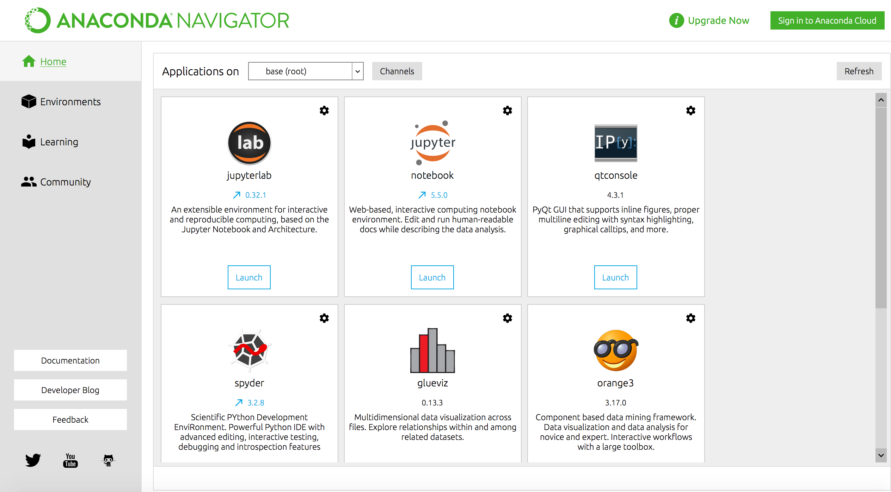
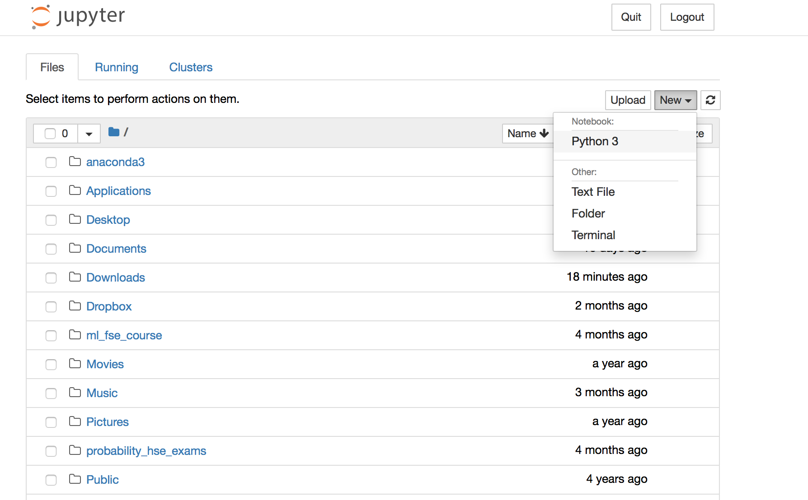
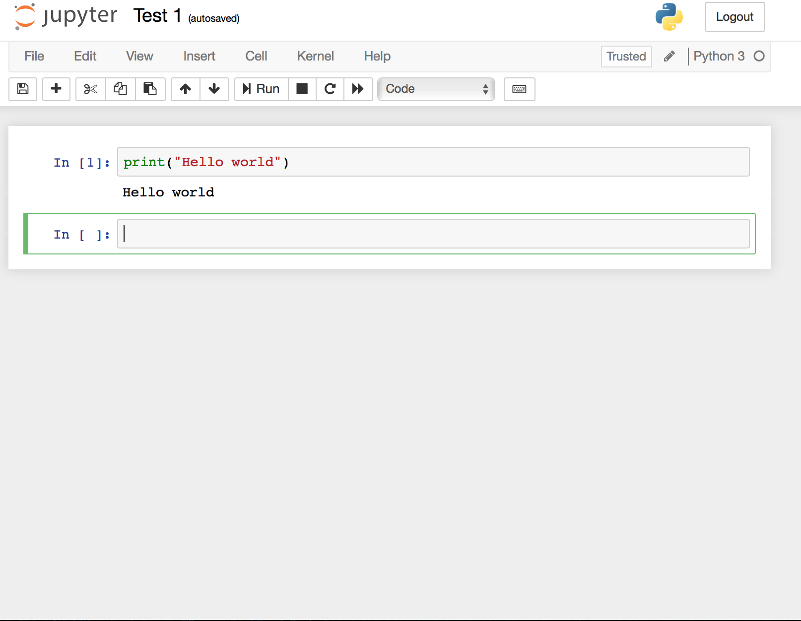

# Коан об установке софта {#installsoft}

В этом коане мы рассмотрим установку и настройку программ для работы на языках программирования R и Python, а также установку и настройку программы Stata. 


```{r, child='setup/setup.Rmd'}
```

```{r, child='01/01_r.Rmd'}
```


### Язык программирования Python
> Python --- это открытая среда программирования, помогающая в работе со статистическими данными. Для программирования на Python подойдет программа Jupyter Notebook. 

### Установка

1. Загрузите и установите Anaconda [с официального сайта](https://www.anaconda.com/distribution/).

2. После загрузки и установки откройте Anaconda Navigator, через который Вы сможете открыть программу Jupyter Notebook.

<center> 



</center> 

### Начало работы

Открыв Jupyter Notebook, вы попадете на страницу, содержащую ваши сохраненные файлы. Чтобы создать новый файл, нажмите "New" ▶ "Notebook: Python 3".

<center> 



</center> 

Затем, в открывшемся окне, появится новый файл. Теперь все готово к работе. Вы можете вводить свой код и затем, используя комбинацию клавиш `<Shift>` + `<Enter>`, проверять его исполнение.

<center> 



</center> 


***
### Программа STATA
> Stata, в отличие от R и Python, является программой, а не языком программирования. Она также помогает в работе со статистическими данными. 


### Установка:

Для установки Stata необходимо загрузить актуальную версию [с сайта компании-разработчика](https://www.stata.com/). Подойдут как Stata SE, так и Stata MP.

### Начало работы:


<center> 


</center> 

1. **Open File** - открыть файл.
2. **Save** - сохранить файл.
3. **Data Editor** - редактирование данных.
4. **Data Browser** - просмотр данных.
5. **Variables** - список переменных.
6. **Command** - командная строка, в которой вводится код.

