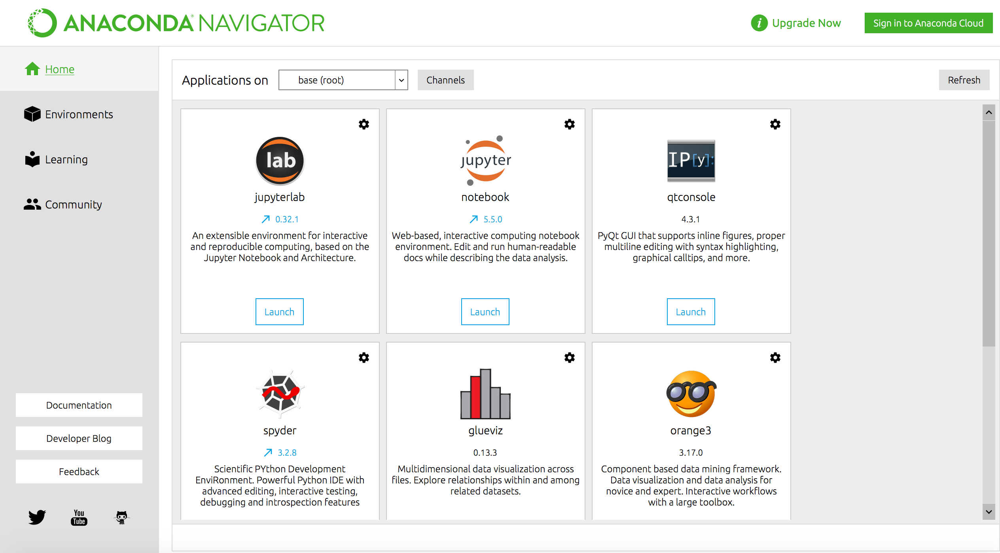
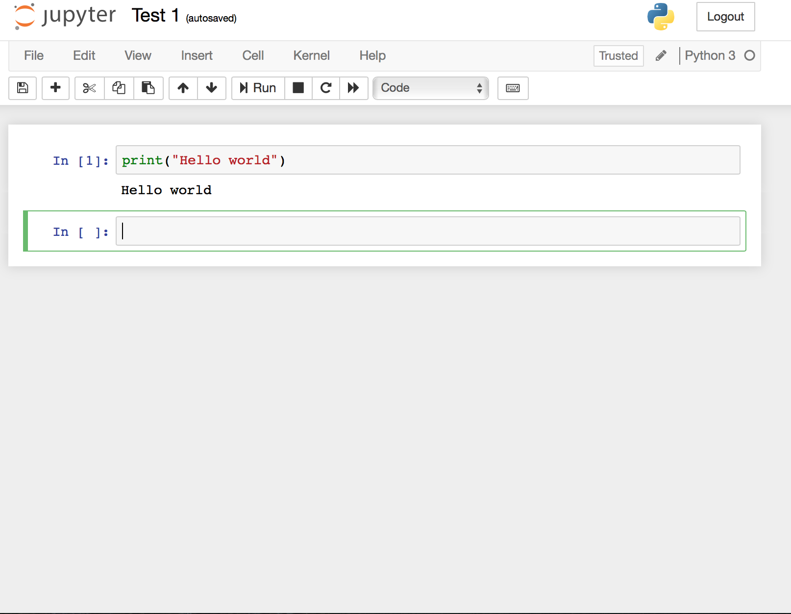

## Язык программирования Python
> Python --- это открытая среда программирования, помогающая в работе со статистическими данными. Для программирования на Python подойдет программа Jupyter Notebook. 

### Установка

1. Загрузите и установите Anaconda [с официального сайта](https://www.anaconda.com/distribution/).

2. После загрузки и установки откройте Anaconda Navigator, через который Вы сможете открыть программу Jupyter Notebook.

 

 

### Начало работы

Открыв Jupyter Notebook, вы попадете на страницу, содержащую ваши сохраненные файлы. Чтобы создать новый файл, нажмите "New" ▶ "Notebook: Python 3".

 

 

Затем, в открывшемся окне, появится новый файл. Теперь все готово к работе. Вы можете вводить свой код и затем, используя комбинацию клавиш `<Shift>` + `<Enter>`, проверять его исполнение.

 

 

