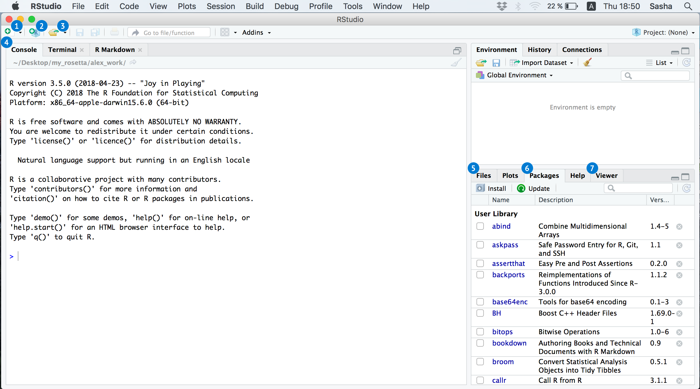

## Язык программирования R

> R --- это открытая среда программирования, помогающая в работе со статистическими данными. Для программирования на R подойдет программа RStudio. 

Рассмотрим установку RStudio на Mac OS и Windows.

### Инструкция по установке RStudio для Windows / Mac OS:

1. Загрузите и установите язык программирования R [с официального сайта](http://cran.cnr.berkeley.edu/).

* Версия для Windows: Выберите “Download R for Windows”  ▶  “base”  ▶  “Download R 3.x.x for Windows”.

* Версия для Mac OS: Выберите “Download R for (Mac) OS X”  ▶  “Latest Release”  ▶ “R 3.x.x”.

2. Загрузите программу RStudio [с официального сайта разработчика](https://www.rstudio.com/products/rstudio/download/) (выберите подходящую версию из предложенных опций). Возможностей бесплатной версии 
будет вполне достаточно для работы.

<center> 

 

</center> 

### Начало работы 


<center> 

 

</center> 


1. **New file** - Создание нового файла.

2. **New project** - Создание нового проекта.

3. **Open file** - Открытие существующего файла.

4. **Console** - Консоль, в которой набирается код.

5. **Files** - Список файлов, доступных для работы.

6. **Packages** - Список установленных пакетов, т.е. расширений. Также можно ознакомиться с ним, введя в консоль команду `installed.packages()`.

7. **Viewer** - Отображение введенного кода.


### Настройка программы [^1]

Запустите RStudio. В разделе Tools --- Global Options --- Sweave --- "Weave .Rnw files using" выберите knitr.

Перед началом работы рекомендуется также установить ряд пакетов, то есть расширений, которые помогут при работе с данными.

Для этого необходимо ввести в командную строку следующую команду:
```{r, eval = FALSE}
install.packages(c("vcd", "ggplot2", "knitr", "xtable", "texreg", "lmtest", "sandwich", "erer", "dplyr", "readxl", "reshape2", "RCurl", "RSelenium","XML", "jsonlite", "quantmod", "lubridate", "stringr", "tidyr"))
```

После выполнения команды все рекомендованные для использования пакеты установятся автоматически. 

При работе на Windows для установки пакетов может потребоваться запуск Rstudio от имени администратора (для этого необходимо кликнуть правой кнопкой мыши, выбрать "Запуск от имени администратора").

Установили? Отлично. Всё готово для использования RStudio на вашем компьютере.

```{r}
cat("Рабочая папка:", getwd(), "\n")
```


[^1]: Источник: https://github.com/bdemeshev/em301/wiki/R
