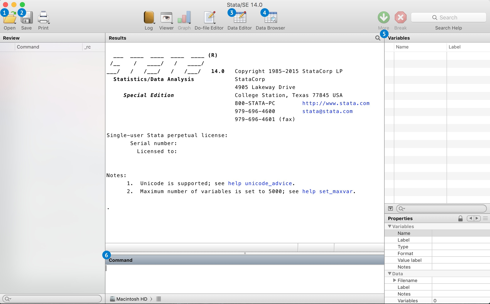

## Программа STATA
> Stata, в отличие от R и Python, является программой, а не языком программирования. Она также помогает в работе со статистическими данными. 

### Установка:

Для установки Stata необходимо загрузить актуальную версию [с сайта компании-разработчика](https://www.stata.com/). Подойдут как Stata SE, так и Stata MP.

### Начало работы:

 
  
  

 
  
1. **Open File** - открыть файл.
2. **Save** - сохранить файл.
3. **Data Editor** - редактирование данных.
4. **Data Browser** - просмотр данных.
5. **Variables** - список переменных.
6. **Command** - командная строка, в которой вводится код.

