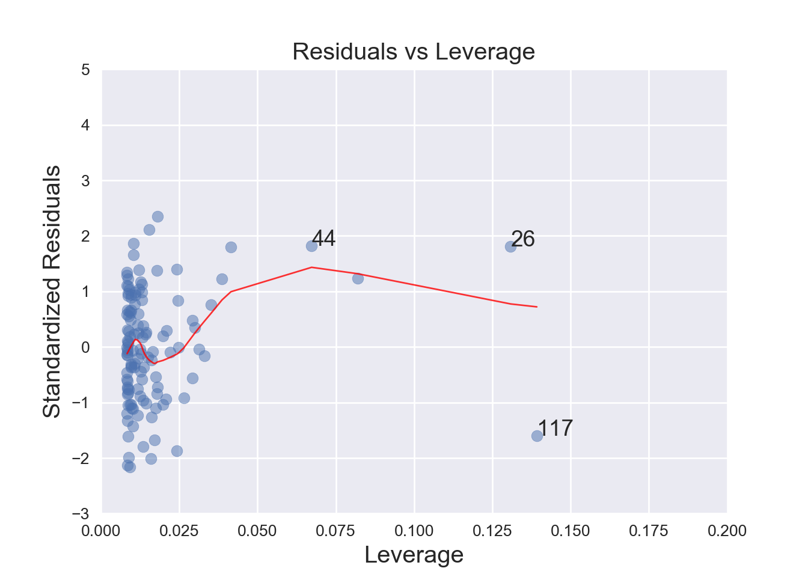
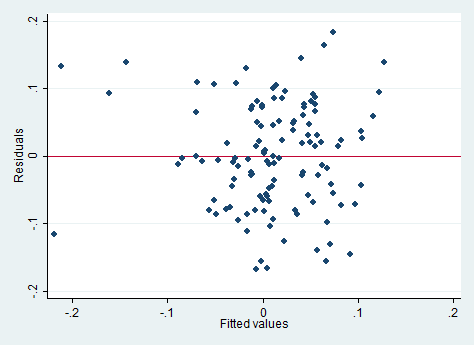

# Коан о простой линейной регрессии {#simplereg}


<!--

## R

Построим простую линейную регрессию в R и проведем несложные тесты. 

Загрузим необходимые пакеты.


```r
library(tidyverse) # манипуляции с данными и построение графиков
library(sjPlot) # красивые графики для линейных моделей
library(skimr) # симпатичное summary
library(rio) # чтение .dta файлов
library(car) # проверка линейных гипотез
library(tseries) # тест Харке – Бера
```

Импортируем данные.


```r
returns = import("../data/02_us_return.dta")
```

Исследуем наш датасет.
Функция `skim()` позволяет получить красивую и приятную в работе табличку (`tibble`), содержащую типы переменных и различные описательные статистики. 
Для удобства выведем результаты только для переменных `MOTOR` и `rkfree`.


```r
skim(returns) %>% 
  filter(skim_variable %in% c('MOTOR', 'rkfree')) 
```


Table: (\#tab:skim)Data summary

                                   
-------------------------  --------
Name                       returns 
Number of rows             2664    
Number of columns          22      
_______________________            
Column type frequency:             
numeric                    2       
________________________           
Group variables            None    
-------------------------  --------


**Variable type: numeric**

skim_variable    n_missing   complete_rate   mean    sd      p0     p25    p50    p75   p100  hist  
--------------  ----------  --------------  -----  ----  ------  ------  -----  -----  -----  ------
MOTOR                 2544            0.05   0.02   0.1   -0.33   -0.05   0.02   0.08   0.27  ▁▂▇▇▁ 
rkfree                2544            0.05   0.01   0.0    0.00    0.01   0.01   0.01   0.01  ▂▇▇▂▂ 

Переименуем столбцы с «неговорящими» названиями :)


```r
returns = rename(returns, n = A, date = B) 
```

И уберем строчки, в которых хотя бы один элемент пустой.


```r
returns= na.omit(returns)
```

Будем верить в CAPM :) (в начале объяснить, что такое capm)
Оценим параметры модели для компании MOTOR. Тогда зависимая переменная - разница доходностей акций MOTOR и безрискового актива (`motor_premium`), а регрессор - рыночная премия (`market_premium`).


```r
returns = mutate(returns, motor_premium = MOTOR - RKFREE, market_premium = MARKET - RKFREE)
```

Оценим нашу модель и проверим гипотезу об адекватности регрессии.


```r
ols = lm(motor_premium ~ market_premium, data = returns)
summary(ols)
```

```

Call:
lm(formula = motor_premium ~ market_premium, data = returns)

Residuals:
      Min        1Q    Median        3Q       Max 
-0.168421 -0.059381 -0.003399  0.061373  0.182991 

Coefficients:
               Estimate Std. Error t value Pr(>|t|)    
(Intercept)    0.005253   0.007200   0.730    0.467    
market_premium 0.848150   0.104814   8.092 5.91e-13 ***
---
Signif. codes:  0 '***' 0.001 '**' 0.01 '*' 0.05 '.' 0.1 ' ' 1

Residual standard error: 0.07844 on 118 degrees of freedom
Multiple R-squared:  0.3569,	Adjusted R-squared:  0.3514 
F-statistic: 65.48 on 1 and 118 DF,  p-value: 5.913e-13
```

Вызовом одной функции получаем кучу полезных графиков :) 
Можем визуально оценить наличие гетероскедастичности, нормальность распределения остатков, наличие выбросов.
Без дополнительных указаний функция построит 4 графика – по одному друг за другом. 
Мы для красоты c помощью функции `par` будем выводить по два графика :)


```r
par(mfrow = c(2,2))
plot(ols) 
```


График **«Residuals vs Fitted»** помогает уловить возможные нелинейные зависимости между регрессором и объясняемой переменной. 
В «хорошем» случае мы ждем картинку с остатками, равномерно рассеянными вдоль горизонтальной прямой.
В нашем случае несколько выбиваются наблюдения с отрицательной рыночной премией.

График **«Normal Q – Q»** позволяет визуально оценить нормальность распределения остатков.
Эталоном здесь является пунктирная прямая.
На графике функция распределения остатков нашей модели «похожа» на нормальную :)

График **«Scale – Location»** дает возможность «на глаз» оценить равную дисперсию остатков регресии и проверить наличие гетероскедастичности. 
За исключением немногочисленных наблюдений с отрицательной рыночной премией, в нашем случае предположение о гомоскедастичности (одинаковой дисперсии) остатков кажется верным.

График **«Residuals vs Leverage»** помогает выявить «влиятельные наблюдения» с высоким «воздействием» (high leverage). 
Это такие наблюдения, которые имеют нетипичные для выборки значения, но исключение которых может значительно повлиять на оценки коэффициентов модели. 
На графике они располагаются справа, за границами, обозначенными красной пунктирной линией (расстояние Кука).

Теперь построим $90\%$-й доверительный интервал для параметров модели.


```r
confint(ols, level = 0.9)
```

```
                        5 %       95 %
(Intercept)    -0.006683687 0.01718942
market_premium  0.674382048 1.02191711
```

И заодно проверим гипотезу о равенстве коэффициента при регрессоре единице.


```r
linearHypothesis(ols, c("market_premium = 1"))
```

```
Linear hypothesis test

Hypothesis:
market_premium = 1

Model 1: restricted model
Model 2: motor_premium ~ market_premium

  Res.Df     RSS Df Sum of Sq      F Pr(>F)
1    119 0.73900                           
2    118 0.72608  1  0.012915 2.0989 0.1501
```

Видим, что на любом разумном уровне значимости она не отвергается.

Теперь посмотрим на остатки регрессии :) Протестируем их на нормальность с помощью теста Харке – Бера.

\[
H_{0}: S = 0, K = 3,
\]
где S — коэффициент асимметрии (Skewness), K — коэффициент эксцесса (Kurtosis)


```r
jarque.bera.test(resid(ols)) 
```

```

	Jarque Bera Test

data:  resid(ols)
X-squared = 1.7803, df = 2, p-value = 0.4106
```

И заодно посмотрим на результаты теста Шапиро – Уилка.

\[
H_{0}: \epsilon_{i} \sim  N(\mu,\sigma^2)
\]


```r
shapiro.test(resid(ols))
```

```

	Shapiro-Wilk normality test

data:  resid(ols)
W = 0.99021, p-value = 0.5531
```

Оба теста указывают на нормальность распределения остатков.

Получим предсказания модели для обучаемой выборки.

#### ДОДУМАТЬ


```r
fitval = fitted(ols)
fit_vs_real = tibble(fitted = fitval, real = returns$market_premium)
```


```r
qplot(x = 1:length(fitval), y = returns$market_premium, 
      xlab = "Number of observation", 
      ylab = "Value") + geom_point(aes(y = fitval, color = 'r'))
```


Выведем прогноз модели по $20$ новым наблюдениям (которые сами же и придумаем). 
Будем считать, что новые наблюдения распределены нормально с математическим ожиданием $0.01$ и дисперсией $0.01$.


```r
set.seed(7)
new_data = tibble(market_premium = rnorm(10, mean = 0.01, sd = 0.1)) 
yhat = predict(ols, newdata = new_data, se = TRUE)
yhat$fit
```

```
           1            2            3            4            5 
 0.207727133 -0.087769779 -0.045152029 -0.021234248 -0.068593258 
           6            7            8            9           10 
-0.066609148  0.077187768  0.003814809  0.026682011  0.199477263 
```
-->


## Python

Опять начинаем с импорта пакетов.
Почти всегда джентельменский набор включает в себя *pandas*, *numpy* и *matplotlib.pyplot*. 
Много полезных функций для статистических расчетов можно найти в модуле Statsmodels. 


```python
import pandas as pd # работа с таблицами
import numpy as np # математические функции и матрицы
import matplotlib.pyplot as plt # графики
import seaborn as sns # еще более классные графики

import statsmodels.api as sm # стандартные регресионные модели
import statsmodels.formula.api as smf # аналогичные модели с синтаксисом в стиле R
import statsmodels.graphics.gofplots as gf # визуализация моделей
import statsmodels.discrete.discrete_model # дискретные модели

from statsmodels.stats.outliers_influence import summary_table # работа с выбросами
from scipy.stats import shapiro # тест Шапиро – Уилка 
```

При желании можем настроить графики по своему вкусу, изменив [стиль](https://tonysyu.github.io/raw_content/matplotlib-style-gallery/gallery.html) и другие параметры шрифтов и графиков :)


```python
plt.style.use('seaborn')
plt.rc('font', size=14)
plt.rc('figure', titlesize=15)
plt.rc('axes', labelsize=15)
plt.rc('axes', titlesize=15)
```

Загрузим данные.


```python
returns = pd.read_stata('../data/02_us_return.dta')
```

Переименуем столбцы с «неговорящими» названиями :)
Параметр `inplace=True` здесь (и во многих других функциях) позволяет изменить объект, не возвращая его копию.


```python
returns.rename(columns={'A':'n', 'B': 'date'}, inplace=True)
```

Избавимся от наблюдений с пропущенными значениями. 


```python
returns.dropna(inplace=True)
```

Как и прежде, рассмотрим CAPM модель :)
Оценим `бэту` для компании MOTOR. 
Тогда зависимая переменная - разница доходностей акций MOTOR и безрискового актива (`motor_premium`), а регрессор - рыночная премия (`market_premium`).


```python
returns['motor_premium'] = returns['MOTOR'] - returns['RKFREE']
returns['market_premium'] = returns['MARKET'] - returns['RKFREE'] 
```

Оценим модель и посмотрим на саммари :)


```python
regr = smf.ols('motor_premium ~ market_premium', data=returns).fit()
regr.summary()
```

```
<class 'statsmodels.iolib.summary.Summary'>
"""
                            OLS Regression Results                            
==============================================================================
Dep. Variable:          motor_premium   R-squared:                       0.357
Model:                            OLS   Adj. R-squared:                  0.351
Method:                 Least Squares   F-statistic:                     65.48
Date:                Sat, 18 Jan 2020   Prob (F-statistic):           5.91e-13
Time:                        12:39:47   Log-Likelihood:                 136.18
No. Observations:                 120   AIC:                            -268.4
Df Residuals:                     118   BIC:                            -262.8
Df Model:                           1                                         
Covariance Type:            nonrobust                                         
==================================================================================
                     coef    std err          t      P>|t|      [0.025      0.975]
----------------------------------------------------------------------------------
Intercept          0.0053      0.007      0.730      0.467      -0.009       0.020
market_premium     0.8481      0.105      8.092      0.000       0.641       1.056
==============================================================================
Omnibus:                        2.684   Durbin-Watson:                   2.030
Prob(Omnibus):                  0.261   Jarque-Bera (JB):                1.780
Skew:                          -0.031   Prob(JB):                        0.411
Kurtosis:                       2.406   Cond. No.                         14.6
==============================================================================

Warnings:
[1] Standard Errors assume that the covariance matrix of the errors is correctly specified.
"""
```

Можем посчитать прогнозное значение. 


```python
returns['yhat'] = regr.fittedvalues # в R добавить для исходных, а сюда для новых
```

Красивые графики для остатков, выборосов и прочих радостей, как в R, придется строить ручками. Зато приятно поиграть с оформлением :)


```python
fig, ax = plt.subplots()
ax.plot(returns['x'],regr.fittedvalues, color='g', alpha=0.8)
```

```
Error in py_call_impl(callable, dots$args, dots$keywords): KeyError: 'x'

Detailed traceback: 
  File "<string>", line 1, in <module>
  File "C:\Users\DNS\ANACON~1\lib\site-packages\pandas\core\frame.py", line 2975, in __getitem__
    indexer = self.columns.get_loc(key)
  File "C:\Users\DNS\ANACON~1\lib\site-packages\pandas\core\indexes\base.py", line 2892, in get_loc
    return self._engine.get_loc(self._maybe_cast_indexer(key))
  File "pandas/_libs/index.pyx", line 107, in pandas._libs.index.IndexEngine.get_loc
  File "pandas/_libs/index.pyx", line 131, in pandas._libs.index.IndexEngine.get_loc
  File "pandas/_libs/hashtable_class_helper.pxi", line 1607, in pandas._libs.hashtable.PyObjectHashTable.get_item
  File "pandas/_libs/hashtable_class_helper.pxi", line 1614, in pandas._libs.hashtable.PyObjectHashTable.get_item
```

```python
ax.scatter(returns['x'],regr.fittedvalues + regr.resid, color='g', alpha=0.8, s=40)
```

```
Error in py_call_impl(callable, dots$args, dots$keywords): KeyError: 'x'

Detailed traceback: 
  File "<string>", line 1, in <module>
  File "C:\Users\DNS\ANACON~1\lib\site-packages\pandas\core\frame.py", line 2975, in __getitem__
    indexer = self.columns.get_loc(key)
  File "C:\Users\DNS\ANACON~1\lib\site-packages\pandas\core\indexes\base.py", line 2892, in get_loc
    return self._engine.get_loc(self._maybe_cast_indexer(key))
  File "pandas/_libs/index.pyx", line 107, in pandas._libs.index.IndexEngine.get_loc
  File "pandas/_libs/index.pyx", line 131, in pandas._libs.index.IndexEngine.get_loc
  File "pandas/_libs/hashtable_class_helper.pxi", line 1607, in pandas._libs.hashtable.PyObjectHashTable.get_item
  File "pandas/_libs/hashtable_class_helper.pxi", line 1614, in pandas._libs.hashtable.PyObjectHashTable.get_item
```

```python
ax.vlines(returns['x'],regr.fittedvalues,regr.fittedvalues + regr.resid, color='gray', alpha=0.5)
```

```
Error in py_call_impl(callable, dots$args, dots$keywords): KeyError: 'x'

Detailed traceback: 
  File "<string>", line 1, in <module>
  File "C:\Users\DNS\ANACON~1\lib\site-packages\pandas\core\frame.py", line 2975, in __getitem__
    indexer = self.columns.get_loc(key)
  File "C:\Users\DNS\ANACON~1\lib\site-packages\pandas\core\indexes\base.py", line 2892, in get_loc
    return self._engine.get_loc(self._maybe_cast_indexer(key))
  File "pandas/_libs/index.pyx", line 107, in pandas._libs.index.IndexEngine.get_loc
  File "pandas/_libs/index.pyx", line 131, in pandas._libs.index.IndexEngine.get_loc
  File "pandas/_libs/hashtable_class_helper.pxi", line 1607, in pandas._libs.hashtable.PyObjectHashTable.get_item
  File "pandas/_libs/hashtable_class_helper.pxi", line 1614, in pandas._libs.hashtable.PyObjectHashTable.get_item
```

```python
plt.title('Линия регрессии и остатки')
plt.xlabel('RKFREE')
plt.ylabel('MARKET')
plt.show()
```


Строим $90\%$-й доверительный интервал.


```python
regr.conf_int(alpha = 0.1)
```

```
                       0         1
Intercept      -0.006684  0.017189
market_premium  0.674382  1.021917
```

И проведем F-test.


```python
hypotheses = '(x = 1)'
regr.f_test(r_matrix = hypotheses)
```

```
Error in py_call_impl(callable, dots$args, dots$keywords): PatsyError: unrecognized token in constraint
    (x = 1)
     ^

Detailed traceback: 
  File "<string>", line 1, in <module>
  File "C:\Users\DNS\ANACON~1\lib\site-packages\statsmodels\base\model.py", line 1648, in f_test
    res = self.wald_test(r_matrix, cov_p=cov_p, invcov=invcov, use_f=True)
  File "C:\Users\DNS\ANACON~1\lib\site-packages\statsmodels\base\model.py", line 1719, in wald_test
    LC = DesignInfo(names).linear_constraint(r_matrix)
  File "C:\Users\DNS\ANACON~1\lib\site-packages\patsy\design_info.py", line 536, in linear_constraint
    return linear_constraint(constraint_likes, self.column_names)
  File "C:\Users\DNS\ANACON~1\lib\site-packages\patsy\constraint.py", line 403, in linear_constraint
    tree = parse_constraint(code, variable_names)
  File "C:\Users\DNS\ANACON~1\lib\site-packages\patsy\constraint.py", line 237, in parse_constraint
    return infix_parse(_tokenize_constraint(string, variable_names),
  File "C:\Users\DNS\ANACON~1\lib\site-packages\patsy\constraint.py", line 196, in _tokenize_constraint
    Origin(string, offset, offset + 1))
```

Тест Шапиро - Уилка. Такой же, как и в R. 


```python
W, p_value = shapiro(regr.resid)
```


Генерируем новые данные и строим предсказание.


```python
import random
random.seed(7)

new_data = returns['x'] + 0.5 * np.random.normal(len(returns))
```

```
Error in py_call_impl(callable, dots$args, dots$keywords): KeyError: 'x'

Detailed traceback: 
  File "<string>", line 1, in <module>
  File "C:\Users\DNS\ANACON~1\lib\site-packages\pandas\core\frame.py", line 2975, in __getitem__
    indexer = self.columns.get_loc(key)
  File "C:\Users\DNS\ANACON~1\lib\site-packages\pandas\core\indexes\base.py", line 2892, in get_loc
    return self._engine.get_loc(self._maybe_cast_indexer(key))
  File "pandas/_libs/index.pyx", line 107, in pandas._libs.index.IndexEngine.get_loc
  File "pandas/_libs/index.pyx", line 131, in pandas._libs.index.IndexEngine.get_loc
  File "pandas/_libs/hashtable_class_helper.pxi", line 1607, in pandas._libs.hashtable.PyObjectHashTable.get_item
  File "pandas/_libs/hashtable_class_helper.pxi", line 1614, in pandas._libs.hashtable.PyObjectHashTable.get_item
```

```python
prediction = regr.predict(new_data)
```

```
Error in py_call_impl(callable, dots$args, dots$keywords): NameError: name 'new_data' is not defined

Detailed traceback: 
  File "<string>", line 1, in <module>
```

А теперь жесть! Построим графички, похожие на `plot()` R.


```python
fig_1 = plt.figure(1)

fig_1.axes[0] = sns.residplot(returns['x'], returns['y'],
                                  lowess=True,
                                  scatter_kws={'alpha': 0.6},
                                  line_kws={'color': 'red', 'lw': 2, 'alpha': 0.8})
```

```
Error in py_call_impl(callable, dots$args, dots$keywords): KeyError: 'x'

Detailed traceback: 
  File "<string>", line 1, in <module>
  File "C:\Users\DNS\ANACON~1\lib\site-packages\pandas\core\frame.py", line 2975, in __getitem__
    indexer = self.columns.get_loc(key)
  File "C:\Users\DNS\ANACON~1\lib\site-packages\pandas\core\indexes\base.py", line 2892, in get_loc
    return self._engine.get_loc(self._maybe_cast_indexer(key))
  File "pandas/_libs/index.pyx", line 107, in pandas._libs.index.IndexEngine.get_loc
  File "pandas/_libs/index.pyx", line 131, in pandas._libs.index.IndexEngine.get_loc
  File "pandas/_libs/hashtable_class_helper.pxi", line 1607, in pandas._libs.hashtable.PyObjectHashTable.get_item
  File "pandas/_libs/hashtable_class_helper.pxi", line 1614, in pandas._libs.hashtable.PyObjectHashTable.get_item
```

```python
fig_1.axes[0].set_title('Residuals vs Fitted')
```

```
Error in py_call_impl(callable, dots$args, dots$keywords): IndexError: list index out of range

Detailed traceback: 
  File "<string>", line 1, in <module>
```

```python
fig_1.axes[0].set_xlabel('Fitted values')
```

```
Error in py_call_impl(callable, dots$args, dots$keywords): IndexError: list index out of range

Detailed traceback: 
  File "<string>", line 1, in <module>
```

```python
fig_1.axes[0].set_ylabel('Residuals')


# можем добавить метки потенциальных аутлаеров
```

```
Error in py_call_impl(callable, dots$args, dots$keywords): IndexError: list index out of range

Detailed traceback: 
  File "<string>", line 1, in <module>
```

```python
abs_resid = abs(regr.resid).sort_values(ascending=False)
abs_resid_top3=abs_resid[:3]

for i in abs_resid_top3.index:
    fig_1.axes[0].annotate(i, 
                               xy = (regr.fittedvalues[i], 
                                   regr.resid[i]))
```

```
Error in py_call_impl(callable, dots$args, dots$keywords): IndexError: list index out of range

Detailed traceback: 
  File "<string>", line 2, in <module>
```


```python
norm_residuals = regr.get_influence().resid_studentized_internal # сохраним стьюдентизированные остатки 


QQ = gf.ProbPlot(norm_residuals)
fig_2 = QQ.qqplot(line='45', alpha=0.5, color='b', lw=1)


fig_2.axes[0].set_title('Normal Q-Q')
fig_2.axes[0].set_xlabel('Theoretical Quantiles')
fig_2.axes[0].set_ylabel('Standardized Residuals');

#и снова метки
abs_norm_resid = np.flip(np.argsort(abs(norm_residuals)), 0)
abs_norm_resid_top3 = abs_norm_resid[:3]

for r, i in enumerate(abs_norm_resid_top3):
    fig_2.axes[0].annotate(i, 
                               xy=(np.flip(QQ.theoretical_quantiles, 0)[r],
                                   norm_residuals[i]))
```




```python
fig_3 = plt.figure(3)

plt.scatter(regr.fittedvalues, np.sqrt(abs(norm_residuals)), alpha=0.5)
sns.regplot(regr.fittedvalues, np.sqrt(abs(norm_residuals)), 
            scatter=False, 
            ci=False, 
            lowess=True,
            line_kws={'color': 'red', 'lw': 1, 'alpha': 0.6})

fig_3.axes[0].set_title('Scale-Location')
fig_3.axes[0].set_xlabel('Fitted values')
fig_3.axes[0].set_ylabel('$\sqrt{|Standardized Residuals|}$')

# и еще раз!)
abs_sq_norm_resid = np.flip(np.argsort(np.sqrt(abs(norm_residuals)), 0))
abs_sq_norm_resid_top3 = abs_sq_norm_resid[:3]

for i in abs_sq_norm_resid_top3:
    fig_3.axes[0].annotate(i, xy=(regr.fittedvalues[i], 
                                   np.sqrt(abs(norm_residuals)[i])))
```


```python
leverage = regr.get_influence().hat_matrix_diag # сохраняем элементы матрицы-шляпницы
cook_dist = regr.get_influence().cooks_distance[0] # и расстояние Кука

fig_4 = plt.figure(4)

plt.scatter(leverage, norm_residuals, alpha=0.5)
sns.regplot(leverage, norm_residuals, 
            scatter=False, 
            ci=False, 
            lowess=True,
            line_kws={'color': 'red', 'lw': 1, 'alpha': 0.8})

fig_4.axes[0].set_xlim(0, 0.20)  # РАЗВЕСТИ НА ОТДЕЛЬНЫЕ ЧАНКИ ИЛИ MESSAGE = FALSE
```

```
(0, 0.2)
```

```python
fig_4.axes[0].set_ylim(-3, 5)
```

```
(-3, 5)
```

```python
fig_4.axes[0].set_title('Residuals vs Leverage')
fig_4.axes[0].set_xlabel('Leverage')
fig_4.axes[0].set_ylabel('Standardized Residuals')


leverage_top3 = np.flip(np.argsort(cook_dist), 0)[:3]

for i in leverage_top3:
    fig_4.axes[0].annotate(i, 
                               xy=(leverage[i], 
                                   norm_residuals[i]))
plt.show()
```


<!--

## Stata


Загружаем данные. 


```stata
use data/us-return.dta
```

```
r(601);

end of do-file
r(601);
```

Любуемся и даем новые названия столбцам.


```stata
summarize
ren A n
ren B date
```

```
no variables defined
r(111);

end of do-file
r(111);
```

Убираем пропущенные значения и создаем новые переменные.


```stata
drop if n == .
gen y = MOTOR - RKFREE
gen x = MARKET - RKFREE
```

```
r(111);

end of do-file
r(111);
```

Строим модель и проверяем гипотезу об адекватности регрессии. Тут же получаем доверительные интервалы для коэффициентов.


```stata
reg y x
```

```
r(111);

end of do-file
r(111);
```

Проверим гипотезу о равенстве коэффициента при регрессоре единице. 

```stata
test x = 1
```

```
r(301);

end of do-file
r(301);
```

Сделаем предсказание по выборке и сохраним остатки.

```stata
predict u_hat, resid
predict y_hat
```

```
r(301);

end of do-file
r(301);
```

Протестируем остатки регрессии на нормальность с помощью теста Харке-Бера.
На самом деле, это не совсем тест Харке-Бера. 
Оригинальный вариант ассимптотический и в нем нет поправки на размер выборки.
А вот в Stata есть. Подробнее здесь https://www.stata.com/manuals13/rsktest.pdf


```stata
sktest u_hat
```

```
r(111);

end of do-file
r(111);
```

И тест Шапиро-Уилка. Тут все аналогично R.

```stata
swilk u_hat
```

```
r(111);

end of do-file
r(111);
```

Гипотеза о нормальности остатков не отвергается.

QQ - график


```stata
qnorm u_hat 
```


График предсказанных значений против остатков.


```stata
rvfplot, yline(0)
```


График диагональных элементов матрицы-шляпницы против квадрата остатков (по сравнению с R оси поменялись местами).


```stata
lvr2plot
```


График предсказанных значений против стандартизиованных остатков.
Размер точек на графике зависит от расстояния Кука для данного наблюдения.


```stata
predict D, cooksd
predict standard, rstandard

graph twoway scatter standard y_hat [aweight=D], msymbol(oh) yline(0)
```


```stata
set seed 7

set obs 120
gen x_new = x+ 0.5 * rnormal()
gen y_hat_new =  .8481496 * x_new + .0052529 
```

```
obs was 0, now 120

x not found
r(111);

end of do-file
r(111);
```


-->
