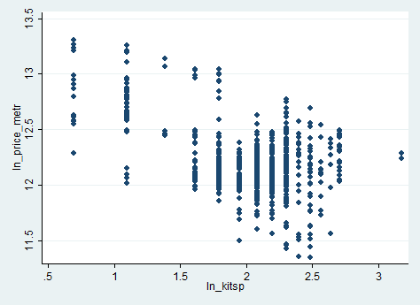

## Stata

Теперь попробуем поработать в **stata**.

Импортируем датасет для анализа.

```{stata}
use data/flats.dta
```

Построим линейную регрессионную модель.

```{stata}
reg ln_price_metr ln_livesp ln_kitsp ln_dist ln_metrdist
```

Визуализируем зависимость регрессоров и регрессанта.

```{stata,echo=1,results="hide"}
scatter ln_price_metr ln_kitsp
graph export kitsp.png, replace
```
<center>

</center>

```{stata,echo=1,results="hide"}
scatter ln_price_metr ln_livesp
graph export livesp.png, replace
```

<center>


</center>

```{stata,echo=1,results="hide"}
scatter ln_price_metr ln_dist
graph export dist.png, replace
```

<center>


</center>

```{stata,echo=1,results="hide"}
scatter ln_price_metr ln_metrdist
graph export metrdist.png, replace
```

<center>


</center>


Подозрительны переменные `ln_kitsp` и `ln_metrdist`.

Проверим наличие гетероскедастичности с помощью тестов.

Тест Уайта строится по короткой команде:

```{stata}
estat imtest, white
```

Тест Уайта выявил гетероскедастичность. Что скажет тест Бройша - Пагана?

```{stata}
estat hettest, rhs mtest
```

И этот тест указывает на наличие нежелательной гетероскедастичности, особенно подозрительны переменные `ln_kitsp` и `ln_metrdist`.

Попробуем проверить ещё и через тест Голдфелда - Квандта. Сделаем его ручками.

Отсортируем наблюдения по возрастанию переменной `ln_kitsp`, построим регрессию и сохраним остатки.

```{stata}
sort ln_kitsp
reg ln_price_metr ln_livesp ln_kitsp ln_dist ln_metrdist in 1 / 258
scalar rss1 = e(rss)
```

Сохраним остатки и в последней части регрессии.

```{stata}
sort ln_kitsp
reg ln_price_metr ln_livesp ln_kitsp ln_dist ln_metrdist in 516 / 773
scalar rss2 = e(rss)
```

Посчитаем тестовую F-статистику.

```{stata}
scalar F = rss2 / rss1
display F
display invFtail(258, 258, 0.05)
```

Тестовая статистика больше табличной, следовательно, гетероскедастичность присутствует. 

Сейчас немного о способах борьбы с гетероскедастичностью. 
Подправим все коэффициенты исходной регрессии на гетероскедастичную переменную, например, на `ln_kitsp`.

```{stata}
gen ln_price_metr_new = ln_price_metr / ln_kitsp
gen ln_livesp_new = ln_livesp / ln_kitsp
gen const_new = 1 / ln_kitsp
gen ln_dist_new = ln_dist / ln_kitsp
gen ln_metrdist_new = ln_metrdist / ln_kitsp
```

И оценим регрессию с новыми переменными.

```{stata}
reg ln_price_metr_new ln_livesp_new const_new ln_dist_new ln_metrdist_new
```

И полученные оценки будут эффективными оценками коэффициентов исходной регрессии.

Также можно использовать метод взвешенного МНК (WLS). Взвесим на стандартное отклонение фактора `ln_kitsp`.

```{stata}
vwls ln_price_metr ln_livesp ln_kitsp ln_dist ln_metrdist, sd(ln_kitsp)
```

Способ #2. Используем робастные оценки Уайта.

```{stata}
reg ln_price_metr ln_livesp ln_kitsp ln_dist ln_metrdist, robust
```

Робастные оценки Уайта позволяют снизить последствия гетероскедастичности через уменьшение стандартных ошибок коэффициентов регрессии.

```{stata, include=FALSE}
save data/livesp.dta, replace
```


