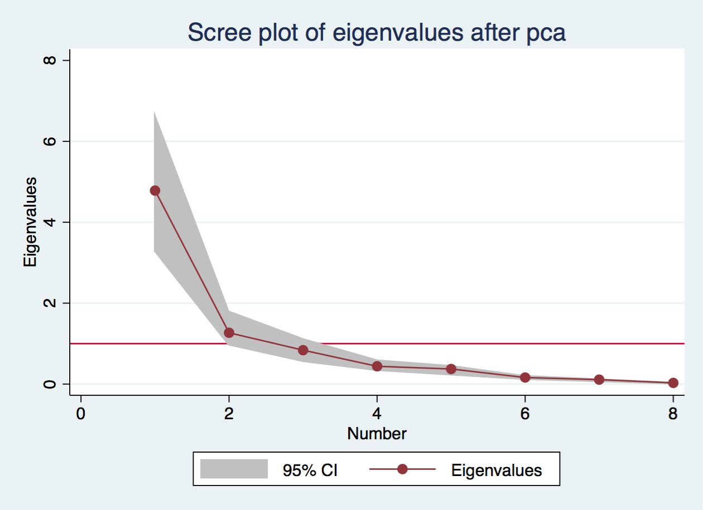

# Коан о методе главных компонент {#мгк}
---
<style>
pre.r {
    background-color: #FEF9E7 !important;
}
pre.stata {
    background-color: #BDBDBD !important;
}
pre.python {
    background-color: #FDF2E9 !important;
}
</style> 

> Метод главных компонент позволяет снизить размерность данных за счет замены исходных переменных на меньшее количество новых переменных. Новые, искусственно созданные, переменные называются главными компонентами.

Реализация метода главных компонент "вручную" включает в себя следующие элементы:

1. Центрирование исходных данных
2. Вычисление собственных значений матрицы $X^TX$
3. Расчет доли дисперсии, объясняемой найденными компонентами
4. Выбор числа главных компонент

Однако прогресс не стоит на месте, и получение главных компонент теперь осуществляется быстрее и проще (а главное совершенно бесплатно и без регистрации). Рассмотрим, как проделать это на r, python и в stata.

## r
```{r setup, include=FALSE}
library(knitr)
library(texreg)
library(Statamarkdown)
library(reticulate)
if (Sys.getenv("USER") == "Sasha") {
  use_python('/Users/Sasha/anaconda3/bin/python3')
  stataexe = "/Applications/Stata/StataSE.app/Contents/MacOS/stataSE"
  knitr::opts_chunk$set(engine.path = list(stata = stataexe), collectcode = TRUE)
}
opts_chunk$set(fig.align = 'center') # Выравнивание картинок по центру
```
Загружаем нужные пакеты:
```{r, include=TRUE, warning=FALSE, message=FALSE}
library(dplyr) # Для работы с данными
library(ggplot2) # Для построения графиков
library(skimr) # Для изучения данных
library(FactoMineR) # Для анализа
library(factoextra) # Для визуализации главных компонент 
```
Загружаем набор данных по параметрам машин **mtcars** и изучаем его строение:
```{r}
skim(mtcars)
```
Целевая переменная в данном наборе данных - это `mpg`, miles per gallon. Для МГК нам понадобится произвести стандартизацию регрессоров, так как разные переменные измерены в несопоставимых единицах измерения: 
```{r}
c = select(mtcars, -mpg) # Выделяем регрессоры в отдельный список
c_pca = PCA(c, scale.unit = TRUE, graph = FALSE) # Применяем функцию PCA для нахождения главных компонент, при этом проводим стандартизацию (scale.unit=TRUE)
```
Используя возможности пакета **factoextra**, построим несколько графиков, чтобы иметь полное представление о созданных главных компонентах. Для начала визуализируем долю объясняемой главными компонентами дисперсии с помощью функции *fviz_eig*:
```{r}
fviz_eig(c_pca, addlabels = TRUE, ylim = c(0, 65), barfill = "dodgerblue2", barcolor = "dodgerblue4", linecolor = "black", title = "Доля объясняемой дисперсии")
```

Итак, две первые главные компоненты, PC1 и PC2, объясняют более 85% дисперсии.

Посмотрим, в каких переменных содержится больше всего информации, т.е. какие из них вносят наибольший вклад в объяснение дисперсии, с помощью функции *fviz_contrib*. 
```{r}
fviz_contrib(c_pca, choice = "var", axes = 1:2, top = 10, fill = "darkseagreen2", linecolor = "black", title = "Вклад переменных в первую и вторую главные компоненты")
```

Соответственно, наибольшая информация содержится в переменных `cyl`, `disp`, `qsec`.

Построим так называемый **Correlation Circle**, показывающий корреляцию между исходными переменными и главными компонентами, используя функцию *fviz_pca_var*. Покажем вклад переменных в первую и вторую главные компоненты цветом:
```{r}
fviz_pca_var(c_pca, col.var = "contrib",
             gradient.cols = c("#00AFBB", "#E7B800", "#FC4E07"),
             title = "Корреляция между исходными переменными и главными компонентами")
```

Переменные с положительной корреляцией расположены близко друг к другу (например, `cyl` и `hp`), с отрицательной корреляцией - на противоположных частях графика (`drat` и `wt`). Чем больше дистанция между переменными и началом координат, тем лучше их удается описать при помощи главных компонент.

## stata

Загружаем нужные нам данные, в данном случае сведения об автомобилях, содержащиеся в пакете auto.
```{stata}
webuse auto
```

Для реализации МГК достаточно использовать функцию `pca`. Она принимает на вход зависимую переменную `price` и регрессоры `mpg`, `rep78`, `headroom`, `weight`, `length`, `displacement`, `foreign`:
```{stata}
pca price mpg rep78 headroom weight length displacement foreign
```
Построим график доли дисперсии, объясняемой каждой компонентой:
```{stata, echo = 1, results = "hide"}
screeplot, yline(1) ci(het) 
graph export scr.png
```


И получим первые две компоненты:
```{stata}
predict pc1 pc2, score
```

## python
Начинаем, как обычно, с обработки данных. Загружаем необходимые для работы библиотеки
```{python}
import pandas as pd # Библиотека pandas для работы с данными
import seaborn as sns # Библиотека seaborn для визуализации
from sklearn.decomposition import PCA # Импортируем функцию PCA, вычисляющую главные компоненты
from sklearn.preprocessing import StandardScaler # Импортируем StandartScaler
```
и набор данных *auto mpg dataset*:
```{python}
url = "http://archive.ics.uci.edu/ml/machine-learning-databases/auto-mpg/auto-mpg.data-original"
df = pd.read_csv(url, 
                delim_whitespace = True, 
                header=None,
                names = ['mpg', 'cylinders', 'displacement',         'horsepower', 'weight', 'acceleration', 'model', 'origin', 'car_name'])  
```
Изучим строение данных:
```{python}
df.head()
```
Так как в наших данных, кроме прочего, также присутствуют и другие типы переменных (например, содержащиеся в переменной `car_names` названия машин), то предварительно очистим данные, оставив только численные переменные. После этого используем функцию StandartScaler для стандартизации регрессоров:
```{python}
df = df.dropna() # Убираем пропущенные значения (NAs)
features = ['cylinders', 'displacement', 'horsepower', 'weight', 'acceleration', 'origin'] # Добавляем количественные регрессоры в отдельный список, убираем переменные car_names, model
x = df[features] # Выделяем численные значения регрессоров !!!Упростить!!!
y = df['mpg'] # Выделяем целевую переменную
x = StandardScaler().fit_transform(x) # Стандартизируем регрессоры
```
Создадим три главные компоненты:
```{python}
pca = PCA(n_components=3) # Создаем 3 главные компоненты
principalComponents = pca.fit_transform(x)
principalDf = pd.DataFrame(data = principalComponents, columns = ['principal component 1', 'principal component 2', 'principal component 3']) # Создаем таблицу, в которую сохраняем значения найденных компонент
```
Вычислим, какую долю дисперсии объясняют главные компоненты:
```{python}
pca.explained_variance_ratio_
```
Таким образом, три главные компоненты объясняют примерно 74 + 14 + 1 = 89% дисперсии.
Представим это на графике:
```{python}
df = pd.DataFrame({'var':pca.explained_variance_ratio_, 'PC':['PC1', 'PC2', 'PC3']})
graph = sns.barplot(x = 'PC', y = 'var', data = df, color = 'wheat')
graph.set_title("Доля дисперсии, объясняемой главными компонентами")
graph.set_ylabel('Доля дисперсии')
graph.set_xlabel('Главные компоненты')
```
```