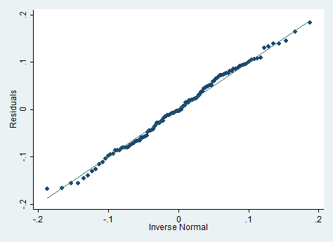
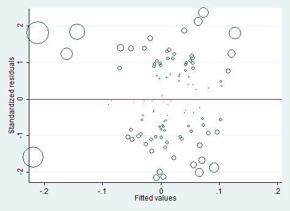

# Коан о простой линейной регрессии stata {#simplereg}


```{r setup, include=FALSE}
library(knitr) # комбинирование кода и текста
library(Statamarkdown) # взаимодействие со статой
library(reticulate) # взаимодействие с питоном

if (Sys.getenv("USER") == "boris") {
  stataexe <- find_stata()
}

if (Sys.getenv("USERNAME") == "Yuliya") {
  use_python("/Users/Юлия/AppData/Local/Programs/Python/Python37/python.exe")
  stataexe <- find_stata()
}

if (Sys.getenv("USER") == "Sasha") {
  use_python('/Users/Sasha/anaconda3/bin/python3')
  stataexe = "/Applications/Stata/StataSE.app/Contents/MacOS/stataSE"
}


if (Sys.getenv("USERNAME") == "Anastasia Karpova") {
  Sys.setenv(language = "russian")

  Sys.setenv(PATH = paste("C:/Users/DNS/Anaconda3/Library/bin",
                       Sys.getenv()["PATH"], sep = ";"))
  Sys.setenv(PATH = paste("C:/Users/DNS/Anaconda3/Scripts",
                       Sys.getenv()["PATH"], sep = ";"))
  Sys.setenv(PATH = paste("C:/Users/DNS/Anaconda3/",
                       Sys.getenv()["PATH"], sep = ";"))

  use_condaenv("base")
  use_python("C:/Users/DNS/Anaconda3/python.exe")
  pandas = reticulate::import("pandas")
  stataexe = "C:/Program Files (x86)/Stata13/StataMP-64.exe"
}

if (Sys.getenv("USERNAME") == "The_sun") {
  use_python("Users/The_sun/Anaconda3/python.exe")
  stataexe = "C:/Program Files (x86)/Stata13/StataMP-64.exe"
}


knitr::opts_chunk$set(engine.path = list(stata = stataexe), collectcode = TRUE)
```

## stata

```{stata, include=FALSE}
clear all
```

Загружаем данные. 
```{stata}
use data/us-return.dta
```

Любуемся и даем новые названия столбцам.
```{stata}
summarize
ren A n
ren B date
```

Убираем пропущенные значения и создаем новые переменные.
```{stata "new var"}
drop if n == .
gen y = MOTOR - RKFREE
gen x = MARKET - RKFREE
```

Строим модель и проверяем гипотезу об адекватности регрессии. Тут же получаем доверительные интервалы для коэффициентов.
```{stata "model_stata"}
reg y x
```

Проверим гипотезу о равенстве коэффициента при регрессоре единице. 
```{stata "lin hyp_stata"}
test x = 1
```

Сделаем предсказание по выборке и сохраним остатки.
```{stata "prediction_stata"}
predict u_hat, resid
predict y_hat
```

Протестируем остатки регрессии на нормальность с помощью теста Харке-Бера.
На самом деле, это не совсем тест Харке-Бера. Оригинальный вариант ассимптотический и в нем нет поправки на размер выборки. В Stata есть. Подробнее здесь https://www.stata.com/manuals13/rsktest.pdf

```{stata "Jarque–Bera"}
sktest u_hat
```

И тест Шапиро-Уилка. Тут все аналогично R.
```{stata "Shapiro-Wilk"}
swilk u_hat
```

Гипотеза о нормальности остатков не отвергается.

QQ - график

```{stata "qq-plot", echo = 1, results = 'hide'}
qnorm u_hat 
graph export qq_plot.png, replace
```


График предсказанных значений против остатков.
```{stata "res_vs_fit", echo = 1, results = 'hide'}
rvfplot, yline(0)
graph export resvsfit.png, replace
```


График диагональных элементов матрицы-шляпницы против квадрата остатков (по сравнению с R оси поменялись местами).
```{stata "res_vs_h", echo = 1, results = 'hide'}
lvr2plot
graph export resvsh.png, replace
```


График предсказанных значений против стандартизиованных остатков. Размер точек на графике зависит от расстояния Кука для данного наблюдения.
```{stata "standard hat", echo = 1:4, results = 'hide'}
predict D, cooksd
predict standard, rstandard

graph twoway scatter standard y_hat [aweight=D], msymbol(oh) yline(0)
graph export standardhat.png, replace
```


```{stata "x_new"}
set seed 7

set obs 120
gen x_new = x+ 0.5 * rnormal()
gen y_hat_new =  .8481496 * x_new + .0052529 
```


