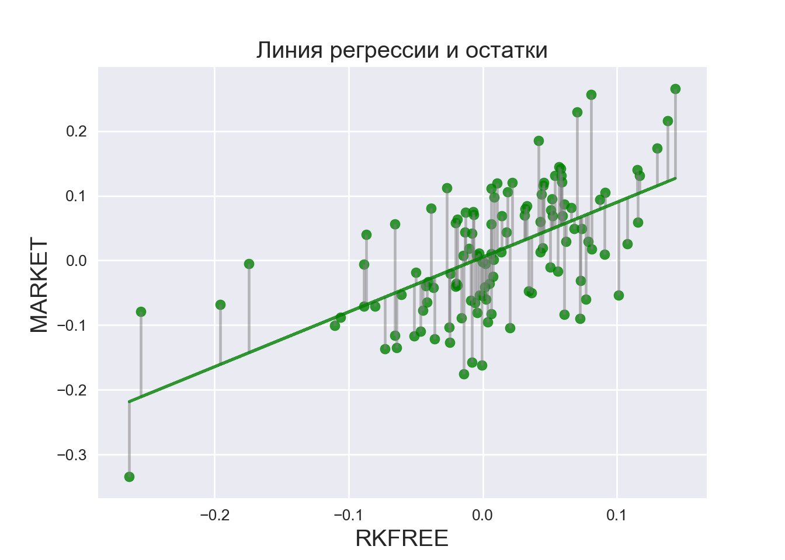
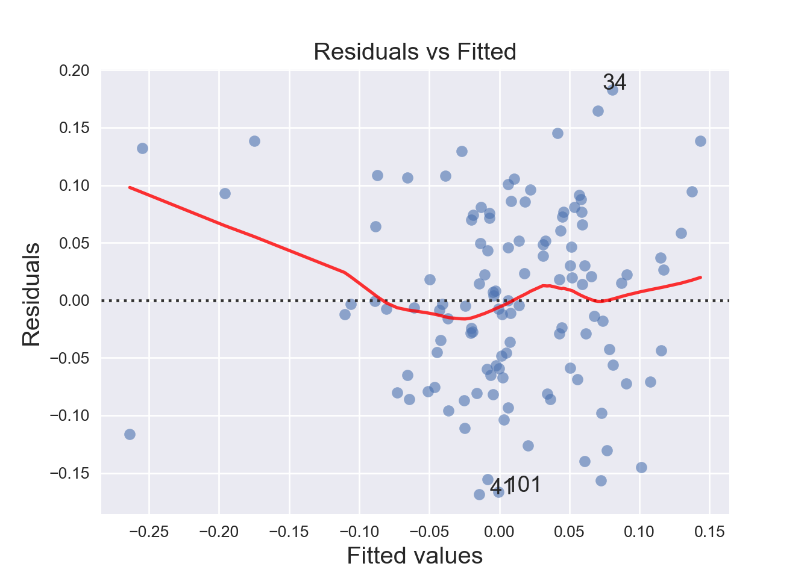

# Коан о простой линейной регрессии {#simplereg}


## r

Построим простую линейную регрессию в R и проведем несложные тесты. 

Загрузим необходимые пакеты.

```r
library(tidyverse) # для манипуляций с данными и построения графиков
library(skimr) # для красивого summary
library(rio) # для чтения .dta файлов
library(car) # для линейных гипотез
library(tseries) # для теста на нормальность
library(sjPlot) # еще графики
```

Импортируем данные.

```r
df = rio::import("data/us-return.dta")
```

Исследуем наш датасет.

```r
skim_with(numeric = list(hist = NULL, p25 = NULL, p75 = NULL)) # опустим некоторые описательные статистики
skim(df) 
```

```
Error in env_bind(mask, ... = env_get(current_env(), "...")): could not find function "env_bind"
```

Переименуем столбцы.

```r
df = rename(df, n = A, date = B) 
```


```r
df = na.omit(df) # уберем пустые строки
```

Будем верить в CAPM :) Оценим параметры модели для компании MOTOR. Соответственно, зависимая переменная - разница доходностей акций MOTOR и безрискового актива, а регрессор - рыночная премия.

```r
df = mutate(df, y = MOTOR - RKFREE, x = MARKET - RKFREE) 
```

Строим нашу модель и проверяем гипотезу об адекватности регрессии.

```r
ols = lm(y ~ x, data = df)
summary(ols)
```

```

Call:
lm(formula = y ~ x, data = df)

Residuals:
      Min        1Q    Median        3Q       Max 
-0.168421 -0.059381 -0.003399  0.061373  0.182991 

Coefficients:
            Estimate Std. Error t value Pr(>|t|)    
(Intercept) 0.005253   0.007200   0.730    0.467    
x           0.848150   0.104814   8.092 5.91e-13 ***
---
Signif. codes:  0 '***' 0.001 '**' 0.01 '*' 0.05 '.' 0.1 ' ' 1

Residual standard error: 0.07844 on 118 degrees of freedom
Multiple R-squared:  0.3569,	Adjusted R-squared:  0.3514 
F-statistic: 65.48 on 1 and 118 DF,  p-value: 5.913e-13
```

```r
coeff = summary(ols)$coeff # отдельно табличка с коэффициентами
coeff
```

```
               Estimate  Std. Error   t value     Pr(>|t|)
(Intercept) 0.005252865 0.007199935 0.7295713 4.670981e-01
x           0.848149581 0.104813757 8.0919681 5.913330e-13
```

Вызовом одной функции получаем кучу полезных графиков. Можем визуально оценить наличие гетероскедастичности, нормальность распределения остатков, наличие выбросов.

```r
plot(ols)
```


Строим доверительный интервал для параметров модели.

```r
est = cbind(Estimate = coef(ols), confint(ols))
```

Проверим гипотезу о равенстве коэффициента при регрессоре единице. 

```r
linearHypothesis(ols, c("x = 1"))
```

```
Linear hypothesis test

Hypothesis:
x = 1

Model 1: restricted model
Model 2: y ~ x

  Res.Df     RSS Df Sum of Sq      F Pr(>F)
1    119 0.73900                           
2    118 0.72608  1  0.012915 2.0989 0.1501
```

Посмотрим на остатки :) Протестируем остатки регрессии на нормальность с помощью теста Харке-Бера.

\[H_{0}: S = 0, K = 3,\\
\text{где S — коэффициент асимметрии (Skewness), K — коэффициент эксцесса (Kurtosis)}\]


```r
jarque.bera.test(resid(ols)) 
```

```

	Jarque Bera Test

data:  resid(ols)
X-squared = 1.7803, df = 2, p-value = 0.4106
```

И тест Шапиро-Уилка.

$H_{0}: \epsilon_{i} \sim  N(\mu,\sigma^2)$

```r
shapiro.test(resid(ols))
```

```

	Shapiro-Wilk normality test

data:  resid(ols)
W = 0.99021, p-value = 0.5531
```

Оба теста указывают на нормальность распределения остатков регрессии.

Сделаем прогноз модели по данным вне обучаемой выборки.

```r
set.seed(7)

newData = data.frame(x = df$x + 0.5*rnorm(length(df$x))) #пошумим
yhat = predict(ols, newdata = newData, se = TRUE)
```

## python

Много полезных функций для статистических расчетов можно найти в пакете Statsmodels. 

```python

import pandas as pd # для работы с таблицами
import numpy as np # математика, работа с матрицами
import matplotlib.pyplot as plt # графики
import statsmodels.api as sm
import statsmodels.formula.api as smf
import statsmodels.graphics.gofplots as gf
from statsmodels.stats.outliers_influence import summary_table
import seaborn as sns # еще более классные графики
from scipy.stats import shapiro # еще математика
import statsmodels.discrete.discrete_model
```

При желании, можем кастомизировать графики :)

```python
plt.style.use('seaborn')
plt.rc('font', size=14)
plt.rc('figure', titlesize=15)
plt.rc('axes', labelsize=15)
plt.rc('axes', titlesize=15)
```

Загрузим данные.

```python
df = pd.read_stata('data/us-return.dta')
```

Избавимся от наблюдений с пропущенными значениями. 

```python
df.dropna(inplace=True)
df.reset_index(drop=True, inplace=True)
```

Переименуем столбцы.

```python
df = df.rename(columns={'A':'n', 'B': 'date'})
```


```python
df['y'] = df['MOTOR'] - df['RKFREE']
df['x'] = df['MARKET'] - df['RKFREE'] 
```

Строим модель и читаем саммари :)

```python
regr = smf.ols('y~x', data = df).fit()
regr.summary()
```

```
<class 'statsmodels.iolib.summary.Summary'>
"""
                            OLS Regression Results                            
==============================================================================
Dep. Variable:                      y   R-squared:                       0.357
Model:                            OLS   Adj. R-squared:                  0.351
Method:                 Least Squares   F-statistic:                     65.48
Date:                Tue, 14 Jan 2020   Prob (F-statistic):           5.91e-13
Time:                        21:45:23   Log-Likelihood:                 136.18
No. Observations:                 120   AIC:                            -268.4
Df Residuals:                     118   BIC:                            -262.8
Df Model:                           1                                         
Covariance Type:            nonrobust                                         
==============================================================================
                 coef    std err          t      P>|t|      [0.025      0.975]
------------------------------------------------------------------------------
Intercept      0.0053      0.007      0.730      0.467      -0.009       0.020
x              0.8481      0.105      8.092      0.000       0.641       1.056
==============================================================================
Omnibus:                        2.684   Durbin-Watson:                   2.030
Prob(Omnibus):                  0.261   Jarque-Bera (JB):                1.780
Skew:                          -0.031   Prob(JB):                        0.411
Kurtosis:                       2.406   Cond. No.                         14.6
==============================================================================

Warnings:
[1] Standard Errors assume that the covariance matrix of the errors is correctly specified.
"""
```

Получить прогноз.

```python
df['yhat'] = regr.fittedvalues
```

Красивые графики для остатков, выборосов и прочих радостей, как в R, придется строить ручками. Зато приятно поиграть с оформлением :)

```python
fig, ax = plt.subplots()
ax.plot(df['x'],regr.fittedvalues, color='g', alpha =0.8)
ax.scatter(df['x'],regr.fittedvalues+regr.resid, color = 'g', alpha = 0.8, s = 40)
ax.vlines(df['x'],regr.fittedvalues,regr.fittedvalues+regr.resid, color = 'gray', alpha = 0.5)
plt.title('Линия регрессии и остатки')
plt.xlabel('RKFREE')
plt.ylabel('MARKET')
plt.show()
```



Строим доверительный интервал.

```python
regr.conf_int()
```

```
                  0         1
Intercept -0.009005  0.019511
x          0.640590  1.055709
```

И проведем F-test.

```python
hypotheses = '(x = 1)'
regr.f_test(r_matrix = hypotheses)
```

```
<class 'statsmodels.stats.contrast.ContrastResults'>
<F test: F=array([[2.09891771]]), p=0.15005564158662682, df_denom=118, df_num=1>
```

Тест Шапиро. Такой же, как и в R. Для удобства можно поместить в табличку.

```python
W, p_value = shapiro(regr.resid)
#pd.DataFrame(data = {'W': [round(W,3)], 'p_value': [round(p_value,3)]})
```


Генерируем новые данные и строим предсказание.

```python
import random
random.seed(7)

newData = df['x'] + 0.5*np.random.normal(len(df))
prediction = regr.predict(newData)
```

А теперь жесть! Построим графички, похожие на autoplot R.

```python
fig_1 = plt.figure(1)

fig_1.axes[0] = sns.residplot(df['x'], df['y'],
                                  lowess=True,
                                  scatter_kws={'alpha': 0.6},
                                  line_kws={'color': 'red', 'lw': 2, 'alpha': 0.8})

fig_1.axes[0].set_title('Residuals vs Fitted')
fig_1.axes[0].set_xlabel('Fitted values')
fig_1.axes[0].set_ylabel('Residuals')


# можем добавить метки потенциальных аутлаеров
abs_resid = abs(regr.resid).sort_values(ascending=False)
abs_resid_top3 = abs_resid[:3]

for i in abs_resid_top3.index:
    fig_1.axes[0].annotate(i, 
                               xy=(regr.fittedvalues[i], 
                                   regr.resid[i]))
```




```python
norm_residuals = regr.get_influence().resid_studentized_internal # сохраним стьюдентизированные остатки 


QQ = gf.ProbPlot(norm_residuals)
fig_2 = QQ.qqplot(line='45', alpha=0.5, color='b', lw=1)


fig_2.axes[0].set_title('Normal Q-Q')
fig_2.axes[0].set_xlabel('Theoretical Quantiles')
fig_2.axes[0].set_ylabel('Standardized Residuals');

#и снова метки
abs_norm_resid = np.flip(np.argsort(abs(norm_residuals)), 0)
abs_norm_resid_top3 = abs_norm_resid[:3]

for r, i in enumerate(abs_norm_resid_top3):
    fig_2.axes[0].annotate(i, 
                               xy=(np.flip(QQ.theoretical_quantiles, 0)[r],
                                   norm_residuals[i]))
```


```python
fig_3 = plt.figure(3)

plt.scatter(regr.fittedvalues, np.sqrt(abs(norm_residuals)), alpha=0.5)
sns.regplot(regr.fittedvalues, np.sqrt(abs(norm_residuals)), 
            scatter=False, 
            ci=False, 
            lowess=True,
            line_kws={'color': 'red', 'lw': 1, 'alpha': 0.6})

fig_3.axes[0].set_title('Scale-Location')
fig_3.axes[0].set_xlabel('Fitted values')
fig_3.axes[0].set_ylabel('$\sqrt{|Standardized Residuals|}$')

# и еще раз!)
abs_sq_norm_resid = np.flip(np.argsort(np.sqrt(abs(norm_residuals)), 0))
abs_sq_norm_resid_top3 = abs_sq_norm_resid[:3]

for i in abs_sq_norm_resid_top3:
    fig_3.axes[0].annotate(i, xy=(regr.fittedvalues[i], 
                                   np.sqrt(abs(norm_residuals)[i])))
```


```python
leverage = regr.get_influence().hat_matrix_diag # сохраняем элементы матрицы-шляпницы
cook_dist = regr.get_influence().cooks_distance[0] # и расстояние Кука

fig_4 = plt.figure(4)

plt.scatter(leverage, norm_residuals, alpha=0.5)
sns.regplot(leverage, norm_residuals, 
            scatter=False, 
            ci=False, 
            lowess=True,
            line_kws={'color': 'red', 'lw': 1, 'alpha': 0.8})

fig_4.axes[0].set_xlim(0, 0.20)
```

```
(0, 0.2)
```

```python
fig_4.axes[0].set_ylim(-3, 5)
```

```
(-3, 5)
```

```python
fig_4.axes[0].set_title('Residuals vs Leverage')
fig_4.axes[0].set_xlabel('Leverage')
fig_4.axes[0].set_ylabel('Standardized Residuals')


leverage_top3 = np.flip(np.argsort(cook_dist), 0)[:3]

for i in leverage_top3:
    fig_4.axes[0].annotate(i, 
                               xy=(leverage[i], 
                                   norm_residuals[i]))
plt.show()
```


