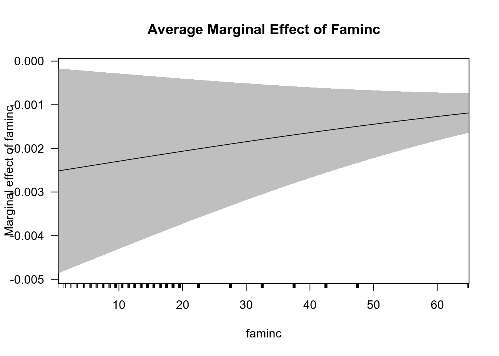

# Модель бинарного выбора {#binchoice}


> Сейчас попробуем подружиться с моделями бинарного выбора на основе данных `bwght.dta`, где зависимая переменная отражает, является индивид курильщиком или нет.

## r

Загрузим необходимы пакеты.

```r
library(rio) # импорт и экспорт данных в разных форматах
library(tidyverse) # графики и манипуляции с данными
library(skimr) # описательные статистики
library(mfx) # нахождение предельных эффектов
library(margins) # визуализация предельных эффектов
library(lmtest) # проведение тестов
library(plotROC) # построение ROC-кривой
library(caret) # confusion-матрица
library(texreg) # вывод результатов регрессии в тех и html
```
Импортируем исследуемые данные.

```r
data = import("data/bwght.dta") 
```
Сгенерируем переменную `smoke`, отражающее состояние отдельного индивида: курильщик, если `smoke = 1`, не курильщик - иначе. 

```r
data = mutate(data, smoke=(cigs>0))
```
Рассмотрим описательные статистики по всем переменным: решение курить, семейный доход, налог на сигареты, цена сигарет, образование отца и матери, паритет, цвет кожи.

```r
skim(data)
```

```
Skim summary statistics
 n obs: 1388 
 n variables: 15 

── Variable type:logical ───────────────────────────────────────────────────────────────────
 variable missing complete    n mean                      count
    smoke       0     1388 1388 0.15 FAL: 1176, TRU: 212, NA: 0

── Variable type:numeric ───────────────────────────────────────────────────────────────────
 variable missing complete    n   mean    sd     p0    p25    p50    p75
    bwght       0     1388 1388 118.7  20.35  23    107    120    132   
 bwghtlbs       0     1388 1388   7.42  1.27   1.44   6.69   7.5    8.25
 cigprice       0     1388 1388 130.56 10.24 103.8  122.8  130.8  137   
     cigs       0     1388 1388   2.09  5.97   0      0      0      0   
   cigtax       0     1388 1388  19.55  7.8    2     15     20     26   
   faminc       0     1388 1388  29.03 18.74   0.5   14.5   27.5   37.5 
 fatheduc     196     1192 1388  13.19  2.75   1     12     12     16   
   lbwght       0     1388 1388   4.76  0.19   3.14   4.67   4.79   4.88
  lfaminc       0     1388 1388   3.07  0.92  -0.69   2.67   3.31   3.62
     male       0     1388 1388   0.52  0.5    0      0      1      1   
 motheduc       1     1387 1388  12.94  2.38   2     12     12     14   
    packs       0     1388 1388   0.1   0.3    0      0      0      0   
   parity       0     1388 1388   1.63  0.89   1      1      1      2   
    white       0     1388 1388   0.78  0.41   0      1      1      1   
   p100     hist
 271    ▁▁▆▇▁▁▁▁
  16.94 ▁▁▆▇▁▁▁▁
 152.5  ▂▁▃▇▅▇▁▂
  50    ▇▁▁▁▁▁▁▁
  38    ▂▅▃▇▅▇▂▂
  65    ▆▆▇▇▃▅▁▆
  18    ▁▁▁▁▂▇▂▅
   5.6  ▁▁▁▁▃▇▁▁
   4.17 ▁▁▁▁▂▅▇▇
   1    ▇▁▁▁▁▁▁▇
  18    ▁▁▁▂▇▃▃▁
   2.5  ▇▁▁▁▁▁▁▁
   6    ▇▃▁▂▁▁▁▁
   1    ▂▁▁▁▁▁▁▇
```
Заметим существование пропущенных переменных у `fatheduc`, `motheduc`. Будем анализировать только те значения, у которых нет пропущенных наблюдений. Для этого создадим новый dataframe, `data_2`, в котором отсутствуют пропущенные значения. Просмотрим его описательные статистики.

```r
data_2 = filter(data, !is.na(fatheduc), !is.na(motheduc))
skim(data_2)
```

```
Skim summary statistics
 n obs: 1191 
 n variables: 15 

── Variable type:logical ───────────────────────────────────────────────────────────────────
 variable missing complete    n mean                      count
    smoke       0     1191 1191 0.14 FAL: 1030, TRU: 161, NA: 0

── Variable type:numeric ───────────────────────────────────────────────────────────────────
 variable missing complete    n    mean    sd     p0    p25    p50    p75
    bwght       0     1191 1191 119.53  20.14  23    108    120    132   
 bwghtlbs       0     1191 1191   7.47   1.26   1.44   6.75   7.5    8.25
 cigprice       0     1191 1191 130.71  10.35 103.8  122.8  130.8  137   
     cigs       0     1191 1191   1.77   5.34   0      0      0      0   
   cigtax       0     1191 1191  19.6    7.86   2     15     20     26   
   faminc       0     1191 1191  32.22  17.96   0.5   18.5   27.5   42.5 
 fatheduc       0     1191 1191  13.19   2.74   1     12     12     16   
   lbwght       0     1191 1191   4.77   0.19   3.14   4.68   4.79   4.88
  lfaminc       0     1191 1191   3.28   0.72  -0.69   2.92   3.31   3.75
     male       0     1191 1191   0.52   0.5    0      0      1      1   
 motheduc       0     1191 1191  13.13   2.42   2     12     12     15   
    packs       0     1191 1191   0.088  0.27   0      0      0      0   
   parity       0     1191 1191   1.61   0.87   1      1      1      2   
    white       0     1191 1191   0.84   0.36   0      1      1      1   
   p100     hist
 271    ▁▁▆▇▁▁▁▁
  16.94 ▁▁▆▇▁▁▁▁
 152.5  ▂▁▃▇▅▇▁▂
  40    ▇▁▁▁▁▁▁▁
  38    ▂▅▃▇▆▇▂▂
  65    ▂▅▇▇▃▅▁▆
  18    ▁▁▁▁▂▇▂▅
   5.6  ▁▁▁▁▂▇▁▁
   4.17 ▁▁▁▁▁▃▇▇
   1    ▇▁▁▁▁▁▁▇
  18    ▁▁▁▂▇▃▃▂
   2    ▇▁▁▁▁▁▁▁
   6    ▇▃▁▂▁▁▁▁
   1    ▂▁▁▁▁▁▁▇
```
Построим модель линейной вероятности. Сохраним результат под `lin_prob_model`. 

```r
lin_prob_model = lm(smoke ~ 1 + faminc + cigtax + cigprice + fatheduc + motheduc + parity + white, data=data_2)
summary(lin_prob_model)
```

```

Call:
lm(formula = smoke ~ 1 + faminc + cigtax + cigprice + fatheduc + 
    motheduc + parity + white, data = data_2)

Residuals:
     Min       1Q   Median       3Q      Max 
-0.46295 -0.17696 -0.11495 -0.02127  1.01628 

Coefficients:
              Estimate Std. Error t value Pr(>|t|)    
(Intercept)  0.4297071  0.2270444   1.893   0.0587 .  
faminc      -0.0014813  0.0006325  -2.342   0.0193 *  
cigtax       0.0008334  0.0026320   0.317   0.7516    
cigprice     0.0007472  0.0019954   0.374   0.7081    
fatheduc    -0.0064880  0.0047493  -1.366   0.1722    
motheduc    -0.0242416  0.0053373  -4.542 6.14e-06 ***
parity       0.0019565  0.0110725   0.177   0.8598    
white        0.0471603  0.0273790   1.723   0.0852 .  
---
Signif. codes:  0 '***' 0.001 '**' 0.01 '*' 0.05 '.' 0.1 ' ' 1

Residual standard error: 0.3318 on 1183 degrees of freedom
Multiple R-squared:  0.06448,	Adjusted R-squared:  0.05895 
F-statistic: 11.65 on 7 and 1183 DF,  p-value: 2.184e-14
```
Посмотрим на число совпадений прогноза и исходных значений. Для этого оценим предсказанные значения модели линейной вероятности. Сохраним значение как `predictions_lin_prob_model`.

```r
predictions_lin_prob_model = predict(lin_prob_model)
```
Генерируем `smoke_ols` как 1, если вероятность по модели больше 0.5 и 0, если она меньше 0.5.

```r
smoke_ols = 1 * (predictions_lin_prob_model>0.5)
```
Число совпадений данных и прогноза модели линейной вероятности:

```r
sum (smoke_ols == data_2$smoke)
```

```
[1] 1030
```
Известно, что модель линейной вероятности обладает значительными недостатками, в частности: нереалистичное значение оцененной вероятности, ошибки, распределённые не нормально и гетероскедастичность. Поэтому оценим `P(smoke=1|x)`, и построим логит- и пробит-модели. 
Немного о логит-модели: предполагается, что существует скрытая (латентная) переменная, для которой строится модель, $$ y^*_i = \beta_1 + \beta_2 \cdot X_i + \varepsilon_i$$,так, что:

\[
\begin{equation*}
Y_i = 
 \begin{cases}
   1, &\text{если ${y_i}^* \geqslant 0$}\\
   0, &\text{если ${y_i}^* < 0$}
 \end{cases}
\end{equation*}
\]

 $$\varepsilon_i \sim logistic, \\f(t) = \frac{e^{-t}}{(1 + e^{-t})^2}$$
 
Построим логит-модель и сохраним результат оцененной модели как `logit_model`.

```r
logit_model = glm(smoke ~ 1 + faminc + cigtax + cigprice + fatheduc + motheduc + parity + white, x=TRUE, data=data_2, family=binomial(link="logit"))
summary(logit_model)
```

```

Call:
glm(formula = smoke ~ 1 + faminc + cigtax + cigprice + fatheduc + 
    motheduc + parity + white, family = binomial(link = "logit"), 
    data = data_2, x = TRUE)

Deviance Residuals: 
    Min       1Q   Median       3Q      Max  
-1.5699  -0.5878  -0.4379  -0.2854   2.6434  

Coefficients:
             Estimate Std. Error z value Pr(>|z|)    
(Intercept)  0.960628   2.083625   0.461  0.64477    
faminc      -0.017142   0.006401  -2.678  0.00741 ** 
cigtax       0.013859   0.024435   0.567  0.57058    
cigprice     0.004156   0.018280   0.227  0.82014    
fatheduc    -0.054616   0.041813  -1.306  0.19148    
motheduc    -0.224467   0.049228  -4.560 5.12e-06 ***
parity      -0.008435   0.097275  -0.087  0.93090    
white        0.436632   0.260283   1.678  0.09344 .  
---
Signif. codes:  0 '***' 0.001 '**' 0.01 '*' 0.05 '.' 0.1 ' ' 1

(Dispersion parameter for binomial family taken to be 1)

    Null deviance: 943.55  on 1190  degrees of freedom
Residual deviance: 862.11  on 1183  degrees of freedom
AIC: 878.11

Number of Fisher Scoring iterations: 5
```
Так как коэффициенты логит- и пробит- моделей плохо интерпретируются, поскольку единицы измерения латентной переменной определить сложно, посчитаем предельные эффекты, то есть изменение вероятности решения курить с изменением фактора на 1 единицу. 

Для предельного эффекта в средних значениях факторов:

```r
logitmfx(smoke ~ 1 + faminc + cigtax + cigprice + fatheduc + motheduc + parity + white, data=data_2, atmean=TRUE)
```

```
Call:
logitmfx(formula = smoke ~ 1 + faminc + cigtax + cigprice + fatheduc + 
    motheduc + parity + white, data = data_2, atmean = TRUE)

Marginal Effects:
               dF/dx   Std. Err.       z     P>|z|    
faminc   -0.00168111  0.00061396 -2.7382  0.006178 ** 
cigtax    0.00135920  0.00239324  0.5679  0.570081    
cigprice  0.00040759  0.00179294  0.2273  0.820165    
fatheduc -0.00535620  0.00409569 -1.3078  0.190953    
motheduc -0.02201350  0.00469099 -4.6927 2.696e-06 ***
parity   -0.00082727  0.00953824 -0.0867  0.930885    
white     0.03815415  0.02011210  1.8971  0.057818 .  
---
Signif. codes:  0 '***' 0.001 '**' 0.01 '*' 0.05 '.' 0.1 ' ' 1

dF/dx is for discrete change for the following variables:

[1] "white"
```

```r
margins = margins(logit_model)
plot(margins)
```


Интерпретация предельных эффектов следующая (на примере переменной семейного дохода): при увеличении семейного дохода в среднем на 1 единицу при остальных неизменных факторах, вероятность стать курильщиком уменьшается в среднем на 0.18%. 

Визуализируем предельный эффект для семейного дохода:

```r
cplot(logit_model, "faminc", what="effect", main="Average Marginal Effect of Faminc")
```


Для определения качества модели построим классификационную матрицу. Для этого сначала вычислим предсказания логит-модели, `predictions_logit_model`. Так как результат не бинарный, то введём порог отсечения, равный 0.5. Назовём бинарный результат `smoke_logit`:

```r
predictions_logit_model = predict(logit_model)
smoke_logit_model = (predictions_logit_model>0.5)
```
Построим классификационную матрицу. При возникновении ошибок аргументов, в частности, при несовпадении их размера или типа, можно воспользоваться функцией `as.factor()`.

```r
confusionMatrix(as.factor(smoke_logit_model), as.factor(data_2$smoke))
```

```
Confusion Matrix and Statistics

          Reference
Prediction FALSE TRUE
     FALSE  1029  161
     TRUE      1    0
                                         
               Accuracy : 0.864          
                 95% CI : (0.8432, 0.883)
    No Information Rate : 0.8648         
    P-Value [Acc > NIR] : 0.5546         
                                         
                  Kappa : -0.0017        
                                         
 Mcnemar's Test P-Value : <2e-16         
                                         
            Sensitivity : 0.9990         
            Specificity : 0.0000         
         Pos Pred Value : 0.8647         
         Neg Pred Value : 0.0000         
             Prevalence : 0.8648         
         Detection Rate : 0.8640         
   Detection Prevalence : 0.9992         
      Balanced Accuracy : 0.4995         
                                         
       'Positive' Class : FALSE          
                                         
```
Качество модели также можно проанализировать с помощью ROC-кривой, отражающей зависимость доли верных положительно классифицируемых наблюдений (`sensitivity`) от доли ложных положительно классифицируемых наблюдений `(1-specifity)`. 

Построим ROC-кривую для логит-модели:

```r
basicplot = ggplot(data_2, aes(m=predictions_logit_model, d=data_2$smoke)) + geom_roc()
basicplot + annotate("text", x = .75, y = .25, 
           label = paste("AUC =", round(calc_auc(basicplot)$AUC, 2)))
```


Площадь под кривой обозначается как AUC. Он показывает качество классификации. Соответственно, чем выше AUC, тем лучше построенная модель.

Теперь рассмотрим логит-модель, не учитывающую переменную `white`. Сохраним эту логит-модель под названием `logit_model_new`. 

```r
logit_model_new = glm(smoke ~ 1 + faminc + cigtax + cigprice + fatheduc + motheduc + parity, x=TRUE, data=data_2, family=binomial(link="logit"))
```
Сравним модели `logit_model` и `logit_model_new` с помощью теста максимального правдоподобия (likelihood ratio test).

```r
lrtest(logit_model,logit_model_new)
```

```
Likelihood ratio test

Model 1: smoke ~ 1 + faminc + cigtax + cigprice + fatheduc + motheduc + 
    parity + white
Model 2: smoke ~ 1 + faminc + cigtax + cigprice + fatheduc + motheduc + 
    parity
  #Df  LogLik Df  Chisq Pr(>Chisq)  
1   8 -431.06                       
2   7 -432.55 -1 2.9988    0.08333 .
---
Signif. codes:  0 '***' 0.001 '**' 0.01 '*' 0.05 '.' 0.1 ' ' 1
```
`p-value = 0.08` в LR-тесте. Следовательно, основная гипотеза о том, что переменная `white` не влияет на решение стать курильщиком, не отвергается на 5% уровне значимости.

Сейчас посмотрим на пробит-модель. Скрытая переменная в этой модели распределена стандартно нормально: 
\[
f(t) = \frac{1 \cdot e^{\frac{-t^2}{2}}}{\sqrt{2 \cdot \pi}}
\]

Построим пробит-модель.

```r
probit_model = glm(smoke ~ 1 + faminc + cigtax + cigprice + fatheduc + motheduc + parity + white, data=data_2, family=binomial(link="probit"))
summary(probit_model)
```

```

Call:
glm(formula = smoke ~ 1 + faminc + cigtax + cigprice + fatheduc + 
    motheduc + parity + white, family = binomial(link = "probit"), 
    data = data_2)

Deviance Residuals: 
    Min       1Q   Median       3Q      Max  
-1.5255  -0.5947  -0.4376  -0.2607   2.7564  

Coefficients:
             Estimate Std. Error z value Pr(>|z|)    
(Intercept)  0.393063   1.130957   0.348  0.72818    
faminc      -0.008873   0.003376  -2.628  0.00858 ** 
cigtax       0.005892   0.013245   0.445  0.65643    
cigprice     0.003561   0.009930   0.359  0.71987    
fatheduc    -0.034593   0.023160  -1.494  0.13527    
motheduc    -0.125693   0.027090  -4.640 3.49e-06 ***
parity      -0.003052   0.053610  -0.057  0.95460    
white        0.242348   0.140052   1.730  0.08356 .  
---
Signif. codes:  0 '***' 0.001 '**' 0.01 '*' 0.05 '.' 0.1 ' ' 1

(Dispersion parameter for binomial family taken to be 1)

    Null deviance: 943.55  on 1190  degrees of freedom
Residual deviance: 858.93  on 1183  degrees of freedom
AIC: 874.93

Number of Fisher Scoring iterations: 5
```
Вычисление предельных эффектов и их интерпретация, построение классификационной матрицы и ROC-кривой и LR-тест проводятся аналогично выполненным в логит-модели.
Выведем сравнительную таблицу для построенных моделей.

```r
screenreg(list(lin_prob_model, logit_model, probit_model), 
             custom.model.names = c("Модель линейной   вероятности", "Логит-модель", "Пробит-модель"))
```

```

==========================================================================
                Модель линейной   вероятности  Логит-модель  Пробит-модель
--------------------------------------------------------------------------
(Intercept)        0.43                           0.96          0.39      
                  (0.23)                         (2.08)        (1.13)     
faminc            -0.00 *                        -0.02 **      -0.01 **   
                  (0.00)                         (0.01)        (0.00)     
cigtax             0.00                           0.01          0.01      
                  (0.00)                         (0.02)        (0.01)     
cigprice           0.00                           0.00          0.00      
                  (0.00)                         (0.02)        (0.01)     
fatheduc          -0.01                          -0.05         -0.03      
                  (0.00)                         (0.04)        (0.02)     
motheduc          -0.02 ***                      -0.22 ***     -0.13 ***  
                  (0.01)                         (0.05)        (0.03)     
parity             0.00                          -0.01         -0.00      
                  (0.01)                         (0.10)        (0.05)     
white              0.05                           0.44          0.24      
                  (0.03)                         (0.26)        (0.14)     
--------------------------------------------------------------------------
R^2                0.06                                                   
Adj. R^2           0.06                                                   
Num. obs.       1191                           1191          1191         
RMSE               0.33                                                   
AIC                                             878.11        874.93      
BIC                                             918.77        915.59      
Log Likelihood                                 -431.06       -429.46      
Deviance                                        862.11        858.93      
==========================================================================
*** p < 0.001, ** p < 0.01, * p < 0.05
```

## python

Попробуем повторить эти шаги, используя **python**.

Импортируем пакеты:

```python
import numpy as np
import pandas as pd # чтение файлов
```

```
Error in py_call_impl(callable, dots$args, dots$keywords): ModuleNotFoundError: No module named 'pandas'

Detailed traceback: 
  File "<string>", line 1, in <module>
```

```python
import matplotlib.pyplot as plt # построение графиков
```

```
Error in py_call_impl(callable, dots$args, dots$keywords): ModuleNotFoundError: No module named 'matplotlib'

Detailed traceback: 
  File "<string>", line 1, in <module>
```

```python
from statsmodels.formula.api import logit, probit, ols # построение логит-, пробит - и линейной регрессий
```

```
Error in py_call_impl(callable, dots$args, dots$keywords): ModuleNotFoundError: No module named 'statsmodels'

Detailed traceback: 
  File "<string>", line 1, in <module>
```

```python
import statistics # описательные статистики
import sklearn
```

```
Error in py_call_impl(callable, dots$args, dots$keywords): ModuleNotFoundError: No module named 'sklearn'

Detailed traceback: 
  File "<string>", line 1, in <module>
```

```python
from sklearn import metrics # для работы с классификационными матрицами
```

```
Error in py_call_impl(callable, dots$args, dots$keywords): ModuleNotFoundError: No module named 'sklearn'

Detailed traceback: 
  File "<string>", line 1, in <module>
```

```python
from sklearn.metrics import roc_curve, auc  # ROC-curve и AUC
```

```
Error in py_call_impl(callable, dots$args, dots$keywords): ModuleNotFoundError: No module named 'sklearn'

Detailed traceback: 
  File "<string>", line 1, in <module>
```

```python
from scipy.stats.distributions import chi2 # хи-квадрат-статистика
```

```
Error in py_call_impl(callable, dots$args, dots$keywords): ModuleNotFoundError: No module named 'scipy'

Detailed traceback: 
  File "<string>", line 1, in <module>
```
Загрузим данные:

```python
data = pd.read_stata("data/bwght.dta")
```

```
Error in py_call_impl(callable, dots$args, dots$keywords): NameError: name 'pd' is not defined

Detailed traceback: 
  File "<string>", line 1, in <module>
```
Уберём пропущенные данные.Выведем описательные статистики по данным.

```python
data_2 = data.dropna()
```

```
Error in py_call_impl(callable, dots$args, dots$keywords): NameError: name 'data' is not defined

Detailed traceback: 
  File "<string>", line 1, in <module>
```

```python
data_2.describe()
```

```
Error in py_call_impl(callable, dots$args, dots$keywords): NameError: name 'data_2' is not defined

Detailed traceback: 
  File "<string>", line 1, in <module>
```
Создадим бинарную переменную `smoke`:

```python
data_2['smoke'] = 1 * (data_2['cigs']>0)
```

```
Error in py_call_impl(callable, dots$args, dots$keywords): NameError: name 'data_2' is not defined

Detailed traceback: 
  File "<string>", line 1, in <module>
```
Построим модель линейной вероятности:

```python
lin_prob_model = ols("smoke ~ 1 + faminc + cigtax + cigprice + fatheduc + motheduc + parity + white", data_2).fit()
```

```
Error in py_call_impl(callable, dots$args, dots$keywords): NameError: name 'ols' is not defined

Detailed traceback: 
  File "<string>", line 1, in <module>
```

```python
lin_prob_model.summary()
```

```
Error in py_call_impl(callable, dots$args, dots$keywords): NameError: name 'lin_prob_model' is not defined

Detailed traceback: 
  File "<string>", line 1, in <module>
```
Создадим переменную `predictions__lin_prob_model`, равную прогнозным значениям модели линейной вероятности, и посмотрим на число совпадений исходных и прогнозных данных.

```python
predictions_lin_prob_model = lin_prob_model.predict(data_2)
```

```
Error in py_call_impl(callable, dots$args, dots$keywords): NameError: name 'lin_prob_model' is not defined

Detailed traceback: 
  File "<string>", line 1, in <module>
```

```python
data_2['smoke_ols'] = 1 * (predictions_lin_prob_model>0.5)
```

```
Error in py_call_impl(callable, dots$args, dots$keywords): NameError: name 'predictions_lin_prob_model' is not defined

Detailed traceback: 
  File "<string>", line 1, in <module>
```

```python
sum(data_2['smoke']==data_2['smoke_ols'])
```

```
Error in py_call_impl(callable, dots$args, dots$keywords): NameError: name 'data_2' is not defined

Detailed traceback: 
  File "<string>", line 1, in <module>
```
Построим логит-модель.

```python
logit_model = logit("smoke ~ 1 + faminc + cigtax + cigprice + fatheduc + motheduc + parity + white", data_2).fit()
```

```
Error in py_call_impl(callable, dots$args, dots$keywords): NameError: name 'logit' is not defined

Detailed traceback: 
  File "<string>", line 1, in <module>
```

```python
logit_model.summary()
```

```
Error in py_call_impl(callable, dots$args, dots$keywords): NameError: name 'logit_model' is not defined

Detailed traceback: 
  File "<string>", line 1, in <module>
```
Посчитаем предельные эффекты в средних значениях переменных для логистической регрессии.

```python
me_mean = logit_model.get_margeff(at='mean')
```

```
Error in py_call_impl(callable, dots$args, dots$keywords): NameError: name 'logit_model' is not defined

Detailed traceback: 
  File "<string>", line 1, in <module>
```

```python
me_mean.summary()
```

```
Error in py_call_impl(callable, dots$args, dots$keywords): NameError: name 'me_mean' is not defined

Detailed traceback: 
  File "<string>", line 1, in <module>
```

Посмотрим на точность классификации построенной логит-модели. Для этого вычислим прогнозные значения модели.


```python
predictions_logit_pred = logit_model.predict(data_2) # прогнозирование значений
```

```
Error in py_call_impl(callable, dots$args, dots$keywords): NameError: name 'logit_model' is not defined

Detailed traceback: 
  File "<string>", line 1, in <module>
```

```python
data_2['smoke_logit_model'] = 1 * (predictions_logit_pred>0.5)
```

```
Error in py_call_impl(callable, dots$args, dots$keywords): NameError: name 'predictions_logit_pred' is not defined

Detailed traceback: 
  File "<string>", line 1, in <module>
```
Построим классификационную матрицу.

```python
sklearn.metrics.confusion_matrix(data_2['smoke'], data_2['smoke_logit_model'])
```

```
Error in py_call_impl(callable, dots$args, dots$keywords): NameError: name 'sklearn' is not defined

Detailed traceback: 
  File "<string>", line 1, in <module>
```
Точность прогноза и классификационные данные.

```python
np.round(sklearn.metrics.accuracy_score(data_2['smoke'],data_2['smoke_logit_model']), 2)
```

```
Error in py_call_impl(callable, dots$args, dots$keywords): NameError: name 'sklearn' is not defined

Detailed traceback: 
  File "<string>", line 1, in <module>
```

```python
sklearn.metrics.classification_report(data_2['smoke'], data_2['smoke_logit_model'])
```

```
Error in py_call_impl(callable, dots$args, dots$keywords): NameError: name 'sklearn' is not defined

Detailed traceback: 
  File "<string>", line 1, in <module>
```
Выведем ROC-кривую для логит-модели.

```python
fpr, tpr, thresholds = metrics.roc_curve(data_2['smoke'], predictions_logit_pred)
```

```
Error in py_call_impl(callable, dots$args, dots$keywords): NameError: name 'metrics' is not defined

Detailed traceback: 
  File "<string>", line 1, in <module>
```

```python
auc = metrics.roc_auc_score(data_2['smoke'], predictions_logit_pred)
```

```
Error in py_call_impl(callable, dots$args, dots$keywords): NameError: name 'metrics' is not defined

Detailed traceback: 
  File "<string>", line 1, in <module>
```

```python
plt.plot(fpr,tpr,label="auc="+str(np.round(auc, 2)))
```

```
Error in py_call_impl(callable, dots$args, dots$keywords): NameError: name 'plt' is not defined

Detailed traceback: 
  File "<string>", line 1, in <module>
```

```python
plt.legend(loc=4)
```

```
Error in py_call_impl(callable, dots$args, dots$keywords): NameError: name 'plt' is not defined

Detailed traceback: 
  File "<string>", line 1, in <module>
```

```python
plt.xlabel('1-Specifity')
```

```
Error in py_call_impl(callable, dots$args, dots$keywords): NameError: name 'plt' is not defined

Detailed traceback: 
  File "<string>", line 1, in <module>
```

```python
plt.ylabel('Sensitivity')
```

```
Error in py_call_impl(callable, dots$args, dots$keywords): NameError: name 'plt' is not defined

Detailed traceback: 
  File "<string>", line 1, in <module>
```

```python
plt.title('ROC-curve')
```

```
Error in py_call_impl(callable, dots$args, dots$keywords): NameError: name 'plt' is not defined

Detailed traceback: 
  File "<string>", line 1, in <module>
```

```python
plt.show()
```

```
Error in py_call_impl(callable, dots$args, dots$keywords): NameError: name 'plt' is not defined

Detailed traceback: 
  File "<string>", line 1, in <module>
```
Построим новую логит-модель (`logit_model_new`) без учёта переменной `white`.

```python
logit_model_new = logit("smoke ~ 1 + faminc + cigtax + cigprice + fatheduc + motheduc + parity ", data_2).fit()
```

```
Error in py_call_impl(callable, dots$args, dots$keywords): NameError: name 'logit' is not defined

Detailed traceback: 
  File "<string>", line 1, in <module>
```

```python
logit_model_new.summary()
```

```
Error in py_call_impl(callable, dots$args, dots$keywords): NameError: name 'logit_model_new' is not defined

Detailed traceback: 
  File "<string>", line 1, in <module>
```
Так как на момент написания коана готовой реализации функции теста отношения правдоподобия нет, то сделаем его ручками.

```python
L1 = logit_model.llf
```

```
Error in py_call_impl(callable, dots$args, dots$keywords): NameError: name 'logit_model' is not defined

Detailed traceback: 
  File "<string>", line 1, in <module>
```

```python
L2 = logit_model_new.llf
```

```
Error in py_call_impl(callable, dots$args, dots$keywords): NameError: name 'logit_model_new' is not defined

Detailed traceback: 
  File "<string>", line 1, in <module>
```

```python
def likelihood_ratio(llmin, llmax):
	return(2*(max(llmax, llmin) - min(llmax, llmin)))
LR = likelihood_ratio (L1, L2)
```

```
Error in py_call_impl(callable, dots$args, dots$keywords): NameError: name 'L1' is not defined

Detailed traceback: 
  File "<string>", line 1, in <module>
```

```python
np.round(chi2.sf(LR, 1), 2) # расчёт p-value для теста
```

```
Error in py_call_impl(callable, dots$args, dots$keywords): NameError: name 'chi2' is not defined

Detailed traceback: 
  File "<string>", line 1, in <module>
```
Основная гипотеза о незначимости фактора `white` не отвергается на 5% уровне значимости. 
Построим пробит-модель.

```python
probit_model = probit("smoke ~ 1 + faminc + cigtax + cigprice + fatheduc + motheduc + parity + white", data_2).fit()
```

```
Error in py_call_impl(callable, dots$args, dots$keywords): NameError: name 'probit' is not defined

Detailed traceback: 
  File "<string>", line 1, in <module>
```

```python
probit_model.summary()
```

```
Error in py_call_impl(callable, dots$args, dots$keywords): NameError: name 'probit_model' is not defined

Detailed traceback: 
  File "<string>", line 1, in <module>
```
Расчёт предельных эффектов, точности классификации, визуализация ROC-кривой и проведение LR-теста проводятся аналогично операциям с логит-моделью.
Сравнение моделей.

```python
pd.DataFrame(dict(col1=lin_prob_model.params, col2=logit_model.params, col3=probit_model.params))
```

```
Error in py_call_impl(callable, dots$args, dots$keywords): NameError: name 'pd' is not defined

Detailed traceback: 
  File "<string>", line 1, in <module>
```

## stata

А сейчас познакомимся с тем, как **stata** работает с моделями бинарного выбора.

Импортируем данные.


```stata
use data/bwght.dta
```

``````
Сгенерируем переменную `smoke`.

```stata
gen smoke = (cigs>0) if cigs != .
```

``````
Рассмотрим описательные статистики dataframe.

```stata
sum smoke faminc cigtax cigprice fatheduc motheduc parity white
```

```
    Variable |        Obs        Mean    Std. Dev.       Min        Max
-------------+---------------------------------------------------------
       smoke |      1,388    .1527378    .3598642          0          1
      faminc |      1,388    29.02666    18.73928         .5         65
      cigtax |      1,388    19.55295    7.795598          2         38
    cigprice |      1,388     130.559    10.24448      103.8      152.5
    fatheduc |      1,192    13.18624    2.745985          1         18
-------------+---------------------------------------------------------
    motheduc |      1,387    12.93583    2.376728          2         18
      parity |      1,388    1.632565    .8940273          1          6
       white |      1,388    .7845821    .4112601          0          1
```
Уберём пропущенные наблюдения.

```stata
sum smoke faminc cigtax cigprice fatheduc motheduc parity white if fatheduc != . & motheduc != .
```

```
> = . & motheduc != .

    Variable |        Obs        Mean    Std. Dev.       Min        Max
-------------+---------------------------------------------------------
       smoke |      1,191    .1351805    .3420599          0          1
      faminc |      1,191    32.21914     17.9562         .5         65
      cigtax |      1,191    19.60327    7.859844          2         38
    cigprice |      1,191    130.7097    10.35128      103.8      152.5
    fatheduc |      1,191    13.19144    2.741274          1         18
-------------+---------------------------------------------------------
    motheduc |      1,191     13.1251    2.417437          2         18
      parity |      1,191     1.61377    .8746352          1          6
       white |      1,191    .8438287    .3631701          0          1
```
Построим модель линейной вероятности. Сохраним результат под `lin_prob_model`.

```stata
reg smoke faminc cigtax cigprice fatheduc motheduc parity white if fatheduc != . & motheduc != .
est store lin_prob_model
```

```
> = . & motheduc != .

      Source |       SS           df       MS      Number of obs   =     1,191
-------------+----------------------------------   F(7, 1183)      =     11.65
       Model |  8.97813534         7  1.28259076   Prob > F        =    0.0000
    Residual |  130.257801     1,183  .110108031   R-squared       =    0.0645
-------------+----------------------------------   Adj R-squared   =    0.0589
       Total |  139.235936     1,190  .117004988   Root MSE        =    .33183

------------------------------------------------------------------------------
       smoke |      Coef.   Std. Err.      t    P>|t|     [95% Conf. Interval]
-------------+----------------------------------------------------------------
      faminc |  -.0014813   .0006325    -2.34   0.019    -.0027223   -.0002404
      cigtax |   .0008334    .002632     0.32   0.752    -.0043306    .0059974
    cigprice |   .0007472   .0019954     0.37   0.708    -.0031676    .0046621
    fatheduc |   -.006488   .0047493    -1.37   0.172    -.0158059    .0028299
    motheduc |  -.0242416   .0053373    -4.54   0.000    -.0347132   -.0137699
      parity |   .0019565   .0110725     0.18   0.860    -.0197675    .0236805
       white |   .0471603    .027379     1.72   0.085    -.0065564    .1008771
       _cons |   .4297071   .2270444     1.89   0.059    -.0157474    .8751616
------------------------------------------------------------------------------
```
Посчитаем количество совпадений прогнозов и исходных значений.

```stata
predict predictions_lin_prob_model
gen smoke_ols = (predictions_lin_prob_model>0.5) if predictions_lin_prob_model != .
count if smoke_ols == smoke
tab smoke_ols smoke
```

```
(option xb assumed; fitted values)
(197 missing values generated)

(197 missing values generated)

  1,030

           |         smoke
 smoke_ols |         0          1 |     Total
-----------+----------------------+----------
         0 |     1,030        161 |     1,191 
-----------+----------------------+----------
     Total |     1,030        161 |     1,191 
```
Построим логит-модель и сохраним результат оцененной модели как `logit_model`.

```stata
logit smoke faminc cigtax cigprice fatheduc motheduc parity white if fatheduc != . & motheduc != .
est store logit_model
```

```
>  != . & motheduc != .

Iteration 0:   log likelihood = -471.77574  
Iteration 1:   log likelihood = -434.01279  
Iteration 2:   log likelihood =  -431.0609  
Iteration 3:   log likelihood = -431.05512  
Iteration 4:   log likelihood = -431.05512  

Logistic regression                             Number of obs     =      1,191
                                                LR chi2(7)        =      81.44
                                                Prob > chi2       =     0.0000
Log likelihood = -431.05512                     Pseudo R2         =     0.0863

------------------------------------------------------------------------------
       smoke |      Coef.   Std. Err.      z    P>|z|     [95% Conf. Interval]
-------------+----------------------------------------------------------------
      faminc |  -.0171419   .0064012    -2.68   0.007     -.029688   -.0045959
      cigtax |   .0138594   .0244353     0.57   0.571    -.0340328    .0617517
    cigprice |   .0041561   .0182797     0.23   0.820    -.0316715    .0399838
    fatheduc |  -.0546159   .0418127    -1.31   0.191    -.1365673    .0273354
    motheduc |  -.2244665   .0492286    -4.56   0.000    -.3209528   -.1279803
      parity |  -.0084354   .0972749    -0.09   0.931    -.1990908    .1822199
       white |   .4366317   .2602835     1.68   0.093    -.0735145    .9467779
       _cons |   .9606284   2.083634     0.46   0.645    -3.123219    5.044476
------------------------------------------------------------------------------
```
Рассчитаем предельные эффекты в средних значениях переменных.

```stata
margins, dydx(*) atmeans
```

```
Conditional marginal effects                    Number of obs     =      1,191
Model VCE    : OIM

Expression   : Pr(smoke), predict()
dy/dx w.r.t. : faminc cigtax cigprice fatheduc motheduc parity white
at           : faminc          =    32.21914 (mean)
               cigtax          =    19.60327 (mean)
               cigprice        =    130.7097 (mean)
               fatheduc        =    13.19144 (mean)
               motheduc        =     13.1251 (mean)
               parity          =     1.61377 (mean)
               white           =    .8438287 (mean)

------------------------------------------------------------------------------
             |            Delta-method
             |      dy/dx   Std. Err.      z    P>|z|     [95% Conf. Interval]
-------------+----------------------------------------------------------------
      faminc |  -.0016811    .000614    -2.74   0.006    -.0028845   -.0004778
      cigtax |   .0013592   .0023933     0.57   0.570    -.0033315    .0060499
    cigprice |   .0004076   .0017929     0.23   0.820    -.0031065    .0039217
    fatheduc |  -.0053562   .0040957    -1.31   0.191    -.0133836    .0026712
    motheduc |  -.0220135    .004691    -4.69   0.000    -.0312077   -.0128193
      parity |  -.0008273   .0095383    -0.09   0.931    -.0195219    .0178674
       white |   .0428206   .0254261     1.68   0.092    -.0070136    .0926548
------------------------------------------------------------------------------
```
Визуализируем предельные эффекты.

```stata
marginsplot
```


Посмотрим на точность классификации построенной логит-модели. Для этого применяется простая команда:

```stata
estat classification
```

```
 translator Graph2png not found
r(111);


Logistic model for smoke

              -------- True --------
Classified |         D            ~D  |      Total
-----------+--------------------------+-----------
     +     |         0             3  |          3
     -     |       161          1027  |       1188
-----------+--------------------------+-----------
   Total   |       161          1030  |       1191

Classified + if predicted Pr(D) >= .5
True D defined as smoke != 0
--------------------------------------------------
Sensitivity                     Pr( +| D)    0.00%
Specificity                     Pr( -|~D)   99.71%
Positive predictive value       Pr( D| +)    0.00%
Negative predictive value       Pr(~D| -)   86.45%
--------------------------------------------------
False + rate for true ~D        Pr( +|~D)    0.29%
False - rate for true D         Pr( -| D)  100.00%
False + rate for classified +   Pr(~D| +)  100.00%
False - rate for classified -   Pr( D| -)   13.55%
--------------------------------------------------
Correctly classified                        86.23%
--------------------------------------------------
```
Построим ROC-кривую, показывающую качество классификации построенной логит-модели.

```stata
lroc
```


попробуем построить ещё одну логит-модель без учёта фактора `white` и сохраним новую модель под именем `logit_model_new`.

```stata
logit smoke faminc cigtax cigprice fatheduc motheduc parity if fatheduc != . & motheduc != .
est store logit_model_new
```

```
 translator Graph2png not found
r(111);


Iteration 0:   log likelihood = -471.77574  
Iteration 1:   log likelihood = -435.32968  
Iteration 2:   log likelihood = -432.55986  
Iteration 3:   log likelihood = -432.55452  
Iteration 4:   log likelihood = -432.55452  

Logistic regression                             Number of obs     =      1,191
                                                LR chi2(6)        =      78.44
                                                Prob > chi2       =     0.0000
Log likelihood = -432.55452                     Pseudo R2         =     0.0831

------------------------------------------------------------------------------
       smoke |      Coef.   Std. Err.      z    P>|z|     [95% Conf. Interval]
-------------+----------------------------------------------------------------
      faminc |  -.0151861   .0062608    -2.43   0.015    -.0274571   -.0029151
      cigtax |   .0185624   .0242462     0.77   0.444    -.0289594    .0660842
    cigprice |   .0018681   .0182217     0.10   0.918    -.0338457     .037582
    fatheduc |   -.050238   .0412875    -1.22   0.224    -.1311599    .0306839
    motheduc |  -.2297778   .0489713    -4.69   0.000    -.3257597   -.1337959
      parity |  -.0182503   .0973743    -0.19   0.851    -.2091005    .1725998
       _cons |   1.509398   2.058132     0.73   0.463    -2.524467    5.543263
------------------------------------------------------------------------------
```
Сравним `logit_model` и `logit_model_new` с помощью LR (likelihood-ratio test):

```stata
lrtest logit_model logit_model_new
```

```
 translator Graph2png not found
r(111);


estimation result logit_model_new not found
r(111);

end of do-file
r(111);
```
`p-value = 0.08` в LR-тесте. Следовательно, основная гипотеза о том, что переменная `white` не влияет на решение стать курильщиком, не отвергается на 5% уровне значимости.

Построим пробит-модель и сохраним результат оцененной модели как `probit_model`.

```stata
probit smoke faminc cigtax cigprice fatheduc motheduc parity white if fatheduc != . & motheduc != .
est store probit_model
```

```
 translator Graph2png not found
r(111);


Iteration 0:   log likelihood = -471.77574  
Iteration 1:   log likelihood = -430.54565  
Iteration 2:   log likelihood = -429.46543  
Iteration 3:   log likelihood = -429.46445  
Iteration 4:   log likelihood = -429.46445  

Probit regression                               Number of obs     =      1,191
                                                LR chi2(7)        =      84.62
                                                Prob > chi2       =     0.0000
Log likelihood = -429.46445                     Pseudo R2         =     0.0897

------------------------------------------------------------------------------
       smoke |      Coef.   Std. Err.      z    P>|z|     [95% Conf. Interval]
-------------+----------------------------------------------------------------
      faminc |  -.0088727   .0033843    -2.62   0.009    -.0155058   -.0022396
      cigtax |   .0058916   .0131832     0.45   0.655    -.0199471    .0317303
    cigprice |   .0035612   .0098119     0.36   0.717    -.0156698    .0227921
    fatheduc |  -.0345932   .0232361    -1.49   0.137    -.0801351    .0109488
    motheduc |  -.1256938   .0271973    -4.62   0.000    -.1789995   -.0723882
      parity |  -.0030532   .0539655    -0.06   0.955    -.1088236    .1027172
       white |   .2423484   .1397166     1.73   0.083    -.0314911    .5161879
       _cons |   .3930625   1.115394     0.35   0.725     -1.79307    2.579195
------------------------------------------------------------------------------
```
Сравним коэффициенты построенных моделей: модели линейной вероятности, логит- и пробит-моделей.

```stata
est tab lin_prob_model logit_model probit_model
```

```
 translator Graph2png not found
r(111);


estimation result probit_model not found
r(111);

end of do-file
r(111);
```


