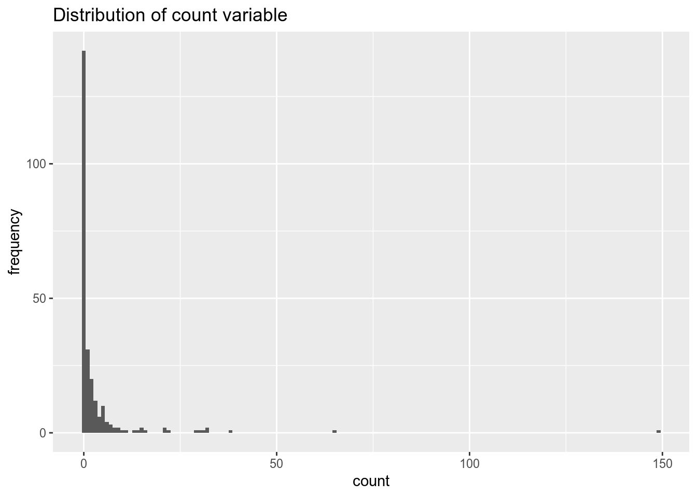

# Модели счетных данных {#poisreg}


Загрузим необходимые пакеты.

```r
library(tidyverse) #работа с данными и графики
library(skimr) #красивое summary
library(rio) #чтение .dta файлов
library(vcd) #еще графики
library(MASS) #отрицательное биномиальное
```

Импортируем данные. Данные содержат информацию о количестве рыбы, пойманной людьми находящимися на отдыхе. 

Camper - наличие/отсутсвие палатки.
Child - количество детей, которых взяли на рыбалку.
Persons - количество людей в группе.
Count - количество пойманной рыбы


```r
df = import(file = "fish.dta")
```

Посмотрим нам описательные статистики. Переменная camper принимает всего два значения, поэтому превратим ее в факторную переменную.

```r
skim_with(numeric = list(hist = NULL, p25 = NULL, p75 = NULL))
skim(df)
```

```
Skim summary statistics
 n obs: 250 
 n variables: 4 

-- Variable type:numeric --------------------------------------------------------------------------------------------------------------------
 variable missing complete   n mean    sd p0 p50 p100
   camper       0      250 250 0.59  0.49  0   1    1
    child       0      250 250 0.68  0.85  0   0    3
    count       0      250 250 3.3  11.64  0   0  149
  persons       0      250 250 2.53  1.11  1   2    4
```

```r
df$camper = factor(df$camper)
```


Наша задача - по имеющимся данным предсказать улов. Для начала посмотрим на распределение объясняемой переменной `count`.

```r
ggplot(df, aes(x = count)) + geom_histogram(binwidth = 1) + labs(x = 'count', y = 'frequency')
```



Предположим, что переменная имеет распределение Пуассона. Будем использовать пуассоновскую регрессию.

```r
poisson = glm(count ~ child + camper +  persons, family = "poisson", data = df)
summary(poisson)
```

```

Call:
glm(formula = count ~ child + camper + persons, family = "poisson", 
    data = df)

Deviance Residuals: 
    Min       1Q   Median       3Q      Max  
-6.8096  -1.4431  -0.9060  -0.0406  16.1417  

Coefficients:
            Estimate Std. Error z value Pr(>|z|)    
(Intercept) -1.98183    0.15226  -13.02   <2e-16 ***
child       -1.68996    0.08099  -20.87   <2e-16 ***
camper1      0.93094    0.08909   10.45   <2e-16 ***
persons      1.09126    0.03926   27.80   <2e-16 ***
---
Signif. codes:  0 '***' 0.001 '**' 0.01 '*' 0.05 '.' 0.1 ' ' 1

(Dispersion parameter for poisson family taken to be 1)

    Null deviance: 2958.4  on 249  degrees of freedom
Residual deviance: 1337.1  on 246  degrees of freedom
AIC: 1682.1

Number of Fisher Scoring iterations: 6
```

Однако, заметим, что дисперсия и среднее значение объясняемой переменной не равны, как это предполагает распределение Пуассона.

```r
with(df, tapply(count, camper, mean))
```

```
       0        1 
1.524272 4.537415 
```

```r
with(df, tapply(count, camper, var))
```

```
        0         1 
 21.05578 212.40099 
```

Оценим регрессию, предполагая отрицательное биномиальное распределение остатков. В этом случае, дисперсия распределения зависит от некоторого параметра и не равна среднему.

```r
nb1 = glm.nb(count ~ child + camper +  persons, data = df)
summary(nb1)
```

```

Call:
glm.nb(formula = count ~ child + camper + persons, data = df, 
    init.theta = 0.4635287626, link = log)

Deviance Residuals: 
    Min       1Q   Median       3Q      Max  
-1.6673  -0.9599  -0.6590  -0.0319   4.9433  

Coefficients:
            Estimate Std. Error z value Pr(>|z|)    
(Intercept)  -1.6250     0.3304  -4.918 8.74e-07 ***
child        -1.7805     0.1850  -9.623  < 2e-16 ***
camper1       0.6211     0.2348   2.645  0.00816 ** 
persons       1.0608     0.1144   9.273  < 2e-16 ***
---
Signif. codes:  0 '***' 0.001 '**' 0.01 '*' 0.05 '.' 0.1 ' ' 1

(Dispersion parameter for Negative Binomial(0.4635) family taken to be 1)

    Null deviance: 394.25  on 249  degrees of freedom
Residual deviance: 210.65  on 246  degrees of freedom
AIC: 820.44

Number of Fisher Scoring iterations: 1

              Theta:  0.4635 
          Std. Err.:  0.0712 

 2 x log-likelihood:  -810.4440 
```

В summary видим, что для nb модели значение AIC меньше, чем для модели с пуассоновским распределением остатков.


Попробуем исключить из модели переменную `camper` и сравним качество двух моделей.

```r
nb2 = update(nb1, . ~ . - camper)
anova(nb1, nb2)
```

```
Likelihood ratio tests of Negative Binomial Models

Response: count
                     Model     theta Resid. df    2 x log-lik.   Test
1          child + persons 0.4348425       247       -817.0372       
2 child + camper + persons 0.4635288       246       -810.4440 1 vs 2
     df LR stat.    Pr(Chi)
1                          
2     1 6.593172 0.01023706
```

С помошью теста отношения правдоподобия сравним оценки пуассоновской и отрицательной биномиальной регрессий.


```r
lr = 2*(logLik(nb1) - logLik(poisson))
2*pchisq(lr, df = 1, lower.tail = FALSE)
```

```
'log Lik.' 1.527587e-189 (df=5)
```


#### То же самое в стате

Загружаем данные и смотрим описательные статистики.

```stata
use fish.dta
summarize
```

```
    Variable |       Obs        Mean    Std. Dev.       Min        Max
-------------+--------------------------------------------------------
      camper |       250        .588    .4931824          0          1
       child |       250        .684    .8503153          0          3
       count |       250       3.296    11.63503          0        149
     persons |       250       2.528     1.11273          1          4
```


```stata
use fish.dta
summarize
```

```
    Variable |       Obs        Mean    Std. Dev.       Min        Max
-------------+--------------------------------------------------------
      camper |       250        .588    .4931824          0          1
       child |       250        .684    .8503153          0          3
       count |       250       3.296    11.63503          0        149
     persons |       250       2.528     1.11273          1          4
```


```stata
hist count
```

```
(bin=15, start=0, width=9.9333333)
```

Строим Пуассоновскую регрессию.
$AIC = -2log(L) + 2k$
$AIC = -2log(L) + klog(N)$

```stata
glm count camper child persons, family(poisson)
```

```
Iteration 0:   log likelihood = -965.92815  
Iteration 1:   log likelihood = -837.97093  
Iteration 2:   log likelihood = -837.07307  
Iteration 3:   log likelihood = -837.07248  
Iteration 4:   log likelihood = -837.07248  

Generalized linear models                          No. of obs      =      
>  250
Optimization     : ML                              Residual df     =      
>  246
                                                   Scale parameter =      
>    1
Deviance         =  1337.079644                    (1/df) Deviance =  5.43
> 5283
Pearson          =  2910.627049                    (1/df) Pearson  =  11.8
> 3182

Variance function: V(u) = u                        [Poisson]
Link function    : g(u) = ln(u)                    [Log]

                                                   AIC             =   6.7
> 2858
Log likelihood   = -837.0724803                    BIC             = -21.1
> 9974

--------------------------------------------------------------------------
> ----
             |                 OIM
       count |      Coef.   Std. Err.      z    P>|z|     [95% Conf. Inter
> val]
-------------+------------------------------------------------------------
> ----
      camper |   .9309359   .0890869    10.45   0.000     .7563289    1.10
> 5543
       child |  -1.689957   .0809922   -20.87   0.000    -1.848699   -1.53
> 1215
     persons |   1.091262   .0392553    27.80   0.000     1.014323    1.16
> 8201
       _cons |  -1.981827    .152263   -13.02   0.000    -2.280257   -1.68
> 3397
--------------------------------------------------------------------------
> ----
```


Можем посчитать AIC и BIC по другой формуле, аналогично выводу R.
$AIC = \frac {-2log(L) + 2k}{N}$

```stata
estat ic
```

```
Akaike's information criterion and Bayesian information criterion

--------------------------------------------------------------------------
> ---
       Model |    Obs    ll(null)   ll(model)     df          AIC         
> BIC
-------------+------------------------------------------------------------
> ---
           . |    250           .   -837.0725      4     1682.145    1696.
> 231
--------------------------------------------------------------------------
> ---
               Note:  N=Obs used in calculating BIC; see [R] BIC note
```

#предсказание
newData = data.frame(camper = factor(0:1, levels = 0:1), child = sample(0:6, 100, replace = TRUE), persons = sample(0:4, 100, replace = TRUE))
skim(newData)
G <- predict(poisson, newdata = newData, type = "link", se = TRUE)
newData$fit <- exp(G$fit)
newData$ciup <- exp(G$fit + 1.96*G$se.fit)
newData$cilow <- exp(G$fit - 1.96*G$se.fit)
head(newData)
hist(newData$fit, breaks = 100)

