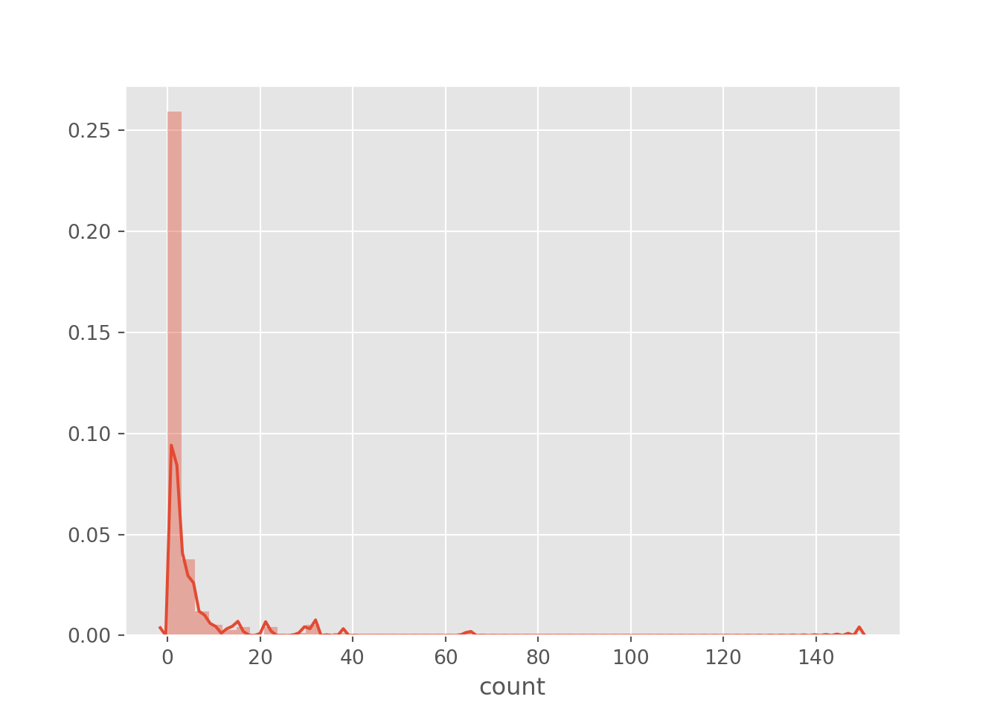

# Модели счетных данных {#poisreg}


Загрузим необходимые пакеты.

```r
library(tidyverse) #работа с данными и графики
library(skimr) #красивое summary
library(rio) #чтение .dta файлов
library(vcd) #еще графики
library(MASS) #отрицательное биномиальное
library(lmtest) #для проверки гипотез
library(pscl) #zero-inflation function
```

```
Error in library(pscl): there is no package called 'pscl'
```

```r
library(margins) #для подсчета предельных эффектов
```

```
Error in library(margins): there is no package called 'margins'
```

Импортируем данные.

```r
df = import(file = "fish.dta")
```
Данные содержат информацию о количестве рыбы, пойманной людьми на отдыхе. 

Camper - наличие/отсутсвие палатки.
Child - количество детей, которых взяли на рыбалку.
Persons - количество людей в группе.
Count - количество пойманной рыбы


Посмотрим нам описательные статистики. 

```r
skim_with(numeric = list(hist = NULL, p25 = NULL, p75 = NULL))
skim(df)
```

```
Skim summary statistics
 n obs: 250 
 n variables: 4 

── Variable type:numeric ─────────────────────────────────────────────────────────────────────────────────────────────────────────────────────────
 variable missing complete   n mean    sd p0 p50 p100
   camper       0      250 250 0.59  0.49  0   1    1
    child       0      250 250 0.68  0.85  0   0    3
    count       0      250 250 3.3  11.64  0   0  149
  persons       0      250 250 2.53  1.11  1   2    4
```

Переменная `camper` принимает всего два значения, поэтому превратим ее в факторную переменную.


```r
df = mutate(df, camper = factor(camper))
```

Наша задача - по имеющимся данным предсказать улов. Для начала посмотрим на распределение объясняемой переменной `count`.

```r
ggplot(df, aes(x = count)) + geom_histogram(binwidth = 1) + labs(x = 'count', y = 'frequency', title = 'Distribution of count variable')
```


Предположим, что переменная имеет распределение Пуассона. Будем использовать пуассоновскую регрессию. 
\[
P(y=k)=exp(-\lambda) \lambda^k / k!
\]
где $\lambda=\exp(b_1 +b_2*x)$


```r
poisson = glm(count ~ child + camper +  persons, family = "poisson", data = df)
summary(poisson)
```

```

Call:
glm(formula = count ~ child + camper + persons, family = "poisson", 
    data = df)

Deviance Residuals: 
    Min       1Q   Median       3Q      Max  
-6.8096  -1.4431  -0.9060  -0.0406  16.1417  

Coefficients:
            Estimate Std. Error z value Pr(>|z|)    
(Intercept) -1.98183    0.15226  -13.02   <2e-16 ***
child       -1.68996    0.08099  -20.87   <2e-16 ***
camper1      0.93094    0.08909   10.45   <2e-16 ***
persons      1.09126    0.03926   27.80   <2e-16 ***
---
Signif. codes:  0 '***' 0.001 '**' 0.01 '*' 0.05 '.' 0.1 ' ' 1

(Dispersion parameter for poisson family taken to be 1)

    Null deviance: 2958.4  on 249  degrees of freedom
Residual deviance: 1337.1  on 246  degrees of freedom
AIC: 1682.1

Number of Fisher Scoring iterations: 6
```

Посчитаем средний предельный эффект для каждой переменной.

```r
colMeans(marginal_effects(poisson))
```

```
Error in marginal_effects(poisson): could not find function "marginal_effects"
```

Однако, заметим, что дисперсия и среднее значение объясняемой переменной не равны, как это предполагает распределение Пуассона.

```r
df %>% group_by(camper) %>% summarize(var = var(count), mean = mean(count))
```

```
# A tibble: 2 x 3
  camper   var  mean
  <fct>  <dbl> <dbl>
1 0       21.1  1.52
2 1      212.   4.54
```

Оценим регрессию, предполагая отрицательное биномиальное распределение остатков. В этом случае, дисперсия распределения зависит от некоторого параметра и не равна среднему.


```r
nb1 = glm.nb(count ~ child + camper +  persons, data = df)
summary(nb1)
```

```

Call:
glm.nb(formula = count ~ child + camper + persons, data = df, 
    init.theta = 0.4635287626, link = log)

Deviance Residuals: 
    Min       1Q   Median       3Q      Max  
-1.6673  -0.9599  -0.6590  -0.0319   4.9433  

Coefficients:
            Estimate Std. Error z value Pr(>|z|)    
(Intercept)  -1.6250     0.3304  -4.918 8.74e-07 ***
child        -1.7805     0.1850  -9.623  < 2e-16 ***
camper1       0.6211     0.2348   2.645  0.00816 ** 
persons       1.0608     0.1144   9.273  < 2e-16 ***
---
Signif. codes:  0 '***' 0.001 '**' 0.01 '*' 0.05 '.' 0.1 ' ' 1

(Dispersion parameter for Negative Binomial(0.4635) family taken to be 1)

    Null deviance: 394.25  on 249  degrees of freedom
Residual deviance: 210.65  on 246  degrees of freedom
AIC: 820.44

Number of Fisher Scoring iterations: 1

              Theta:  0.4635 
          Std. Err.:  0.0712 

 2 x log-likelihood:  -810.4440 
```

Попробуем исключить из модели переменную `camper` и сравним качество двух моделей.

```r
nb2 = update(nb1, . ~ . - camper)
waldtest(nb1, nb2)
```

```
Wald test

Model 1: count ~ child + camper + persons
Model 2: count ~ child + persons
  Res.Df Df      F   Pr(>F)   
1    246                      
2    247 -1 6.9979 0.008686 **
---
Signif. codes:  0 '***' 0.001 '**' 0.01 '*' 0.05 '.' 0.1 ' ' 1
```


Можем посмотреть на результаты модели с "раздутыми нулями" (zero-inflated). Они предполагают большую частоту нулевых наблюдений.

```r
zero_infl = zeroinfl(count ~ child + camper | persons, data = df, dist = 'negbin')
```

```
Error in zeroinfl(count ~ child + camper | persons, data = df, dist = "negbin"): could not find function "zeroinfl"
```

```r
summary(zero_infl)
```

```
Error in summary(zero_infl): object 'zero_infl' not found
```


#### То же самое в стате

Загружаем данные и смотрим описательные статистики.


```stata
use fish.dta
summarize
```

```
no; data in memory would be lost
r(4);

end of do-file
r(4);
```


```stata
hist count
```

```
 no; data in memory would be lost
r(4);


variable count not found
r(111);

end of do-file
r(111);
```

Строим Пуассоновскую регрессию. 
В описательных статистиках:
$AIC = -2log(L) + 2k$
$AIC = -2log(L) + klog(N)$


```stata
glm count camper child persons, family(poisson)
```

```
 no; data in memory would be lost
r(4);


variable count not found
r(111);

end of do-file
r(111);
```

Можем посчитать AIC и BIC по другой формуле, аналогично выводу R.
$AIC = \frac {-2log(L) + 2k}{N}$

```stata
estat ic
```

```
 no; data in memory would be lost
r(4);


Akaike's information criterion and Bayesian information criterion

-----------------------------------------------------------------------------
       Model |        Obs  ll(null)  ll(model)      df         AIC        BIC
-------------+---------------------------------------------------------------
           . |        120  109.6972   136.1825       2   -268.3649  -262.7899
-----------------------------------------------------------------------------
               Note: N=Obs used in calculating BIC; see [R] BIC note.
```

Посмотрим, равны ли среднее значение и дисперсия, как это предполагает распределение Пуассона.

```stata
tabstat count, by(camper) stat(mean, variance) nototal
```

```
 no; data in memory would be lost
r(4);


variable count not found
r(111);

end of do-file
r(111);
```

Предположим, что остатки имеют отрицательное биномиальное распределение.

```stata
nbreg count child camper persons
```

```
 no; data in memory would be lost
r(4);


variable count not found
r(111);

end of do-file
r(111);
```
 
Проверим гипотезу о равенстве 0 коэффицинта при переменной `camper`. Проведем тест Вальда.

```stata
quietly: nbreg count child i.camper persons #скрыть вывод регрессии
test i.camper 
```

```
 no; data in memory would be lost
r(4);


variable count not found
r(111);

end of do-file
r(111);
```

Посчитаем средний предельный эффект для каждоый переменной.

```stata
margins, dydx(*)
```

```
 no; data in memory would be lost
r(4);


Average marginal effects                        Number of obs     =        120
Model VCE    : OLS

Expression   : Linear prediction, predict()
dy/dx w.r.t. : x

------------------------------------------------------------------------------
             |            Delta-method
             |      dy/dx   Std. Err.      t    P>|t|     [95% Conf. Interval]
-------------+----------------------------------------------------------------
           x |   .8481496   .1048138     8.09   0.000     .6405898    1.055709
------------------------------------------------------------------------------
```

И модель с раздутыми нулями.

```stata
zinb count child i.camper, inflate(persons)
```

```
 no; data in memory would be lost
r(4);


variable count not found
r(111);

end of do-file
r(111);
```


#### То же самое в python

Нужные пакетики:

```python
import seaborn as sns
import matplotlib.pyplot as plt
import numpy as np
import pandas as pd
plt.style.use('ggplot')
```

Загружаем данные и смотрим описательные статистики.

```python
df_fish = pd.read_stata('fish.dta')
```


```python
sns.distplot(df_fish['count'])
plt.show()
```



Превращаем переменную `camper` в категориальную.

```python
df_fish['camper']=df_fish['camper'].astype('category')
```

Строим Пуассоновскую регрессию.

```python
regr_pois = smf.glm('count ~ child + camper +  persons', data=df_fish,
                    family=sm.families.Poisson(link=sm.families.links.log)).fit()
```

```
Error in py_call_impl(callable, dots$args, dots$keywords): NameError: name 'smf' is not defined

Detailed traceback: 
  File "<string>", line 1, in <module>
```

```python
regr_pois.summary()
```

```
Error in py_call_impl(callable, dots$args, dots$keywords): NameError: name 'regr_pois' is not defined

Detailed traceback: 
  File "<string>", line 1, in <module>
```

Посмотрим, равны ли среднее значение и дисперсия, как это предполагает распределение Пуассона.

```python
(df_fish
 .filter(['count', 'camper'])
 .groupby('camper')
 .agg(['mean', 'var']))
```

```
           count            
            mean         var
camper                      
0       1.524272   21.055778
1       4.537415  212.400988
```

И регрессию с остатками, имеющими отрицательное биномиальное распределение.

```python
regr_bin = smf.glm('count ~ child + camper +  persons', data=df_fish,
              family=sm.families.NegativeBinomial(link=sm.families.links.log)).fit()
```

```
Error in py_call_impl(callable, dots$args, dots$keywords): NameError: name 'smf' is not defined

Detailed traceback: 
  File "<string>", line 1, in <module>
```
 
Проверим гипотезу о равенстве 0 коэффициента при переменной `camper`. Проведем тест Вальда.

```python
hyp = '(camper = 0)'
regr_bin.wald_test(hyp)
```

```
Error in py_call_impl(callable, dots$args, dots$keywords): NameError: name 'regr_bin' is not defined

Detailed traceback: 
  File "<string>", line 1, in <module>
```

Посчитаем средний предельный эффект для каждой переменной.

```python
pred = regr_pois.fittedvalues
```

```
Error in py_call_impl(callable, dots$args, dots$keywords): NameError: name 'regr_pois' is not defined

Detailed traceback: 
  File "<string>", line 1, in <module>
```

```python
mean_mef_child = np.mean([regr_pois.params[1] * p for p in pred])
```

```
Error in py_call_impl(callable, dots$args, dots$keywords): NameError: name 'pred' is not defined

Detailed traceback: 
  File "<string>", line 1, in <module>
```

```python
mean_mef_camper = np.mean([regr_pois.params[2] * p for p in pred])
```

```
Error in py_call_impl(callable, dots$args, dots$keywords): NameError: name 'pred' is not defined

Detailed traceback: 
  File "<string>", line 1, in <module>
```

```python
data_1 = pd.DataFrame({'child': df_fish['child'], 'camper': 1, 'persons': df_fish['persons']})
data_0 = pd.DataFrame({'child': df_fish['child'], 'camper': 0, 'persons': df_fish['persons']})
mean_mef_persons = np.mean([(regr_pois.predict(data_1)[i]-regr_pois.predict(data_0)[i]) 
                            for i in range(len(df_fish))])
```

```
Error in py_call_impl(callable, dots$args, dots$keywords): NameError: name 'regr_pois' is not defined

Detailed traceback: 
  File "<string>", line 2, in <module>
  File "<string>", line 2, in <listcomp>
```

И модель с раздутыми нулями.

```python
1
```

```
1
```


Проблемы:

2) предельные эффекты в Питоне
3) clogit ВООБЩЕ НЕ ПОЛУЧАЕТСЯ

