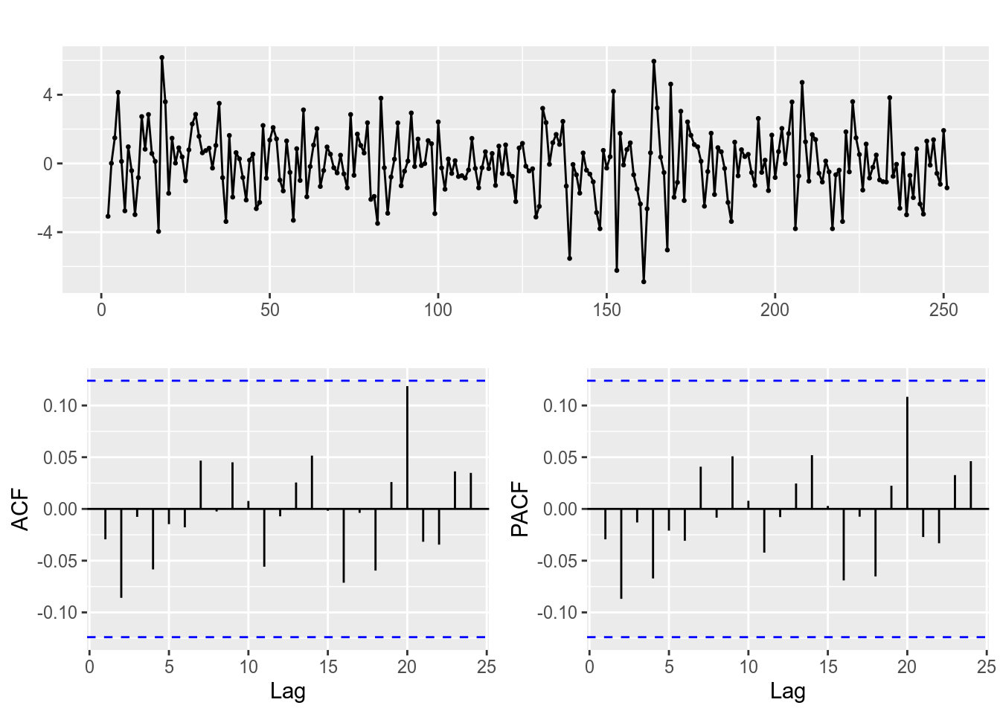

# ARMA {#arma}

> Достигнем просветления в анализе временных рядов вместе с нашими друзьями, Stata, R и Python!
В качестве анализируемых наблюдений используем данные по стоимости акций коммапнии `Apple` c 2015-01-01 по 2015-12-31: цена открытия/ закрытия, минимальная/ максимальная цены, объём и скорректиованная цена.


## R

Традиционно начнём в **r**.


Загрузим необходимые пакеты:


```r
library(xts) # работа с временными рядами
library(dplyr) # манипуляции с данными
library(ggplot2) # построение графиков
library(aTSA) # тест Дики-Фуллера
library(forecast) # прогнозирование ARMA-моделей
library(quantmod) # импортирование набора данных из интернета
library(lmtest) # проверка гипотез
```

Импортируем dataset `AAPL` прямо из пакета `quantmod`. Будем анализировать одномерный временной ряд от переменной `AAPL. Close`.


```r
getSymbols("AAPL",from = "2015-01-01",to = "2015-12-31")
```

```
[1] "AAPL"
```

Обозначим исследуемый набор данных как `apple_df`. 


```r
apple_df = AAPL$AAPL.Close
```

Визуализируем изучаемый временной ряд, его автокорреляционную и частную автокорреляционную функции.


```r
ggtsdisplay(apple_df)
```


По графику видим, что процесс напоминает случайное блуждание: медленно убывает автокорреляционная функция, первый лаг частной автокорреляционной функции не входит в доверительный интервал, остальные - входят.

Проверим стационарность ряда тестом Дики - Фуллера.


```r
adf.test(apple_df)
```

```
Augmented Dickey-Fuller Test 
alternative: stationary 
 
Type 1: no drift no trend 
     lag    ADF p.value
[1,]   0 0.0708   0.664
[2,]   1 0.1616   0.690
[3,]   2 0.1670   0.692
[4,]   3 0.1321   0.682
[5,]   4 0.0120   0.647
Type 2: with drift no trend 
     lag  ADF p.value
[1,]   0 2.15    0.99
[2,]   1 2.06    0.99
[3,]   2 2.24    0.99
[4,]   3 2.35    0.99
[5,]   4 2.65    0.99
Type 3: with drift and trend 
     lag  ADF p.value
[1,]   0 1.75    0.99
[2,]   1 1.53    0.99
[3,]   2 1.64    0.99
[4,]   3 1.77    0.99
[5,]   4 2.17    0.99
---- 
Note: in fact, p.value = 0.01 means p.value <= 0.01 
```

Тест выявил нестационарность на 5% уровне значимости (основная гипотеза – о нестационарности ряда).

Возьмём первую разность от ряда, чтобы сделать его стационарным (ведь только стационарные процессы могут быть описаны моделью `ARMA (p, q)` ) и снова построим автокорреляционную и частную автокорреляционную функции.


```r
apple_diff = diff(apple_df)
ggtsdisplay(apple_diff)
```



```r
summary(apple_diff)
```

```
     Index              AAPL.Close      
 Min.   :2015-01-02   Min.   :-6.89000  
 1st Qu.:2015-04-04   1st Qu.:-1.02500  
 Median :2015-07-02   Median :-0.07500  
 Mean   :2015-07-02   Mean   :-0.00804  
 3rd Qu.:2015-09-30   3rd Qu.: 1.14499  
 Max.   :2015-12-30   Max.   : 6.17000  
                      NA's   :1         
```

Ряд похож на стационарный. 
Теперь построим несколько моделей, которые потенциально могут описать данный ряд, хотя уже заранее ожидается, что ряд в разностях будет описан `ARIMA (0, 0, 0)`, что равносильно `ARMA(0, 0)`, но всё же...

`ARIMA (0, 0, 0)`:


```r
arima_000 = arima(apple_diff, order = c(0, 0, 0))
summary(arima_000)
```

```

Call:
arima(x = apple_diff, order = c(0, 0, 0))

Coefficients:
      intercept
        -0.0080
s.e.     0.1244

sigma^2 estimated as 3.867:  log likelihood = -523.79,  aic = 1051.58

Training set error measures:
                       ME     RMSE      MAE      MPE     MAPE      MASE
Training set 8.078552e-15 1.966425 1.495158 99.55996 99.55996 0.6825331
                    ACF1
Training set -0.02936922
```

Построим также модель `ARIMA (1, 0, 0)` , что равносильно `ARMA (1, 0)`, для сравнения.


```r
arima_100 = arima(apple_diff, order = c(1, 0, 0))
summary(arima_100)
```

```

Call:
arima(x = apple_diff, order = c(1, 0, 0))

Coefficients:
          ar1  intercept
      -0.0296    -0.0075
s.e.   0.0635     0.1208

sigma^2 estimated as 3.863:  log likelihood = -523.68,  aic = 1053.36

Training set error measures:
                        ME     RMSE      MAE      MPE     MAPE      MASE
Training set -0.0003728078 1.965566 1.491983 94.09101 105.0814 0.6810838
                     ACF1
Training set -0.002372191
```

```r
coeftest(arima_100)
```

```

z test of coefficients:

            Estimate Std. Error z value Pr(>|z|)
ar1       -0.0296313  0.0634712 -0.4668   0.6406
intercept -0.0075101  0.1207545 -0.0622   0.9504
```

По информационному критерию Акаике первая модель лучше (AIC меньше), а также во второй модели коэффициент перед ar(1) незначим. 

Получается, что (как и ожидалось) первая модель лучше.
Можно схитрить и использовать функцию автоподбора коэффициентов модели ARIMA.


```r
arima_auto_model = auto.arima(apple_diff)
summary(arima_auto_model)
```

```
Series: apple_diff 
ARIMA(0,0,0) with zero mean 

sigma^2 estimated as 3.867:  log likelihood=-523.79
AIC=1049.58   AICc=1049.6   BIC=1053.1

Training set error measures:
                       ME     RMSE     MAE       MPE     MAPE      MASE
Training set -0.008040008 1.966441 1.49548 -37.76185 445.4945 0.6841274
                    ACF1
Training set -0.02936922
```

Такая функция автоматически минимизирует критерий Акаике. 
Заметим, что автоподбор выдал модель `ARIMA (0, 0, 0)` для первой разности.

Теперь проверим остатки модели `ARIMA (0, 0, 0)` на белошумность. 
Сохраним остатки и проделаем тест Льюнг - Бокса, в котором основная гипотеза - остатки независимы. 

Сохраним остатки модели `ARIMA (0, 0, 0)` и построим тест Льюнг - Бокса (если наблюдений мало, то используем опцию `Box-Pierce`).


```r
res_arima_000 = resid(arima_000)
Box.test(res_arima_000, lag = 10, type = "Ljung-Box")
```

```

	Box-Ljung test

data:  res_arima_000
X-squared = 4.2362, df = 10, p-value = 0.9361
```

Основная гипотеза об отсутствии автокорреляции остатков отвергается, следовательно, модель корректно описывает структуру автокорреляции.

Время небольших фактов: Льюнг - это женщина-статистик!
Поэтому правильно склонять "Льюнг - Бокса", а не "Льюнга - Бокса"!

<center>


</center>

Можно ещё также научиться оценивать визуально, где лежат корни AR и MA (`unit root test`). 
Так как для построенной модели нет AR и MA частей (`ARIMA (0, 0, 0)`), то можно применить команду к, например, `ARIMA (1, 0, 0)`:


```r
autoplot(arima_100)
```


Построим прогноз на 3 периода вперёд для модели `arima_000`. 
Визуализируем прогноз, границы 80% и 95% доверительного интервалов.


```r
forecast(arima_000, h = 10) %>%
autoplot()
```


## Python

Настало время **python**!


Импортируем необходимые пакеты.


```python
import numpy as np
import pandas as pd
import quandl # импортирование данных из Сети
import datetime # работа с форматами даты и времени
import matplotlib.pyplot as plt # построение графиков
from pandas import Series # работа с временными рядами
import statsmodels
from statsmodels.tsa.arima_model import ARMA # ARMA-модели
from statsmodels.graphics.tsaplots import plot_acf # построение графика acf
from statsmodels.graphics.tsaplots import plot_pacf # построение графика pacf
import statsmodels.api as sm
from statsmodels.stats import diagnostic as diag # тесты
import pmdarima as pm
from pmdarima.arima import auto_arima # автоподбор коэффициентов модели ARIMA
from statsmodels.tsa.stattools import adfuller # тест Дики-Фуллера
```

Загрузим набор данных:


```python
start = datetime.datetime(2015, 1, 1)
end = datetime.datetime(2015, 12, 31)
apple = quandl.get("WIKI/" + "AAPL", start_date=start, end_date=end)
```

Проверим загрузку данных. Будем анализировать цену закрытия.


```python
apple.head()
```

```
              Open    High      Low  ...    Adj. Low  Adj. Close  Adj. Volume
Date                                 ...                                     
2015-01-02  111.39  111.44  107.350  ...  101.982949  103.863957   53204626.0
2015-01-05  108.29  108.65  105.410  ...  100.139941  100.937944   64285491.0
2015-01-06  106.54  107.43  104.630  ...   99.398938  100.947444   65797116.0
2015-01-07  107.20  108.20  106.695  ...  101.360696  102.362951   40105934.0
2015-01-08  109.23  112.15  108.700  ...  103.265455  106.295968   59364547.0

[5 rows x 12 columns]
```

```python
apple_df = apple["Close"]
```

Посмотрим на структуру временного ряда, автокорреляционную и частную автокорреляционную функции.


```python
apple_df.plot(grid=True)
plt.title("Структурa временного ряда")
plt.show()
```


```python
plot_acf(apple_df, lags=20)
plt.show()
```


```python
plot_pacf(apple_df, lags=20)
plt.show()
```


Появились очень знакомые (и красивые) графики. 
Важно отметить, что на графиках есть 0 - лаг, он равен единице, в предыдущих графиках его не было.

Проверим стационарность ряда тестом Дики-Фуллера.


```python
res = sm.tsa.adfuller(apple_df, regression="ct")
"p-value:{}".format(res[1])
```

```
'p-value:0.23195078841554445'
```

Возьмём первую разность и уберём пропущенные наблюдения.


```python
apple_diff = apple_df.diff(periods=1).dropna()
```

И визуализируем структуру нового ряда.


```python
apple_diff.plot(grid=True)
plt.title("Структурa временного ряда")
plt.show()
```


```python
plot_acf(apple_diff, lags=50)
plt.show()
```


```python
plot_pacf(apple_diff, lags=50)
plt.show()
```


Аналогично операциям в **r**, смоделируем данный ряд как `ARMA (0, 0)`.


```python
arma_00 = ARMA(apple_diff, order=(0, 0))
```

```
C:\Users\Yuliya\AppData\Local\Programs\Python\Python37\lib\site-packages\statsmodels\tsa\base\tsa_model.py:225: ValueWarning: A date index has been provided, but it has no associated frequency information and so will be ignored when e.g. forecasting.
  ' ignored when e.g. forecasting.', ValueWarning)
```

```python
arma_00_fit = arma_00.fit(disp=False)
arma_00_fit.summary()
```

```
<class 'statsmodels.iolib.summary.Summary'>
"""
                              ARMA Model Results                              
==============================================================================
Dep. Variable:                  Close   No. Observations:                  251
Model:                     ARMA(0, 0)   Log Likelihood                -525.777
Method:                           css   S.D. of innovations              1.966
Date:                Sat, 18 Jan 2020   AIC                           1055.555
Time:                        00:45:59   BIC                           1062.606
Sample:                             0   HQIC                          1058.392
                                                                              
==============================================================================
                 coef    std err          z      P>|z|      [0.025      0.975]
------------------------------------------------------------------------------
const         -0.0162      0.124     -0.131      0.896      -0.259       0.227
==============================================================================
"""
```

Смоделируем ряд как `ARMA (1, 0)`:


```python
arma_10 = ARMA(apple_diff, order=(1, 0))
```

```
C:\Users\Yuliya\AppData\Local\Programs\Python\Python37\lib\site-packages\statsmodels\tsa\base\tsa_model.py:225: ValueWarning: A date index has been provided, but it has no associated frequency information and so will be ignored when e.g. forecasting.
  ' ignored when e.g. forecasting.', ValueWarning)
```

```python
arma_10_fit = arma_10.fit(disp=False)
arma_10_fit.summary()
```

```
<class 'statsmodels.iolib.summary.Summary'>
"""
                              ARMA Model Results                              
==============================================================================
Dep. Variable:                  Close   No. Observations:                  251
Model:                     ARMA(1, 0)   Log Likelihood                -525.704
Method:                       css-mle   S.D. of innovations              1.965
Date:                Sat, 18 Jan 2020   AIC                           1057.408
Time:                        00:45:59   BIC                           1067.984
Sample:                             0   HQIC                          1061.664
                                                                              
===============================================================================
                  coef    std err          z      P>|z|      [0.025      0.975]
-------------------------------------------------------------------------------
const          -0.0157      0.121     -0.130      0.897      -0.253       0.222
ar.L1.Close    -0.0243      0.063     -0.383      0.702      -0.149       0.100
                                    Roots                                    
=============================================================================
                  Real          Imaginary           Modulus         Frequency
-----------------------------------------------------------------------------
AR.1          -41.1210           +0.0000j           41.1210            0.5000
-----------------------------------------------------------------------------
"""
```

Вторая модель имеет более высокое значение критерия Акаике и незначимый коэффициент перед ar(1).

Отдельно можно выделить значения AIC и BIC для построенных моделей.


```python
np.round(arma_00_fit.aic, 2)
```

```
1055.55
```

```python
np.round(arma_10_fit.aic, 2)
```

```
1057.41
```


```python
np.round(arma_00_fit.bic, 2)
```

```
1062.61
```

```python
np.round(arma_10_fit.bic, 2)
```

```
1067.98
```

Как и в **r**, **python** имеет опцию автоподбора коэффициентов модели `ARIMA`.


```python
auto_arima_python = pm.auto_arima(apple_diff)
```

```
C:\Users\Yuliya\AppData\Local\Programs\Python\Python37\lib\site-packages\statsmodels\tsa\statespace\representation.py:375: FutureWarning: Using a non-tuple sequence for multidimensional indexing is deprecated; use `arr[tuple(seq)]` instead of `arr[seq]`. In the future this will be interpreted as an array index, `arr[np.array(seq)]`, which will result either in an error or a different result.
  return matrix[[slice(None)]*(matrix.ndim-1) + [0]]
C:\Users\Yuliya\AppData\Local\Programs\Python\Python37\lib\site-packages\statsmodels\tsa\statespace\representation.py:375: FutureWarning: Using a non-tuple sequence for multidimensional indexing is deprecated; use `arr[tuple(seq)]` instead of `arr[seq]`. In the future this will be interpreted as an array index, `arr[np.array(seq)]`, which will result either in an error or a different result.
  return matrix[[slice(None)]*(matrix.ndim-1) + [0]]
```

```python
auto_arima_python.summary()
```

```
<class 'statsmodels.iolib.summary.Summary'>
"""
                           Statespace Model Results                           
==============================================================================
Dep. Variable:                      y   No. Observations:                  251
Model:                        SARIMAX   Log Likelihood                -525.777
Date:                Sat, 18 Jan 2020   AIC                           1055.555
Time:                        00:46:00   BIC                           1062.606
Sample:                             0   HQIC                          1058.392
                                - 251                                         
Covariance Type:                  opg                                         
==============================================================================
                 coef    std err          z      P>|z|      [0.025      0.975]
------------------------------------------------------------------------------
intercept     -0.0162      0.124     -0.131      0.896      -0.260       0.227
sigma2         3.8635      0.285     13.563      0.000       3.305       4.422
===================================================================================
Ljung-Box (Q):                       29.94   Jarque-Bera (JB):                 9.55
Prob(Q):                              0.88   Prob(JB):                         0.01
Heteroskedasticity (H):               0.88   Skew:                            -0.09
Prob(H) (two-sided):                  0.55   Kurtosis:                         3.94
===================================================================================

Warnings:
[1] Covariance matrix calculated using the outer product of gradients (complex-step).
"""
```

В строчке `SARIMAX` нет рядом коэффициентов. 
Это означает, что они нулевые, как и предполагалось, то есть модель описывается `ARMA (0, 0)`.
Эта функция также удобна тем, что выводит статистики.

Проверим белошумность остатков тестом Льюнг - Бокса.

Сохраним остатки как `residuals`. Построим тест Льюнг-Бокса (опция `boxpierce=False`) (если наблюдений мало, то используем опцию `Box-Pierce`).


```python
residuals = pd.DataFrame(arma_00_fit.resid)
diag.acorr_ljungbox(residuals, lags=10, boxpierce=False)
```

```
(array([0.14719804, 2.2301318 , 2.23871226, 3.09884873, 3.18193505,
       3.24119693, 3.68529998, 3.69140909, 4.34844736, 4.35831357]), array([0.70122752, 0.32789367, 0.52436357, 0.54142173, 0.67196005,
       0.77802184, 0.81522682, 0.8838376 , 0.88701969, 0.92973867]))
```

Посмотрим на прогноз на 10 дней вперёд.


```python
forecast = arma_00_fit.forecast(steps=10)[0]
forecast
```

```
array([-0.01621514, -0.01621514, -0.01621514, -0.01621514, -0.01621514,
       -0.01621514, -0.01621514, -0.01621514, -0.01621514, -0.01621514])
```

И визуализируем прогнозные значения на исходном графике.


```python
arma_00_fit.plot_predict(len(apple_diff)-250, len(apple_diff)+10)
plt.xlabel("Лаги")
plt.ylabel("Изменение цены")
plt.title("Изменение цены закрытия AAPL")
plt.show()
```


## Stata


Теперь научимся анализировать временные ряды в **stata**.

Импортируем данные командой `use apple_08.dta`.


Установим временной формат переменной `Date` и визуализируем исследуемый временной ряд, его автокорреляционную и частную автокорреляционную функции.


```stata
tsset Date
```

```
no variables defined
r(111);

end of do-file
r(111);
```


```stata
tsline Close
```
<center>


</center>


```stata
ac Close
```

<center>


</center>


```stata
pac Close
```

<center>


</center>
На графиках видим отличные от предыдущих 2-х сетов графиков. 
Почему так происходит – хороший исследовательский вопрос!

[Stackexchange](https://stats.stackexchange.com/questions/169891/same-data-different-pacf-r-vs-stata/)
рекомендует приписать ", yw" после "ac/pac", но это не работает на моём примере.

Несмотря на выявленное различие, всё равно посмотрим процедуру анализа временного ряда в stata.

Проверим стационарность ряда тестом Дики-Фуллера.


```stata
dfuller Close, trend lags(0)
```

```
no variables defined
r(111);

end of do-file
r(111);
```

Тест выявил нестационарность на 5% уровне значимости (основная гипотеза - о нестационарности).

Возьмём первую разность от ряда, чтобы сделать его стационарным и снова построим графики ACF и PACF.


```stata
gen Close_1 = Close[_n]-Close[_n-1]
```

И визуализируем его, вместе с автокорреляционной и частной автокорреляционной функциями.


```stata
tsline Close_1
```

<center>


</center>


```stata
ac Close_1
```
<center>


</center>

```stata
pac Close_1
```
<center>


</center>


Теперь построим несколько моделей, которые потенциально могут описать данный ряд, хотя уже заранее ожидается, что ряд в разностях будет описан `ARIMA (0, 0, 0)`, что равносильно `ARMA (0, 0)`, но всё же...

`ARIMA (0, 0, 0)`. Можно также отдельно вывести AIC и BIC для построенной модели. Построим также модель `ARIMA (1, 0, 0)` для сравнения.


```stata
arima Close_1, arima(0, 0, 0)
estat ic
arima Close_1, arima(1, 0, 0)
estat ic
```

```
no variables defined
r(111);

end of do-file
r(111);
```

По информационному критерию Акаике первая модель лучше (AIC меньше), а также во второй модели коэффициент перед ar(1) незначим. 

Проверим остатки модели `ARIMA (0, 0, 0)` на белошумность. 
Сохраним остатки модели и проверим тестом Льюнг-Бокса. 
Основная гипотеза - остатки независимы.


```stata
arima Close_1, arima(0, 0, 0)
predict res, resid
wntestq res
```

```
no variables defined
r(111);

end of do-file
r(111);
```

Теперь попробуем построить прогноз по модели `ARIMA (0, 0, 0)`:


```stata
arima Close_1, arima(0, 0, 0)
predict prognoz
display prognoz
```

```
no variables defined
r(111);

end of do-file
r(111);
```

Прогноз аналогичен полученным раньше.


