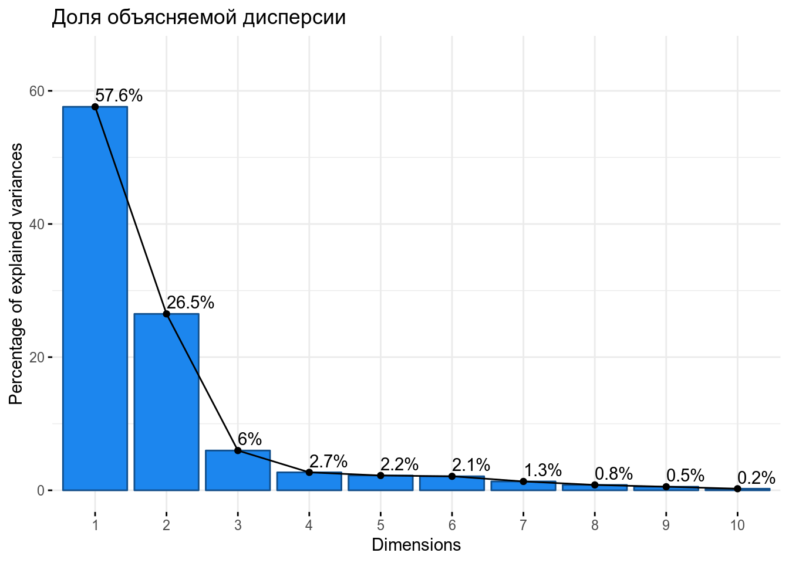
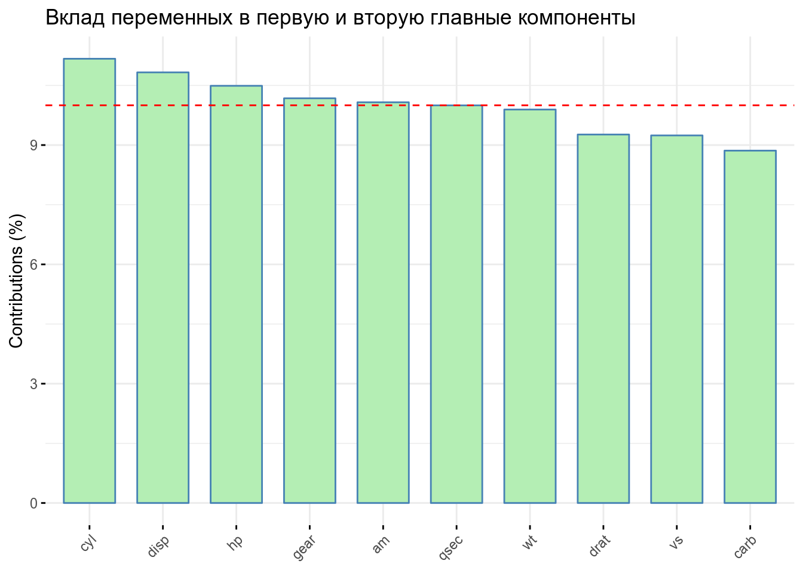
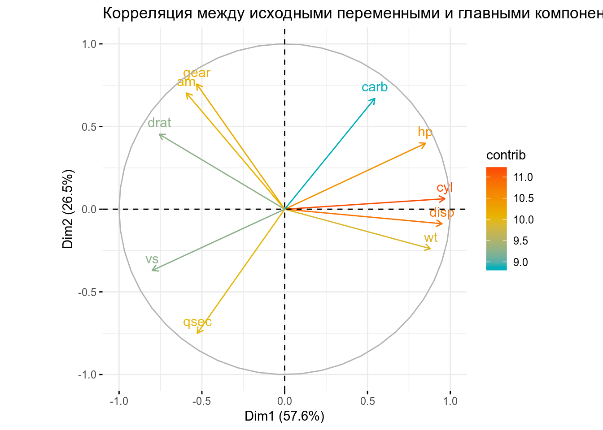

# Коан о методе главных компонент {#pca}
---
<style>
pre.r {
    background-color: #FEF9E7 !important;
}
pre.stata {
    background-color: #BDBDBD !important;
}
pre.python {
    background-color: #FDF2E9 !important;
}
</style> 

> Метод главных компонент позволяет снизить размерность данных за счет замены исходных переменных на меньшее количество новых переменных. Новые, искусственно созданные, переменные называются главными компонентами.

Реализация метода главных компонент "вручную" включает в себя следующие элементы:

1. Центрирование исходных данных
2. Вычисление собственных значений матрицы $X^TX$
3. Расчет доли дисперсии, объясняемой найденными компонентами
4. Выбор числа главных компонент

Однако прогресс не стоит на месте, и получение главных компонент теперь осуществляется быстрее и проще (а главное совершенно бесплатно и без регистрации). Рассмотрим, как проделать это на r, python и в stata.

## r

Загружаем нужные пакеты:

```r
library(dplyr) # Для работы с данными
library(ggplot2) # Для построения графиков
library(skimr) # Для изучения данных
library(FactoMineR) # Для анализа
library(factoextra) # Для визуализации главных компонент 
```
Загружаем набор данных по параметрам машин **mtcars** и изучаем его строение:

```r
skim(mtcars)
```

```
Skim summary statistics
 n obs: 32 
 n variables: 11 

── Variable type:numeric ─────────────────────────────────────────────────────────────────────────────────────────────────────────
 variable missing complete  n   mean     sd    p0    p25    p50    p75
       am       0       32 32   0.41   0.5   0      0      0      1   
     carb       0       32 32   2.81   1.62  1      2      2      4   
      cyl       0       32 32   6.19   1.79  4      4      6      8   
     disp       0       32 32 230.72 123.94 71.1  120.83 196.3  326   
     drat       0       32 32   3.6    0.53  2.76   3.08   3.7    3.92
     gear       0       32 32   3.69   0.74  3      3      4      4   
       hp       0       32 32 146.69  68.56 52     96.5  123    180   
      mpg       0       32 32  20.09   6.03 10.4   15.43  19.2   22.8 
     qsec       0       32 32  17.85   1.79 14.5   16.89  17.71  18.9 
       vs       0       32 32   0.44   0.5   0      0      0      1   
       wt       0       32 32   3.22   0.98  1.51   2.58   3.33   3.61
   p100     hist
   1    ▇▁▁▁▁▁▁▆
   8    ▆▇▂▇▁▁▁▁
   8    ▆▁▁▃▁▁▁▇
 472    ▇▆▁▂▅▃▁▂
   4.93 ▃▇▁▅▇▂▁▁
   5    ▇▁▁▆▁▁▁▂
 335    ▃▇▃▅▂▃▁▁
  33.9  ▃▇▇▇▃▂▂▂
  22.9  ▃▂▇▆▃▃▁▁
   1    ▇▁▁▁▁▁▁▆
   5.42 ▃▃▃▇▆▁▁▂
```
Целевая переменная в данном наборе данных - это `mpg`, miles per gallon. Для МГК нам понадобится произвести стандартизацию регрессоров, так как разные переменные измерены в несопоставимых единицах измерения: 

```r
c = select(mtcars, -mpg) # Выделяем регрессоры в отдельный список
c_pca = PCA(c, scale.unit = TRUE, graph = FALSE) # Применяем функцию PCA для нахождения главных компонент, при этом проводим стандартизацию (scale.unit=TRUE)
```
Используя возможности пакета **factoextra**, построим несколько графиков, чтобы иметь полное представление о созданных главных компонентах. Для начала визуализируем долю объясняемой главными компонентами дисперсии с помощью функции *fviz_eig*:

```r
fviz_eig(c_pca, addlabels = TRUE, ylim = c(0, 65), barfill = "dodgerblue2", barcolor = "dodgerblue4", linecolor = "black", title = "Доля объясняемой дисперсии")
```



Итак, две первые главные компоненты, PC1 и PC2, объясняют более 85% дисперсии.

Посмотрим, в каких переменных содержится больше всего информации, т.е. какие из них вносят наибольший вклад в объяснение дисперсии, с помощью функции *fviz_contrib*. 

```r
fviz_contrib(c_pca, choice = "var", axes = 1:2, top = 10, fill = "darkseagreen2", linecolor = "black", title = "Вклад переменных в первую и вторую главные компоненты")
```



Соответственно, наибольшая информация содержится в переменных `cyl`, `disp`, `qsec`.

Построим так называемый **Correlation Circle**, показывающий корреляцию между исходными переменными и главными компонентами, используя функцию *fviz_pca_var*. Покажем вклад переменных в первую и вторую главные компоненты цветом:

```r
fviz_pca_var(c_pca, col.var = "contrib",
             gradient.cols = c("#00AFBB", "#E7B800", "#FC4E07"),
             title = "Корреляция между исходными переменными и главными компонентами")
```



Переменные с положительной корреляцией расположены близко друг к другу (например, `cyl` и `hp`), с отрицательной корреляцией - на противоположных частях графика (`drat` и `wt`). Чем больше дистанция между переменными и началом координат, тем лучше их удается описать при помощи главных компонент.

## stata

Загружаем нужные нам данные, в данном случае сведения об автомобилях, содержащиеся в пакете auto.

```stata
webuse auto
```

```
```

Для реализации МГК достаточно использовать функцию `pca`. Она принимает на вход зависимую переменную `price` и регрессоры `mpg`, `rep78`, `headroom`, `weight`, `length`, `displacement`, `foreign`:

```stata
pca price mpg rep78 headroom weight length displacement foreign
```

```
Principal components/correlation                 Number of obs    =         69
                                                 Number of comp.  =          8
                                                 Trace            =          8
    Rotation: (unrotated = principal)            Rho              =     1.0000

    --------------------------------------------------------------------------
       Component |   Eigenvalue   Difference         Proportion   Cumulative
    -------------+------------------------------------------------------------
           Comp1 |       4.7823      3.51481             0.5978       0.5978
           Comp2 |       1.2675      .429638             0.1584       0.7562
           Comp3 |      .837857      .398188             0.1047       0.8610
           Comp4 |      .439668     .0670301             0.0550       0.9159
           Comp5 |      .372638      .210794             0.0466       0.9625
           Comp6 |      .161844     .0521133             0.0202       0.9827
           Comp7 |      .109731      .081265             0.0137       0.9964
           Comp8 |     .0284659            .             0.0036       1.0000
    --------------------------------------------------------------------------

Principal components (eigenvectors) 

    --------------------------------------------------------------------------
        Variable |    Comp1     Comp2     Comp3     Comp4     Comp5     Comp6 
    -------------+------------------------------------------------------------
           price |   0.2324    0.6397   -0.3334   -0.2099    0.4974   -0.2815 
             mpg |  -0.3897   -0.1065    0.0824    0.2568    0.6975    0.5011 
           rep78 |  -0.2368    0.5697    0.3960    0.6256   -0.1650   -0.1928 
        headroom |   0.2560   -0.0315    0.8439   -0.3750    0.2560   -0.1184 
          weight |   0.4435    0.0979   -0.0325    0.1792   -0.0296    0.2657 
          length |   0.4298    0.0687    0.0864    0.1845   -0.2438    0.4144 
    displacement |   0.4304    0.0851   -0.0445    0.1524    0.1782    0.2907 
         foreign |  -0.3254    0.4820    0.0498   -0.5183   -0.2850    0.5401 
    --------------------------------------------------------------------------

    ------------------------------------------------
        Variable |    Comp7     Comp8 | Unexplained 
    -------------+--------------------+-------------
           price |   0.2165   -0.0891 |           0 
             mpg |   0.1625    0.0115 |           0 
           rep78 |  -0.0813    0.0065 |           0 
        headroom |   0.0226    0.0252 |           0 
          weight |   0.1104    0.8228 |           0 
          length |   0.5437   -0.4921 |           0 
    displacement |  -0.7733   -0.2608 |           0 
         foreign |  -0.1173    0.0639 |           0 
    ------------------------------------------------
```
Построим график доли дисперсии, объясняемой каждой компонентой:

```stata
screeplot, yline(1) ci(het) 
```


И получим первые две компоненты:

```stata
predict pc1 pc2, score
```

```
 translator Graph2png not found
r(111);


(6 components skipped)

Scoring coefficients 
    sum of squares(column-loading) = 1

    --------------------------------------------------------------------------
        Variable |    Comp1     Comp2     Comp3     Comp4     Comp5     Comp6 
    -------------+------------------------------------------------------------
           price |   0.2324    0.6397   -0.3334   -0.2099    0.4974   -0.2815 
             mpg |  -0.3897   -0.1065    0.0824    0.2568    0.6975    0.5011 
           rep78 |  -0.2368    0.5697    0.3960    0.6256   -0.1650   -0.1928 
        headroom |   0.2560   -0.0315    0.8439   -0.3750    0.2560   -0.1184 
          weight |   0.4435    0.0979   -0.0325    0.1792   -0.0296    0.2657 
          length |   0.4298    0.0687    0.0864    0.1845   -0.2438    0.4144 
    displacement |   0.4304    0.0851   -0.0445    0.1524    0.1782    0.2907 
         foreign |  -0.3254    0.4820    0.0498   -0.5183   -0.2850    0.5401 
    --------------------------------------------------------------------------

    ----------------------------------
        Variable |    Comp7     Comp8 
    -------------+--------------------
           price |   0.2165   -0.0891 
             mpg |   0.1625    0.0115 
           rep78 |  -0.0813    0.0065 
        headroom |   0.0226    0.0252 
          weight |   0.1104    0.8228 
          length |   0.5437   -0.4921 
    displacement |  -0.7733   -0.2608 
         foreign |  -0.1173    0.0639 
    ----------------------------------
```

## python
Начинаем, как обычно, с обработки данных. Загружаем необходимые для работы библиотеки

```python
import pandas as pd # Библиотека pandas для работы с данными
import seaborn as sns # Библиотека seaborn для визуализации
from sklearn.decomposition import PCA # Импортируем функцию PCA, вычисляющую главные компоненты
from sklearn.preprocessing import StandardScaler # Импортируем StandartScaler
```
и набор данных *auto mpg dataset*:

```python
url = "http://archive.ics.uci.edu/ml/machine-learning-databases/auto-mpg/auto-mpg.data-original"
df = pd.read_csv(url, 
                delim_whitespace = True, 
                header=None,
                names = ['mpg', 'cylinders', 'displacement',         'horsepower', 'weight', 'acceleration', 'model', 'origin', 'car_name'])  
```
Изучим строение данных:

```python
df.head()
```

```
    mpg  cylinders  displacement  ...  model  origin                   car_name
0  18.0        8.0         307.0  ...   70.0     1.0  chevrolet chevelle malibu
1  15.0        8.0         350.0  ...   70.0     1.0          buick skylark 320
2  18.0        8.0         318.0  ...   70.0     1.0         plymouth satellite
3  16.0        8.0         304.0  ...   70.0     1.0              amc rebel sst
4  17.0        8.0         302.0  ...   70.0     1.0                ford torino

[5 rows x 9 columns]
```
Так как в наших данных, кроме прочего, также присутствуют и другие типы переменных (например, содержащиеся в переменной `car_names` названия машин), то предварительно очистим данные, оставив только численные переменные. После этого используем функцию StandartScaler для стандартизации регрессоров:

```python
df = df.dropna() # Убираем пропущенные значения (NAs)
features = ['cylinders', 'displacement', 'horsepower', 'weight', 'acceleration', 'origin'] # Добавляем количественные регрессоры в отдельный список, убираем переменные car_names, model
x = df[features] # Выделяем численные значения регрессоров !!!Упростить!!!
y = df['mpg'] # Выделяем целевую переменную
x = StandardScaler().fit_transform(x) # Стандартизируем регрессоры
```
Создадим три главные компоненты:

```python
pca = PCA(n_components=3) # Создаем 3 главные компоненты
principalComponents = pca.fit_transform(x)
principalDf = pd.DataFrame(data = principalComponents, columns = ['principal component 1', 'principal component 2', 'principal component 3']) # Создаем таблицу, в которую сохраняем значения найденных компонент
```
Вычислим, какую долю дисперсии объясняют главные компоненты:

```python
pca.explained_variance_ratio_
```

```
array([0.73960122, 0.14245627, 0.08026557])
```
Таким образом, три главные компоненты объясняют примерно 74 + 14 + 1 = 89% дисперсии.
Представим это на графике:

```python
df = pd.DataFrame({'var':pca.explained_variance_ratio_, 'PC':['PC1', 'PC2', 'PC3']})
graph = sns.barplot(x = 'PC', y = 'var', data = df, color = 'wheat')
graph.set_title("Доля дисперсии, объясняемой главными компонентами")
graph.set_ylabel('Доля дисперсии')
graph.set_xlabel('Главные компоненты')
```


```
