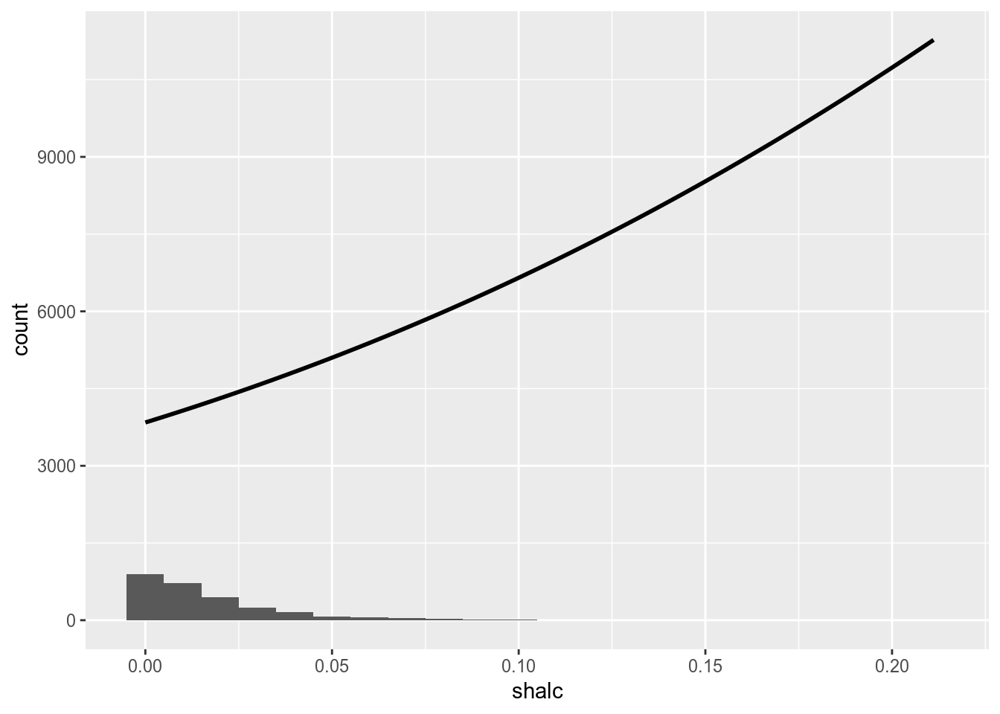

# TOBIT, HECKIT {#tobit_heckit}


```r
library(ggplot2)
library(AER) #tobit
library(sampleSelection) #heckit
library('ltm') #margins
library('foreign')
library(skimr)
```


Данная глава посвящена моделям с цензурированными выборками. В таких выборках часть значений целевой переменной будет дискретной переменной, а часть - непрерывной. Простой пример, который указывается в некоторых учебниках, это исследование расходов семей на автомобили. Каждая семья может либо потратить какую-то сумму на автомобиль, либо, если она не может позволить себе автомобиль, то значение расходов будет равно нулю. Соответственно, переменная демонстрирует либо факт неучастия в покупке автомобиля, либо степень участия в виде суммы. Оценивается в данном случае обычная регрессионная модель, но с функцией правдоподобия следующего вида:


\begin{equation}
L=\prod_{y_{t}=0}\left(1-\Phi\left(\frac{\boldsymbol{x}_{t}^{\prime} \boldsymbol{\beta}}{\sigma}\right)\right) \prod_{y_{t}>0} \frac{1}{\sqrt{2 \pi} \sigma} \exp \left(-\frac{1}{2 \sigma^{2}}\left(y_{t}-\boldsymbol{x}_{t}^{\prime} \boldsymbol{\beta}\right)^{2}\right)
\end{equation}

Для начала подгрузим данные и визуализируем их. Этот датасет результаты тестирования двухсот школьников по шкале от 200 до 800 (apt), а также их успеваемость по чтению и математике (read и math соответственно). Построим гистограмму, наложив поверх неё функцию плотности нормального распределения.


```r
data = read.csv('tobit.csv')
```


```r
# Функция, генерирующая функцию плотности нормального распределения в соответствии с распределением вектора входных данных
f <- function(x, var, bw = 15) {
  dnorm(x, mean = mean(var), sd(var)) * length(var)  * bw
}


p <- ggplot(data, aes(x = apt, fill=prog))
p + stat_bin(binwidth=15) +
  stat_function(fun = f, size = 1,
    args = list(var = data$apt))
```


Как можем видеть, нашлось довольно много школьников, которые написали тест на высший балл. В связи с этим распределение даллеко от нормального из-за ограничений баллов теста. Вид выборки также довольно специфичен при взгляде на диаграмму рассеяния. Довольно различимая линейная зависимость как бы сплюснута сверху.


```r
g <- ggplot(data, aes(math, apt, col = prog))
g +geom_point()
```


Оценим Тобит-модель:


```r
model_tobit = tobit(apt ~ math + read, data = data, right = 800)
summary(model_tobit)
```

```

Call:
tobit(formula = apt ~ math + read, right = 800, data = data)

Observations:
         Total  Left-censored     Uncensored Right-censored 
           200              0            183             17 

Coefficients:
             Estimate Std. Error z value Pr(>|z|)    
(Intercept) 159.00366   29.90374   5.317 1.05e-07 ***
math          6.34441    0.70306   9.024  < 2e-16 ***
read          2.88961    0.63295   4.565 4.99e-06 ***
Log(scale)    4.21923    0.05293  79.719  < 2e-16 ***
---
Signif. codes:  0 '***' 0.001 '**' 0.01 '*' 0.05 '.' 0.1 ' ' 1

Scale: 67.98 

Gaussian distribution
Number of Newton-Raphson Iterations: 5 
Log-likelihood: -1047 on 4 Df
Wald-statistic: 266.2 on 2 Df, p-value: < 2.22e-16 
```

Модель Тобина имеет ряд ограничений. Основное из них -- это зависимость вероятности участия и интенсивности участия определяется одним и тем же набором переменных. Для преодоления этих ограничений была предложена модель Хекмана. В ней принятие решения "участвовать - не участвовать" и определение степени участия могут зависеть от разных переменных.

Загрузим другие данные во славу разнообразия.


```r
data = read.dta('data_alcohol&tobacco.dta')
summary(data)
```

```
     obs                 age           bluecol            lnx       
 Length:2724        Min.   :0.000   Min.   :0.0000   Min.   :11.76  
 Class :character   1st Qu.:1.000   1st Qu.:0.0000   1st Qu.:13.41  
 Mode  :character   Median :2.000   Median :0.0000   Median :13.76  
                    Mean   :2.408   Mean   :0.1468   Mean   :13.73  
                    3rd Qu.:4.000   3rd Qu.:0.0000   3rd Qu.:14.06  
                    Max.   :4.000   Max.   :1.0000   Max.   :15.33  
    flanders         nadults        ninfants           nkids       
 Min.   :0.0000   Min.   :1.00   Min.   :0.00000   Min.   :0.0000  
 1st Qu.:0.0000   1st Qu.:1.00   1st Qu.:0.00000   1st Qu.:0.0000  
 Median :0.0000   Median :2.00   Median :0.00000   Median :0.0000  
 Mean   :0.4519   Mean   :1.97   Mean   :0.04479   Mean   :0.5646  
 3rd Qu.:1.0000   3rd Qu.:2.00   3rd Qu.:0.00000   3rd Qu.:1.0000  
 Max.   :1.0000   Max.   :7.00   Max.   :2.00000   Max.   :5.0000  
     resid                shalc              shtob        
 Min.   :-0.9797682   Min.   :0.000000   Min.   :0.00000  
 1st Qu.: 0.0626030   1st Qu.:0.002906   1st Qu.:0.00000  
 Median : 0.1223031   Median :0.010898   Median :0.00000  
 Mean   : 0.0001171   Mean   :0.017828   Mean   :0.01224  
 3rd Qu.: 0.1854353   3rd Qu.:0.024244   3rd Qu.:0.01381  
 Max.   : 0.5795787   Max.   :0.211124   Max.   :0.19276  
    walloon          whitecol      shalc_tobit             alc        
 Min.   :0.0000   Min.   :0.000   Min.   :-0.005627   Min.   :0.0000  
 1st Qu.:0.0000   1st Qu.:0.000   1st Qu.: 0.010925   1st Qu.:1.0000  
 Median :0.0000   Median :0.000   Median : 0.015169   Median :1.0000  
 Mean   :0.3814   Mean   :0.333   Mean   : 0.015198   Mean   :0.8289  
 3rd Qu.:1.0000   3rd Qu.:1.000   3rd Qu.: 0.019735   3rd Qu.:1.0000  
 Max.   :1.0000   Max.   :1.000   Max.   : 0.032814   Max.   :1.0000  
      tob        
 Min.   :0.0000  
 1st Qu.:0.0000  
 Median :0.0000  
 Mean   :0.3803  
 3rd Qu.:1.0000  
 Max.   :1.0000  
```


```r
f <- function(x, var, bw = 15) {
  dnorm(x, mean = mean(var), sd(var)) * length(var)  * bw
}


p <- ggplot(data, aes(x = shalc))
p + stat_bin(binwidth=0.01) +
  stat_function(fun = f, size = 1,
    args = list(var = data$alc))
```




```r
heck1 = heckit(alc ~ age + nadults + nkids + lnx + walloon, shalc ~  age + nadults + nkids + lnx + walloon, data = data, method = 'ml')
summary(heck1)
```

```
--------------------------------------------
Tobit 2 model (sample selection model)
Maximum Likelihood estimation
Newton-Raphson maximisation, 5 iterations
Return code 2: successive function values within tolerance limit
Log-Likelihood: 4311.465 
2724 observations (466 censored and 2258 observed)
14 free parameters (df = 2710)
Probit selection equation:
             Estimate Std. Error t value Pr(>|t|)    
(Intercept) -11.12847    0.99823 -11.148  < 2e-16 ***
age           0.06449    0.02333   2.765  0.00574 ** 
nadults      -0.08657    0.04198  -2.062  0.03927 *  
nkids        -0.08477    0.03621  -2.341  0.01929 *  
lnx           0.88399    0.07585  11.654  < 2e-16 ***
walloon       0.19751    0.06229   3.171  0.00154 ** 
Outcome equation:
              Estimate Std. Error t value Pr(>|t|)    
(Intercept)  0.0413302  0.0205897   2.007 0.044815 *  
age          0.0022075  0.0003854   5.727 1.13e-08 ***
nadults     -0.0017463  0.0006455  -2.705 0.006865 ** 
nkids       -0.0021381  0.0005640  -3.791 0.000153 ***
lnx         -0.0015570  0.0014823  -1.050 0.293642    
walloon      0.0025647  0.0009575   2.679 0.007437 ** 
   Error terms:
        Estimate Std. Error t value Pr(>|t|)    
sigma  0.0214606  0.0003194  67.187   <2e-16 ***
rho   -0.0062437  0.1345571  -0.046    0.963    
---
Signif. codes:  0 '***' 0.001 '**' 0.01 '*' 0.05 '.' 0.1 ' ' 1
--------------------------------------------
```


```r
heck2 = heckit2fit(alc ~ age + nadults + nkids + lnx + walloon, shalc ~  age + nadults + nkids + lnx + walloon, data = data)
summary(heck2)
```

```
--------------------------------------------
Tobit 2 model (sample selection model)
2-step Heckman / heckit estimation
2724 observations (466 censored and 2258 observed)
15 free parameters (df = 2710)
Probit selection equation:
             Estimate Std. Error t value Pr(>|t|)    
(Intercept) -11.12810    0.99819 -11.148  < 2e-16 ***
age           0.06448    0.02332   2.765  0.00574 ** 
nadults      -0.08653    0.04196  -2.062  0.03930 *  
nkids        -0.08475    0.03620  -2.341  0.01931 *  
lnx           0.88396    0.07585  11.654  < 2e-16 ***
walloon       0.19748    0.06228   3.171  0.00154 ** 
Outcome equation:
              Estimate Std. Error t value Pr(>|t|)    
(Intercept)  0.0584579  0.0763935   0.765 0.444207    
age          0.0021170  0.0005482   3.862 0.000115 ***
nadults     -0.0016402  0.0007920  -2.071 0.038456 *  
nkids       -0.0020387  0.0007089  -2.876 0.004062 ** 
lnx         -0.0027209  0.0052148  -0.522 0.601873    
walloon      0.0023175  0.0014319   1.619 0.105666    
Multiple R-Squared:0.0534,	Adjusted R-Squared:0.0509
   Error terms:
               Estimate Std. Error t value Pr(>|t|)
invMillsRatio -0.003805   0.016022  -0.237    0.812
sigma          0.021579         NA      NA       NA
rho           -0.176330         NA      NA       NA
--------------------------------------------
```


Теперь то же самое в STATA.


```stata
clear
use tobit
summarize
```

```
    Variable |        Obs        Mean    Std. Dev.       Min        Max
-------------+---------------------------------------------------------
          v1 |        200        99.5    57.87918          0        199
    unnamed0 |        200        99.5    57.87918          0        199
          id |        200       100.5    57.87918          1        200
        read |        200       52.23    10.25294         28         76
        math |        200      52.645    9.368448         33         75
-------------+---------------------------------------------------------
        prog |          0
         apt |        200     640.035    99.21903        352        800
         top |        200        .915    .2795815          0          1
```


```stata
egen prog_2 = group(prog)
tobit apt read math i.prog_2, ul
```

```
Tobit regression                                Number of obs     =        200
                                                LR chi2(4)        =     188.97
                                                Prob > chi2       =     0.0000
Log likelihood = -1041.0629                     Pseudo R2         =     0.0832

------------------------------------------------------------------------------
         apt |      Coef.   Std. Err.      t    P>|t|     [95% Conf. Interval]
-------------+----------------------------------------------------------------
        read |   2.697939    .618798     4.36   0.000     1.477582    3.918296
        math |   5.914485   .7098063     8.33   0.000     4.514647    7.314323
             |
      prog_2 |
          2  |  -12.71476   12.40629    -1.02   0.307    -37.18173     11.7522
          3  |   -46.1439   13.72401    -3.36   0.001     -73.2096   -19.07821
             |
       _cons |    209.566   32.77154     6.39   0.000     144.9359    274.1961
-------------+----------------------------------------------------------------
      /sigma |   65.67672   3.481272                      58.81116    72.54228
------------------------------------------------------------------------------
             0  left-censored observations
           183     uncensored observations
            17 right-censored observations at apt >= 800
```

```stata
clear all
use data_alcohol&tobacco
heckman shalc age nadults nkids lnx walloon, select(alc = age nadults nkids lnx walloon)

```

```
Iteration 0:   log likelihood =  4309.5307  
Iteration 1:   log likelihood =  4311.3949  
Iteration 2:   log likelihood =  4311.4638  
Iteration 3:   log likelihood =  4311.4649  
Iteration 4:   log likelihood =  4311.4649  

Heckman selection model                         Number of obs     =      2,724
(regression model with sample selection)        Censored obs      =        466
                                                Uncensored obs    =      2,258

                                                Wald chi2(5)      =     126.74
Log likelihood =  4311.465                      Prob > chi2       =     0.0000

------------------------------------------------------------------------------
             |      Coef.   Std. Err.      z    P>|z|     [95% Conf. Interval]
-------------+----------------------------------------------------------------
shalc        |
         age |   .0022075   .0003854     5.73   0.000     .0014521     .002963
     nadults |  -.0017463   .0006455    -2.71   0.007    -.0030114   -.0004812
       nkids |  -.0021381    .000564    -3.79   0.000    -.0032435   -.0010327
         lnx |   -.001557   .0014823    -1.05   0.294    -.0044622    .0013483
     walloon |   .0025647   .0009575     2.68   0.007     .0006881    .0044413
       _cons |   .0413301   .0205898     2.01   0.045     .0009749    .0816853
-------------+----------------------------------------------------------------
alc          |
         age |    .064492   .0233269     2.76   0.006     .0187722    .1102118
     nadults |  -.0865676   .0419754    -2.06   0.039    -.1688379   -.0042973
       nkids |  -.0847672   .0362055    -2.34   0.019    -.1557287   -.0138058
         lnx |   .8839885   .0758532    11.65   0.000      .735319    1.032658
     walloon |   .1975137    .062286     3.17   0.002     .0754353    .3195921
       _cons |  -11.12847   .9982321   -11.15   0.000    -13.08497   -9.171975
-------------+----------------------------------------------------------------
     /athrho |  -.0062433   .1345632    -0.05   0.963    -.2699823    .2574956
    /lnsigma |  -3.841538   .0148838  -258.10   0.000    -3.870709   -3.812366
-------------+----------------------------------------------------------------
         rho |  -.0062433   .1345579                     -.2636083    .2519516
       sigma |   .0214606   .0003194                      .0208436    .0220958
      lambda |   -.000134   .0028877                     -.0057938    .0055259
------------------------------------------------------------------------------
LR test of indep. eqns. (rho = 0):   chi2(1) =     0.00   Prob > chi2 = 0.9640
```


```stata
heckman shalc age nadults nkids lnx walloon, select(alc = age nadults nkids lnx walloon) twostep
```

```
> nx walloon) twostep

Heckman selection model -- two-step estimates   Number of obs     =      2,724
(regression model with sample selection)        Censored obs      =        466
                                                Uncensored obs    =      2,258

                                                Wald chi2(5)      =     125.15
                                                Prob > chi2       =     0.0000

------------------------------------------------------------------------------
             |      Coef.   Std. Err.      z    P>|z|     [95% Conf. Interval]
-------------+----------------------------------------------------------------
shalc        |
         age |    .002117   .0005482     3.86   0.000     .0010426    .0031915
     nadults |  -.0016402    .000792    -2.07   0.038    -.0031925   -.0000879
       nkids |  -.0020387   .0007089    -2.88   0.004    -.0034282   -.0006492
         lnx |  -.0027209   .0052148    -0.52   0.602    -.0129417    .0074998
     walloon |   .0023175   .0014319     1.62   0.106    -.0004889     .005124
       _cons |   .0584579   .0763935     0.77   0.444    -.0912706    .2081865
-------------+----------------------------------------------------------------
alc          |
         age |    .064482   .0233247     2.76   0.006     .0187665    .1101975
     nadults |  -.0865298   .0419629    -2.06   0.039    -.1687756   -.0042839
       nkids |  -.0847535   .0362048    -2.34   0.019    -.1557135   -.0137934
         lnx |   .8839584   .0758491    11.65   0.000     .7352969     1.03262
     walloon |   .1974812   .0622813     3.17   0.002     .0754121    .3195503
       _cons |   -11.1281   .9981866   -11.15   0.000    -13.08451   -9.171695
-------------+----------------------------------------------------------------
mills        |
      lambda |   -.003805    .016022    -0.24   0.812    -.0352075    .0275975
-------------+----------------------------------------------------------------
         rho |   -0.17633
       sigma |  .02157888
------------------------------------------------------------------------------
```

