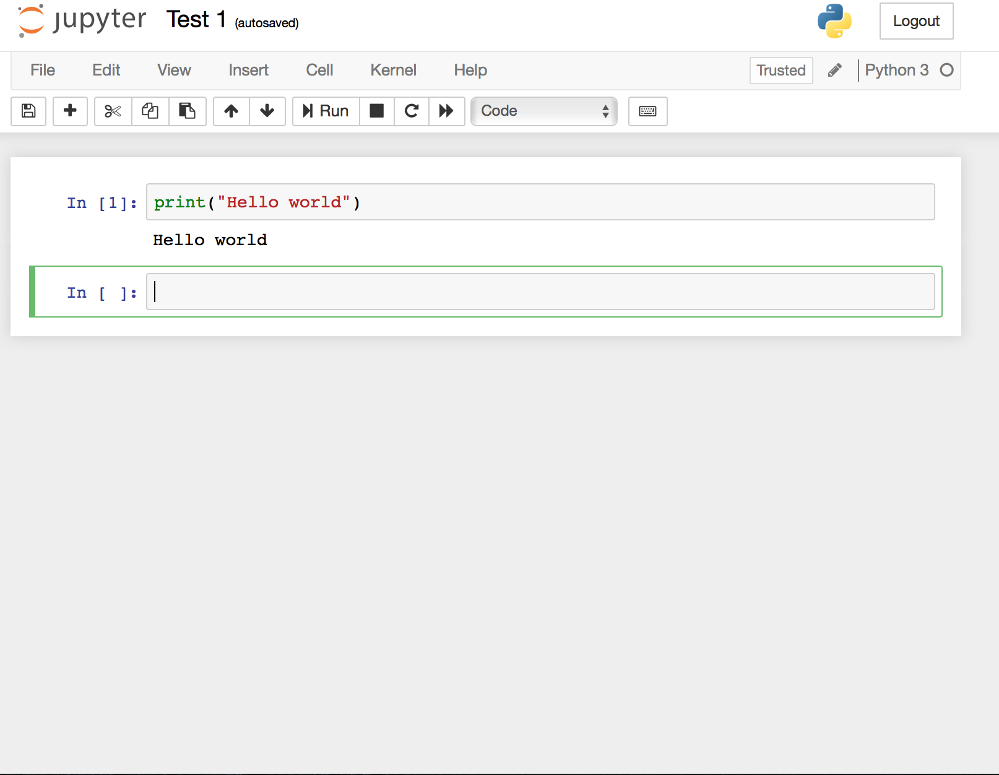

--- 
title: "Розеттский камень"
author: "Пуассон, фея и три мексиканских негодяя"
date: "2020-01-25"
bibliography:
- book.bib
- packages.bib
description: Сборник коанов для эконометристов, жаждущих просветления.
documentclass: book
link-citations: yes
site: bookdown::bookdown_site
biblio-style: apalike
---

# Приветственный коан {#installsoft}

В этом коане мы рассмотрим установку и настройку R, Python и Stata. 

<style>
pre.r {
    background-color: #FEF9E7 !important;
}
pre.stata {
    background-color: #BDBDBD !important;
}
pre.python {
    background-color: #FDF2E9 !important;
}
</style> 


## Язык программирования R

> R --- это открытая среда программирования, помогающая в работе со статистическими данными. Для программирования на R подойдет программа RStudio. 

Рассмотрим установку RStudio на Mac OS и Windows.

### Инструкция по установке RStudio для Windows / Mac OS:

1. Загрузите и установите язык программирования R [с официального сайта](http://cran.cnr.berkeley.edu/).

* Версия для Windows: Выберите “Download R for Windows”  ▶  “base”  ▶  “Download R 3.x.x for Windows”.

* Версия для Mac OS: Выберите “Download R for (Mac) OS X”  ▶  “Latest Release”  ▶ “R 3.x.x”.

2. Загрузите программу RStudio [с официального сайта разработчика](https://www.rstudio.com/products/rstudio/download/) (выберите подходящую версию из предложенных опций). Возможностей бесплатной версии 
будет вполне достаточно для работы.

<center> 

 

</center> 

### Начало работы 


<center> 

 

</center> 


1. **New file** - Создание нового файла.

2. **New project** - Создание нового проекта.

3. **Open file** - Открытие существующего файла.

4. **Console** - Консоль, в которой набирается код.

5. **Files** - Список файлов, доступных для работы.

6. **Packages** - Список установленных пакетов, т.е. расширений. Также можно ознакомиться с ним, введя в консоль команду `installed.packages()`.

7. **Viewer** - Отображение введенного кода.


### Настройка программы [^1]

Запустите RStudio. В разделе Tools --- Global Options --- Sweave --- "Weave .Rnw files using" выберите knitr.

Перед началом работы рекомендуется также установить ряд пакетов, то есть расширений, которые помогут при работе с данными.

Для этого необходимо ввести в командную строку следующую команду:

```r
install.packages(c("vcd", "ggplot2", "knitr", "xtable", "texreg", "lmtest", "sandwich", "erer", "dplyr", "readxl", "reshape2", "RCurl", "RSelenium","XML", "jsonlite", "quantmod", "lubridate", "stringr", "tidyr"))
```

После выполнения команды все рекомендованные для использования пакеты установятся автоматически. 

При работе на Windows для установки пакетов может потребоваться запуск Rstudio от имени администратора (для этого необходимо кликнуть правой кнопкой мыши, выбрать "Запуск от имени администратора").

Установили? Отлично. Всё готово для использования RStudio на вашем компьютере.


```r
cat("Рабочая папка:", getwd(), "\n")
```

```
<U+0420><U+0430><U+0431><U+043E><U+0447><U+0430><U+044F> <U+043F><U+0430><U+043F><U+043A><U+0430>: C:/Users/The_sun/Desktop/Current_projects/Rosetta_demeshev/01 
```


[^1]: Источник: https://github.com/bdemeshev/em301/wiki/R


## Язык программирования Python
> Python --- это открытая среда программирования, помогающая в работе со статистическими данными. Для программирования на Python подойдет программа Jupyter Notebook. 

### Установка

1. Загрузите и установите Anaconda [с официального сайта](https://www.anaconda.com/distribution/).

2. После загрузки и установки откройте Anaconda Navigator, через который Вы сможете открыть программу Jupyter Notebook.

<center> 


</center> 

### Начало работы

Открыв Jupyter Notebook, вы попадете на страницу, содержащую ваши сохраненные файлы. Чтобы создать новый файл, нажмите "New" ▶ "Notebook: Python 3".

<center> 


</center> 

Затем, в открывшемся окне, появится новый файл. Теперь все готово к работе. Вы можете вводить свой код и затем, используя комбинацию клавиш `<Shift>` + `<Enter>`, проверять его исполнение.

<center> 



</center> 


## Программа STATA
> Stata, в отличие от R и Python, является программой, а не языком программирования. Она также помогает в работе со статистическими данными. 


### Установка:

Для установки Stata необходимо загрузить актуальную версию [с сайта компании-разработчика](https://www.stata.com/). Подойдут как Stata SE, так и Stata MP.

### Начало работы:


<center> 
  
  

</center> 
  
  1. **Open File** - открыть файл.
2. **Save** - сохранить файл.
3. **Data Editor** - редактирование данных.
4. **Data Browser** - просмотр данных.
5. **Variables** - список переменных.
6. **Command** - командная строка, в которой вводится код.


