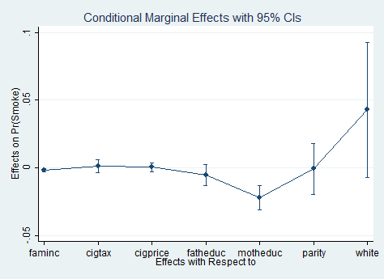
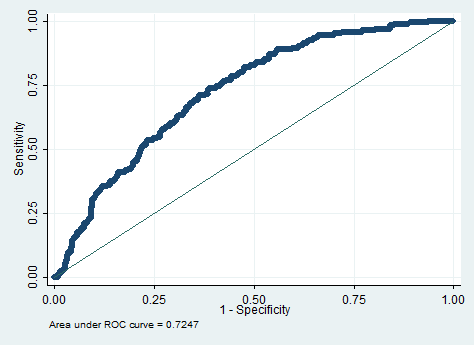

# Модель бинарного выбора {#binchoice}

<!-- Цвета для кусков кода 
<style>
pre.r {
    background-color: #81BEF7 !important;
}
pre.stata {
    background-color: #BDBDBD !important;
}
</style> -->
```{r setup, include=FALSE}
library(texreg)
library(Statamarkdown)
library(reticulate)
library(knitr)
library(rmarkdown)
library(dplyr)
use_python("/Users/Юлия/AppData/Local/Programs/Python/Python37/python.exe")
stataexe <- find_stata()
knitr::opts_chunk$set(engine.path = list(stata = stataexe), collectcode = TRUE)
opts_chunk$set(fig.align = 'center') # выравнивание картинок по центру
```

> Сейчас попробуем подружиться с моделями бинарного выбора на основе данных `bwght.dta`, где зависимая переменная отражает, является индивид курильщиком или нет.

## r

Загрузим необходимы пакеты.
```{r, message=FALSE, warning=FALSE}
library(rio) # чтение dta файлов
library(tidyverse) # манипуляции с данными и графики
library(skimr) # описательные статистики
library(mfx) # нахождение предельных эффектов
library(margins) # визуализация предельных эффектов
library(lmtest) # проведение тестов
library(plotROC) # построение ROC-кривой
library(caret) # confusion-матрица
library(texreg) # вывод результатов регрессии в тех и html
```
Импортируем исследуемые данные.
```{r}
data = import("data/bwght.dta") 
```
Сгенерируем переменную `smoke`, отражающее состояние отдельного индивида: курильщик, если `smoke = 1`, не курильщик - иначе. 
```{r}
data = mutate(data, smoke=(cigs>0))
```
Рассмотрим описательные статистики по всем переменным: решение курить, семейный доход, налог на сигареты, цена сигарет, образование отца и матери, паритет, цвет кожи.
```{r, warning=FALSE, message=FALSE}
skim(data)
```
Заметим существование пропущенных переменных у `fatheduc`, `motheduc`. Будем анализировать только те значения, у которых нет пропущенных наблюдений. Для этого создадим новый dataframe, `data_2`, в котором отсутствуют пропущенные значения. Просмотрим его описательные статистики.
```{r, warning=FALSE, message=FALSE}
data_2 = filter(data, !is.na(fatheduc), !is.na(motheduc))
skim(data_2)
```
Построим модель линейной вероятности. Сохраним результат под `lin_prob_model`. 
```{r, warning=FALSE, message=FALSE}
lin_prob_model = lm(smoke ~ 1 + faminc + cigtax + cigprice + fatheduc + motheduc + parity + white, data=data_2)
summary(lin_prob_model)
```
Посмотрим на число совпадений прогноза и исходных значений. Для этого оценим предсказанные значения модели линейной вероятности. Сохраним значение как `predictions_lin_prob_model`.
```{r, warning=FALSE, message=FALSE}
predictions_lin_prob_model = predict(lin_prob_model)
```
Генерируем `smoke_ols` как 1, если вероятность по модели больше 0.5 и 0, если она меньше 0.5.
```{r, warning=FALSE, message=FALSE}
smoke_ols = 1 * (predictions_lin_prob_model>0.5)
```
Число совпадений данных и прогноза модели линейной вероятности:
```{r}
sum (smoke_ols == data_2$smoke)
```
Известно, что модель линейной вероятности обладает значительными недостатками, в частности: нереалистичное значение оцененной вероятности, ошибки, распределённые не нормально и гетероскедастичность. Поэтому оценим `P(smoke=1|x)`, и построим логит- и пробит-модели. 
Немного о логит-модели: предполагается, что существует скрытая (латентная) переменная, для которой строится модель, $$ y^*_i = \beta_1 + \beta_2 \cdot X_i + \varepsilon_i$$,так, что:

\[
\begin{equation*}
Y_i = 
 \begin{cases}
   1, &\text{если ${y_i}^* \geqslant 0$}\\
   0, &\text{если ${y_i}^* < 0$}
 \end{cases}
\end{equation*}
\]

 $$\varepsilon_i \sim logistic, \\f(t) = \frac{e^{-t}}{(1 + e^{-t})^2}$$
 
Построим логит-модель и сохраним результат оцененной модели как `logit_model`.
```{r, warning=FALSE}
logit_model = glm(smoke ~ 1 + faminc + cigtax + cigprice + fatheduc + motheduc + parity + white, x=TRUE, data=data_2, family=binomial(link="logit"))
summary(logit_model)
```
Так как коэффициенты логит- и пробит- моделей плохо интерпретируются, поскольку единицы измерения латентной переменной определить сложно, посчитаем предельные эффекты, то есть изменение вероятности решения курить с изменением фактора на 1 единицу. 

Для предельного эффекта в средних значениях факторов:
```{r, warning=FALSE, message=FALSE}
logitmfx(smoke ~ 1 + faminc + cigtax + cigprice + fatheduc + motheduc + parity + white, data=data_2, atmean=TRUE)
margins = margins(logit_model)
plot(margins)
```
Интерпретация предельных эффектов следующая (на примере переменной семейного дохода): при увеличении семейного дохода в среднем на 1 единицу при остальных неизменных факторах, вероятность стать курильщиком уменьшается в среднем на 0.18%. 

Визуализируем предельный эффект для семейного дохода:
```{r}
cplot(logit_model, "faminc", what="effect", main="Average Marginal Effect of Faminc")
```
Для определения качества модели построим классификационную матрицу. Для этого сначала вычислим предсказания логит-модели, `predictions_logit_model`. Так как результат не бинарный, то введём порог отсечения, равный 0.5. Назовём бинарный результат `smoke_logit`:
```{r}
predictions_logit_model = predict(logit_model)
smoke_logit_model = (predictions_logit_model>0.5)
```
Построим классификационную матрицу. При возникновении ошибок аргументов, в частности, при несовпадении их размера или типа, можно воспользоваться функцией `as.factor()`.
```{r, warning=FALSE, message=FALSE}
confusionMatrix(as.factor(smoke_logit_model), as.factor(data_2$smoke))
```
Качество модели также можно проанализировать с помощью ROC-кривой, отражающей зависимость доли верных положительно классифицируемых наблюдений (`sensitivity`) от доли ложных положительно классифицируемых наблюдений `(1-specifity)`. 

Построим ROC-кривую для логит-модели:
```{r, warning=FALSE, message=FALSE}
basicplot = ggplot(data_2, aes(m=predictions_logit_model, d=data_2$smoke)) + geom_roc()
basicplot + annotate("text", x = .75, y = .25, 
           label = paste("AUC =", round(calc_auc(basicplot)$AUC, 2)))
```
Площадь под кривой обозначается как AUC. Он показывает качество классификации. Соответственно, чем выше AUC, тем лучше построенная модель.

Теперь рассмотрим логит-модель, не учитывающую переменную `white`. Сохраним эту логит-модель под названием `logit_model_new`. 
```{r}
logit_model_new = glm(smoke ~ 1 + faminc + cigtax + cigprice + fatheduc + motheduc + parity, x=TRUE, data=data_2, family=binomial(link="logit"))
```
Сравним модели `logit_model` и `logit_model_new` с помощью теста максимального правдоподобия (likelihood ratio test).
```{r}
lrtest(logit_model,logit_model_new)
```
`p-value = 0.08` в LR-тесте. Следовательно, основная гипотеза о том, что переменная `white` не влияет на решение стать курильщиком, не отвергается на 5% уровне значимости.

Сейчас посмотрим на пробит-модель. Скрытая переменная в этой модели распределена стандартно нормально: 
\[
f(t) = \frac{1 \cdot e^{\frac{-t^2}{2}}}{\sqrt{2 \cdot \pi}}
\]

Построим пробит-модель.
```{r}
probit_model = glm(smoke ~ 1 + faminc + cigtax + cigprice + fatheduc + motheduc + parity + white, data=data_2, family=binomial(link="probit"))
summary(probit_model)
```
Вычисление предельных эффектов и их интерпретация, построение классификационной матрицы и ROC-кривой и LR-тест проводятся аналогично выполненным в логит-модели.
Выведем сравнительную таблицу для построенных моделей.
```{r}
screenreg(list(lin_prob_model, logit_model, probit_model), 
             custom.model.names = c("Модель линейной   вероятности", "Логит-модель", "Пробит-модель"))
```

## python

Попробуем повторить эти шаги, используя **python**.
```{r, include=FALSE}
library(reticulate)
use_python("/users/yuliya/appdata/local/programs/python/python37-32")
```
Импортируем пакеты:
```{python}
import numpy as np
import pandas as pd # чтение файлов
import matplotlib.pyplot as plt # построение графиков
from statsmodels.formula.api import logit, probit, ols # построение логит-, пробит - и линейной регрессий
import statistics # описательные статистики
import sklearn
from sklearn import metrics # для работы с классификационными матрицами
from sklearn.metrics import roc_curve, auc  # ROC-curve и AUC
from scipy.stats.distributions import chi2 # хи-квадрат-статистика
```
Загрузим данные:
```{python}
data = pd.read_stata("data/bwght.dta")
```
Уберём пропущенные данные.Выведем описательные статистики по данным.
```{python}
data_2 = data.dropna()
data_2.describe()
```
Создадим бинарную переменную `smoke`:
```{python, warning=FALSE, message=FALSE, result=FALSE}
data_2['smoke'] = 1 * (data_2['cigs']>0)
```
Построим модель линейной вероятности:
```{python, warning=FALSE, message=FALSE}
lin_prob_model = ols("smoke ~ 1 + faminc + cigtax + cigprice + fatheduc + motheduc + parity + white", data_2).fit()
lin_prob_model.summary()
```
Создадим переменную `predictions__lin_prob_model`, равную прогнозным значениям модели линейной вероятности, и посмотрим на число совпадений исходных и прогнозных данных.
```{python, warning=FALSE, message=FALSE}
predictions_lin_prob_model = lin_prob_model.predict(data_2)
data_2['smoke_ols'] = 1 * (predictions_lin_prob_model>0.5)
sum(data_2['smoke']==data_2['smoke_ols'])
```
Построим логит-модель.
```{python, warning=FALSE, message=FALSE}
logit_model = logit("smoke ~ 1 + faminc + cigtax + cigprice + fatheduc + motheduc + parity + white", data_2).fit()
logit_model.summary()
```
Посчитаем предельные эффекты в средних значениях переменных для логистической регрессии.
```{python, warning=FALSE, message=FALSE}
me_mean = logit_model.get_margeff(at='mean')
me_mean.summary()
```

Посмотрим на точность классификации построенной логит-модели. Для этого вычислим прогнозные значения модели.

```{python, warning=FALSE, message=FALSE}
predictions_logit_pred = logit_model.predict(data_2) # прогнозирование значений
data_2['smoke_logit_model'] = 1 * (predictions_logit_pred>0.5)
``` 
Построим классификационную матрицу.
```{python}
sklearn.metrics.confusion_matrix(data_2['smoke'], data_2['smoke_logit_model'])
```
Точность прогноза и классификационные данные.
```{python}
np.round(sklearn.metrics.accuracy_score(data_2['smoke'],data_2['smoke_logit_model']), 2)
sklearn.metrics.classification_report(data_2['smoke'], data_2['smoke_logit_model'])
```
Выведем ROC-кривую для логит-модели.
```{python}
fpr, tpr, thresholds = metrics.roc_curve(data_2['smoke'], predictions_logit_pred)
auc = metrics.roc_auc_score(data_2['smoke'], predictions_logit_pred)
plt.plot(fpr,tpr,label="auc="+str(np.round(auc, 2)))
plt.legend(loc=4)
plt.xlabel('1-Specifity')
plt.ylabel('Sensitivity')
plt.title('ROC-curve')
plt.show()
```
Построим новую логит-модель (`logit_model_new`) без учёта переменной `white`.
```{python}
logit_model_new = logit("smoke ~ 1 + faminc + cigtax + cigprice + fatheduc + motheduc + parity ", data_2).fit()
logit_model_new.summary()
```
Так как на момент написания коана готовой реализации функции теста отношения правдоподобия нет, то сделаем его ручками.
```{python}
L1 = logit_model.llf
L2 = logit_model_new.llf
def likelihood_ratio(llmin, llmax):
	return(2*(max(llmax, llmin) - min(llmax, llmin)))
LR = likelihood_ratio (L1, L2)
np.round(chi2.sf(LR, 1), 2) # расчёт p-value для теста
```
Основная гипотеза о незначимости фактора `white` не отвергается на 5% уровне значимости. 
Построим пробит-модель.
```{python, message=FALSE}
probit_model = probit("smoke ~ 1 + faminc + cigtax + cigprice + fatheduc + motheduc + parity + white", data_2).fit()
probit_model.summary()
```
Расчёт предельных эффектов, точности классификации, визуализация ROC-кривой и проведение LR-теста проводятся аналогично операциям с логит-моделью.
Сравнение моделей.
```{python, warning=FALSE,message=FALSE}
pd.DataFrame(dict(col1=lin_prob_model.params, col2=logit_model.params, col3=probit_model.params))
```

## stata

А сейчас познакомимся с тем, как **stata** работает с моделями бинарного выбора.

Импортируем данные.
```{stata, include=FALSE}
clear all
```

```{stata, result=FALSE, message=FALSE, warning=FALSE}
use data/bwght.dta
```
Сгенерируем переменную `smoke`.
```{stata, message=FALSE, warning=FALSE}
gen smoke = (cigs>0) if cigs != .
```
Рассмотрим описательные статистики dataframe.
```{stata, message=FALSE, warning=FALSE}
sum smoke faminc cigtax cigprice fatheduc motheduc parity white
```
Уберём пропущенные наблюдения.
```{stata, message=FALSE, warning=FALSE}
sum smoke faminc cigtax cigprice fatheduc motheduc parity white if fatheduc != . & motheduc != .
``` 
Построим модель линейной вероятности. Сохраним результат под `lin_prob_model`.
```{stata, message=FALSE, warning=FALSE}
reg smoke faminc cigtax cigprice fatheduc motheduc parity white if fatheduc != . & motheduc != .
est store lin_prob_model
```
Посчитаем количество совпадений прогнозов и исходных значений.
```{stata, result=FALSE, message=FALSE, warning=FALSE}
predict predictions_lin_prob_model
gen smoke_ols = (predictions_lin_prob_model>0.5) if predictions_lin_prob_model != .
count if smoke_ols == smoke
tab smoke_ols smoke
```
Построим логит-модель и сохраним результат оцененной модели как `logit_model`.
```{stata, message=FALSE, warning=FALSE}
logit smoke faminc cigtax cigprice fatheduc motheduc parity white if fatheduc != . & motheduc != .
est store logit_model
```
Рассчитаем предельные эффекты в средних значениях переменных.
```{stata, message=FALSE, warning=FALSE}
margins, dydx(*) atmeans
```
Визуализируем предельные эффекты.
```{stata,warning=FALSE, message=FALSE, echo=1, results="hide"}
marginsplot
graph export marginsplot1.png, replace
```


Посмотрим на точность классификации построенной логит-модели. Для этого применяется простая команда:
```{stata, message=FALSE, warning=FALSE}
estat classification
```
Построим ROC-кривую, показывающую качество классификации построенной логит-модели.
```{stata,warning=FALSE, message=FALSE, echo=1, results="hide"}
lroc
graph export lroc.png, replace
```


попробуем построить ещё одну логит-модель без учёта фактора `white` и сохраним новую модель под именем `logit_model_new`.
```{stata, message=FALSE, warning=FALSE}
logit smoke faminc cigtax cigprice fatheduc motheduc parity if fatheduc != . & motheduc != .
est store logit_model_new
```
Сравним `logit_model` и `logit_model_new` с помощью LR (likelihood-ratio test):
```{stata}
lrtest logit_model logit_model_new
```
`p-value = 0.08` в LR-тесте. Следовательно, основная гипотеза о том, что переменная `white` не влияет на решение стать курильщиком, не отвергается на 5% уровне значимости.

Построим пробит-модель и сохраним результат оцененной модели как `probit_model`.
```{stata, message=FALSE, warning=FALSE}
probit smoke faminc cigtax cigprice fatheduc motheduc parity white if fatheduc != . & motheduc != .
est store probit_model
```
Сравним коэффициенты построенных моделей: модели линейной вероятности, логит- и пробит-моделей.
```{stata, message=FALSE, warning=FALSE}
est tab lin_prob_model logit_model probit_model
```

```{stata, include=FALSE}
save data/bwght1.dta, replace
```
