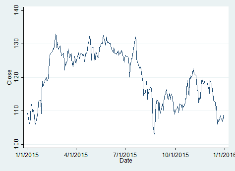
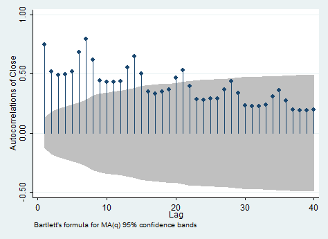
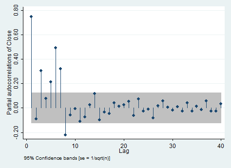
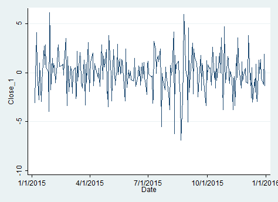
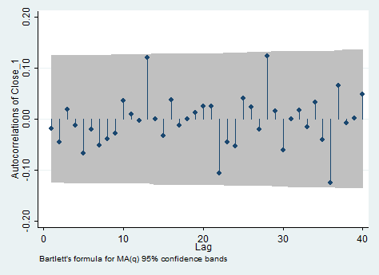
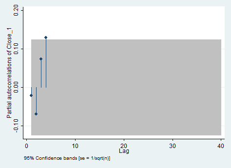

# ARMA {#arma}
```{r stata_py_setup, include=FALSE}
library(knitr) # комбинирование кода и текста
library(Statamarkdown) # взаимодействие со статой
library(reticulate) # взаимодействие с питоном
if (Sys.getenv("USER") == "boris") {
  stataexe <- find_stata()
}
if (Sys.getenv("USERNAME") == "Yuliya") {
  use_python("/Users/Юлия/AppData/Local/Programs/Python/Python37/python.exe")
  stataexe <- find_stata()
}
if (Sys.getenv("USER") == "Sasha") {
  use_python("/Users/Sasha/anaconda3/bin/python3")
  stataexe = "/Applications/Stata/StataSE.app/Contents/MacOS/stataSE"
}
if (Sys.getenv("USERNAME") == "Anastasia Karpova") {
  Sys.setenv(language = "russian")
  Sys.setenv(PATH = paste("C:/Users/DNS/Anaconda3/Library/bin",
                       Sys.getenv()["PATH"], sep = ";"))
  Sys.setenv(PATH = paste("C:/Users/DNS/Anaconda3/Scripts",
                       Sys.getenv()["PATH"], sep = ";"))
  Sys.setenv(PATH = paste("C:/Users/DNS/Anaconda3/",
                       Sys.getenv()["PATH"], sep = ";"))
  use_condaenv("base")
  use_python("C:/Users/DNS/Anaconda3/python.exe")
  pandas = reticulate::import("pandas")
  stataexe = "C:/Program Files (x86)/Stata13/StataMP-64.exe"
}
if (Sys.getenv("USERNAME") == "The_sun") {
  use_python("Users/The_sun/Anaconda3/python.exe")
  stataexe = "C:/Program Files (x86)/Stata13/StataMP-64.exe"
}
knitr::opts_chunk$set(engine.path = list(stata = stataexe), collectcode = TRUE)
```

```{r setup, include=FALSE}
library(texreg)
library(Statamarkdown)
library(reticulate)
library(knitr)
library(rmarkdown)
library(dplyr)
stataexe <- find_stata()
knitr::opts_chunk$set(engine.path = list(stata = stataexe), collectcode = TRUE)
opts_chunk$set(fig.align = "center") # выравнивание картинок по центру
```

> Достигнем просветления в анализе временных рядов вместе с нашими друзьями, Stata, R и Python!
В качестве анализируемых наблюдений используем данные по стоимости акций коммапнии `Apple` c 2015-01-01 по 2015-12-31: цена открытия/ закрытия, минимальная/ максимальная цены, объём и скорректиованная цена.

## R

Традиционно начнём в **r**.

```{r, include=FALSE}
Sys.setlocale("LC_TIME", "C")
```

Загрузим необходимые пакеты:

```{r,result=FALSE, warning=FALSE, message=FALSE}
library(xts) # работа с временными рядами
library(dplyr) # манипуляции с данными
library(ggplot2) # построение графиков
library(aTSA) # тест Дики-Фуллера
library(forecast) # прогнозирование ARMA-моделей
library(quantmod) # импортирование набора данных из интернета
library(lmtest) # проверка гипотез
```

Импортируем dataset `AAPL` прямо из пакета `quantmod`. Будем анализировать одномерный временной ряд от переменной `AAPL. Close`.

```{r, result=FALSE, warning=FALSE, message=FALSE}
getSymbols("AAPL",from = "2015-01-01",to = "2015-12-31")
```

Обозначим исследуемый набор данных как `apple_df`. 

```{r, warning=FALSE, message=FALSE}
apple_df = AAPL$AAPL.Close
```

Визуализируем изучаемый временной ряд, его автокорреляционную и частную автокорреляционную функции.

```{r, warning=FALSE}
ggtsdisplay(apple_df)
```

По графику видим, что процесс напоминает случайное блуждание: медленно убывает автокорреляционная функция, первый лаг частной автокорреляционной функции не входит в доверительный интервал, остальные - входят.

Проверим стационарность ряда тестом Дики - Фуллера.

```{r}
adf.test(apple_df)
```

Тест выявил нестационарность на 5% уровне значимости (основная гипотеза – о нестационарности ряда).

Возьмём первую разность от ряда, чтобы сделать его стационарным (ведь только стационарные процессы могут быть описаны моделью `ARMA (p, q)` ) и снова построим автокорреляционную и частную автокорреляционную функции.

```{r, warning=FALSE}
apple_diff = diff(apple_df)
ggtsdisplay(apple_diff)
summary(apple_diff)
```

Ряд похож на стационарный. 
Теперь построим несколько моделей, которые потенциально могут описать данный ряд, хотя уже заранее ожидается, что ряд в разностях будет описан `ARIMA (0, 0, 0)`, что равносильно `ARMA(0, 0)`, но всё же...

`ARIMA (0, 0, 0)`:

```{r}
arima_000 = arima(apple_diff, order = c(0, 0, 0))
summary(arima_000)
```

Построим также модель `ARIMA (1, 0, 0)` , что равносильно `ARMA (1, 0)`, для сравнения.

```{r}
arima_100 = arima(apple_diff, order = c(1, 0, 0))
summary(arima_100)
coeftest(arima_100)
```

По информационному критерию Акаике первая модель лучше (AIC меньше), а также во второй модели коэффициент перед ar(1) незначим. 

Получается, что (как и ожидалось) первая модель лучше.
Можно схитрить и использовать функцию автоподбора коэффициентов модели ARIMA.

```{r}
arima_auto_model = auto.arima(apple_diff)
summary(arima_auto_model)
```

Такая функция автоматически минимизирует критерий Акаике. 
Заметим, что автоподбор выдал модель `ARIMA (0, 0, 0)` для первой разности.

Теперь проверим остатки модели `ARIMA (0, 0, 0)` на белошумность. 
Сохраним остатки и проделаем тест Льюнг - Бокса, в котором основная гипотеза - остатки независимы. 

Сохраним остатки модели `ARIMA (0, 0, 0)` и построим тест Льюнг - Бокса (если наблюдений мало, то используем опцию `Box-Pierce`).

```{r}
res_arima_000 = resid(arima_000)
Box.test(res_arima_000, lag = 10, type = "Ljung-Box")
```

Основная гипотеза об отсутствии автокорреляции остатков отвергается, следовательно, модель корректно описывает структуру автокорреляции.

Время небольших фактов: Льюнг - это женщина-статистик!
Поэтому правильно склонять "Льюнг - Бокса", а не "Льюнга - Бокса"!

<center>


</center>

Можно ещё также научиться оценивать визуально, где лежат корни AR и MA (`unit root test`). 
Так как для построенной модели нет AR и MA частей (`ARIMA (0, 0, 0)`), то можно применить команду к, например, `ARIMA (1, 0, 0)`:

```{r}
autoplot(arima_100)
```

Построим прогноз на 3 периода вперёд для модели `arima_000`. 
Визуализируем прогноз, границы 80% и 95% доверительного интервалов.

```{r, warning=FALSE, message=FALSE}
forecast(arima_000, h = 10) %>%
autoplot()
```

## Python

Настало время **python**!

```{r, include=FALSE}
library(reticulate)
use_python("/users/yuliya/appdata/local/programs/python/python37-32")
```

Импортируем необходимые пакеты.

```{python}
import numpy as np
import pandas as pd
import quandl # импортирование данных из Сети
import datetime # работа с форматами даты и времени
import matplotlib.pyplot as plt # построение графиков
from pandas import Series # работа с временными рядами
import statsmodels
from statsmodels.tsa.arima_model import ARMA # ARMA-модели
from statsmodels.graphics.tsaplots import plot_acf # построение графика acf
from statsmodels.graphics.tsaplots import plot_pacf # построение графика pacf
import statsmodels.api as sm
from statsmodels.stats import diagnostic as diag # тесты
import pmdarima as pm
from pmdarima.arima import auto_arima # автоподбор коэффициентов модели ARIMA
from statsmodels.tsa.stattools import adfuller # тест Дики-Фуллера
```

Загрузим набор данных:

```{python}
start = datetime.datetime(2015, 1, 1)
end = datetime.datetime(2015, 12, 31)
apple = quandl.get("WIKI/" + "AAPL", start_date=start, end_date=end)
```

Проверим загрузку данных. Будем анализировать цену закрытия.

```{python}
apple.head()
apple_df = apple["Close"]
```

Посмотрим на структуру временного ряда, автокорреляционную и частную автокорреляционную функции.

```{python}
apple_df.plot(grid=True)
plt.title("Структурa временного ряда")
plt.show()
plot_acf(apple_df, lags=20)
plt.show()
plot_pacf(apple_df, lags=20)
plt.show()
```

Появились очень знакомые (и красивые) графики. 
Важно отметить, что на графиках есть 0 - лаг, он равен единице, в предыдущих графиках его не было.

Проверим стационарность ряда тестом Дики-Фуллера.

```{python, warning=FALSE, message=FALSE}
res = sm.tsa.adfuller(apple_df, regression="ct")
"p-value:{}".format(res[1])
```

Возьмём первую разность и уберём пропущенные наблюдения.

```{python, warning=FALSE, message=FALSE}
apple_diff = apple_df.diff(periods=1).dropna()
```

И визуализируем структуру нового ряда.

```{python}
apple_diff.plot(grid=True)
plt.title("Структурa временного ряда")
plt.show()
plot_acf(apple_diff, lags=50)
plt.show()
plot_pacf(apple_diff, lags=50)
plt.show()
```

Аналогично операциям в **r**, смоделируем данный ряд как `ARMA (0, 0)`.

```{python, message=FALSE, warning=FALSE}
arma_00 = ARMA(apple_diff, order=(0, 0))
arma_00_fit = arma_00.fit(disp=False)
arma_00_fit.summary()
```

Смоделируем ряд как `ARMA (1, 0)`:

```{python,warning=FALSE,message=FALSE}
arma_10 = ARMA(apple_diff, order=(1, 0))
arma_10_fit = arma_10.fit(disp=False)
arma_10_fit.summary()
```

Вторая модель имеет более высокое значение критерия Акаике и незначимый коэффициент перед ar(1).

Отдельно можно выделить значения AIC и BIC для построенных моделей.

```{python}
np.round(arma_00_fit.aic, 2)
np.round(arma_10_fit.aic, 2)
```

```{python}
np.round(arma_00_fit.bic, 2)
np.round(arma_10_fit.bic, 2)
```

Как и в **r**, **python** имеет опцию автоподбора коэффициентов модели `ARIMA`.

```{python, warning=FALSE,message=FALSE,result=FALSE}
auto_arima_python = pm.auto_arima(apple_diff)
auto_arima_python.summary()
```

В строчке `SARIMAX` нет рядом коэффициентов. 
Это означает, что они нулевые, как и предполагалось, то есть модель описывается `ARMA (0, 0)`.
Эта функция также удобна тем, что выводит статистики.

Проверим белошумность остатков тестом Льюнг - Бокса.

Сохраним остатки как `residuals`. Построим тест Льюнг-Бокса (опция `boxpierce=False`) (если наблюдений мало, то используем опцию `Box-Pierce`).

```{python}
residuals = pd.DataFrame(arma_00_fit.resid)
diag.acorr_ljungbox(residuals, lags=10, boxpierce=False)
```

Посмотрим на прогноз на 10 дней вперёд.

```{python, warning=FALSE, message=FALSE}
forecast = arma_00_fit.forecast(steps=10)[0]
forecast
```

И визуализируем прогнозные значения на исходном графике.

```{python, warning=FALSE, message=FALSE}
arma_00_fit.plot_predict(len(apple_diff)-250, len(apple_diff)+10)
plt.xlabel("Лаги")
plt.ylabel("Изменение цены")
plt.title("Изменение цены закрытия AAPL")
plt.show()
```

## Stata

```{stata, include=FALSE}
clear all
```

Теперь научимся анализировать временные ряды в **stata**.
Импортируем dataset.

```{stata, results="hide"}
use data/apple.dta
```

Установим временной формат переменной `Date` и визуализируем исследуемый временной ряд, его автокорреляционную и частную автокорреляционную функции.

```{stata}
tsset Date
```

```{stata, echo=1, results="hide"}
tsline Close
graph export ts.png
```
<center>


</center>

```{stata, echo=1, results= "hide"}
ac Close
graph export ac.png
```

<center>



</center>

```{stata, echo = 1, results = "hide"}
pac Close
graph export pac.png
```

<center>


</center>
На графиках видим отличные от предыдущих 2-х сетов графиков. 
Почему так происходит – хороший исследовательский вопрос!

[Stackexchange](https://stats.stackexchange.com/questions/169891/same-data-different-pacf-r-vs-stata/)
рекомендует приписать ", yw" после "ac/pac", но это не работает на моём примере.

Несмотря на выявленное различие, всё равно посмотрим процедуру анализа временного ряда в stata.

Проверим стационарность ряда тестом Дики-Фуллера.

```{stata}
dfuller Close, trend lags(0)
```

Тест выявил нестационарность на 5% уровне значимости (основная гипотеза - о нестационарности).

Возьмём первую разность от ряда, чтобы сделать его стационарным и снова построим графики ACF и PACF.

```{stata, results="hide"}
gen Close_1 = Close[_n]-Close[_n-1]
```

И визуализируем его, вместе с автокорреляционной и частной автокорреляционной функциями.

```{stata, echo=1, results="hide"}
tsline Close_1
graph export ts_1.png
```

<center>



</center>

```{stata, echo=1, results="hide"}
ac Close_1
graph export acc_1.png
```
<center>


</center>
```{stata, echo=1, results="hide"}
pac Close_1
graph export pacc_1.png
```
<center>


</center>


Теперь построим несколько моделей, которые потенциально могут описать данный ряд, хотя уже заранее ожидается, что ряд в разностях будет описан `ARIMA (0, 0, 0)`, что равносильно `ARMA (0, 0)`, но всё же...

`ARIMA (0, 0, 0)`. Можно также отдельно вывести AIC и BIC для построенной модели. Построим также модель `ARIMA (1, 0, 0)` для сравнения.

```{stata}
arima Close_1, arima(0, 0, 0)
estat ic
arima Close_1, arima(1, 0, 0)
estat ic
```

По информационному критерию Акаике первая модель лучше (AIC меньше), а также во второй модели коэффициент перед ar(1) незначим. 

Проверим остатки модели `ARIMA (0, 0, 0)` на белошумность. 
Сохраним остатки модели и проверим тестом Льюнг-Бокса. 
Основная гипотеза - остатки независимы.

```{stata}
arima Close_1, arima(0, 0, 0)
predict res, resid
wntestq res
```

Теперь попробуем построить прогноз по модели `ARIMA (0, 0, 0)`:

```{stata}
arima Close_1, arima(0, 0, 0)
predict prognoz
display prognoz
```

Прогноз аналогичен полученным раньше.

```{stata, include=FALSE}
save data/prognoz.dta, replace
```


