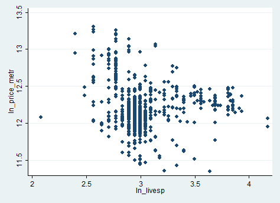
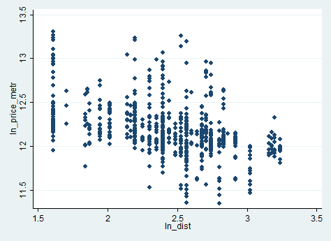
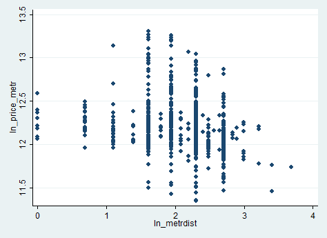

# Гетероскедастичность в простой регрессии {#heterosked}

```{r setup, include=FALSE}
library("texreg")
library("Statamarkdown")
library("reticulate")
library ("knitr")
library("dplyr")
library("rmarkdown")
use_python("/Users/Юлия/AppData/Local/Programs/Python/Python37/python.exe")
stataexe <- find_stata()
knitr::opts_chunk$set(engine.path = list(stata = stataexe), collectcode = TRUE)
opts_chunk$set(fig.align = 'center') # выравнивание картинок по центру
```
> Одним из нарушений условий ТГМ является гетероскедастичность, возникающая ввиду неодинаковых дисперсий для разных наблюдений. Она нежелательна ввиду того, что оценки МНК не являются эффективными (но остаются несмещёнными), и предпосылки для использования `t`-статистик нарушены, что даёт неверный результат о значимости коэффициентов.

Этот коан благословит Вас на поиски гетероскедастичности и просветит о способах борьбы с ней.

Будем анализировать гетероскедастичность на данных о стоимости квартир.

## r

Вызовем **r** в помощь в охоте на гетероскедастичность. Импортируем его оружейные пакеты.
```{r, message=FALSE, warning=FALSE}
library(rio) # чтение dta - файлов
library(dplyr) # манипуляции с данными
library(lmtest) # тест Бройша-Пагана
library(sandwich) # оценка дисперсии при гетероскедастичности
library(UStatBookABSC) # WLS
library (estimatr) # получение робастных оценок
library(ggpubr) # для графиков
library(skimr) # для описательных статистик
```
Импортируем наш dataset, `flats.dta`:
```{r}
flats= import("data/flats.dta")
```
Рассмотрим описательные статистики загруженного датасета.
```{r}
skim(flats)
```
Построим простую линейную регрессионную модель, на которой будем проверять гетероскедастичность.
```{r}
reg = lm(ln_price_metr ~ 1 + ln_livesp + ln_kitsp + ln_dist + ln_metrdist, data=flats)
summary(reg)
```
Проверим наличие гетероскедастичности визуально. Построим зависимости цены квартир от объясняющих факторов.
```{r}
kit = ggplot(flats) + geom_point(aes(x = ln_kitsp, y = ln_price_metr)) + 
  labs(x = "Площадь кухни, кв.м", y = "Цена квартиры, $1000", 
  title = "Стоимость квартир в Москве")
live = ggplot(flats) + geom_point(aes(x = ln_livesp, y = ln_price_metr)) + 
  labs(x = "Жилая площадь, кв.м", y = "Цена квартиры, $1000", 
  title = "Стоимость квартир в Москве")
dist = ggplot(flats) + geom_point(aes(x = ln_dist, y = ln_price_metr)) + 
  labs(x = "Расстояние до центра, м", y = "Цена квартиры, $1000",
  title = "Стоимость квартир в Москве")
metrdist = ggplot(flats) + geom_point(aes(x = ln_metrdist, y = ln_price_metr)) + 
  labs(x = "Расстояние до метро, м", y = "Цена квартиры, $1000", 
  title = "Стоимость квартир в Москве")

ggarrange(kit, live, dist, metrdist, ncol=2, nrow=2)
```
Из сета красивых графиков видно, что гетероскедастичность присутствует. В частности, подозрительны переменные `ln_kitsp` и `ln_metrdist`.


Проверим наличие гетероскедастичности с помощью тестов. Начнём с теста Уайта. Он неконструктивный, он может лишь показать наличие гетероскедастичности, асимптотический. Нормальность остатков в предпосылках не требуется, подразумевается, что $$E{\varepsilon^4_i} = const$$.

\[
\begin{cases}
H_0: \sigma^2_i = \sigma^2 \\
H_1: \sigma^2_i \neq = \sigma^2 \\
\end{cases}
\]

На первом шаге тест сохраняет остатки от построения начальной регрессии.
\[
\hat{\ln{(pricemetr_i)}} = \hat{\beta}_0 + \hat{\beta}_{\ln{(kitsp)}} \cdot \ln{(kitsp_i)} + \hat{\beta}_{\ln{(livesp)}}\cdot \ln{(livesp_i)} + \hat{\beta}_{\ln{(dist)}}\cdot \ln{(dist_i)} + \hat{\beta}_{\ln{(metrdist)}}\cdot \ln{(metrdist_i)}
\]
На втором - строится вспомогательная регрессия (X_j-вектор j-го фактора).
\[
\hat{e}^2_i = \hat{\alpha}_0 + \sum_{j=1}^{k} \hat{\alpha}_j \cdot X_j + \sum_{j=1}^{k} \hat{\gamma}_j \cdot X^2_j + \sum_{j < m}^{k} \hat{\delta}_j X_j \cdot X_m
\]

`R-squared` построенной вспомогательной регрессии должен быть распределён как:
\[
n \cdot R^2_{aux} \sim \chi^2_{K-1}
\]
где `K` – число факторов во вспомогательной регрессии.

Тест Уайта реализуется (ручками) как:
```{r}
bptest(reg, varformula = ~ 1 + ln_livesp + ln_kitsp + ln_dist + ln_metrdist + I(ln_livesp ^ 2) + I(ln_kitsp ^ 2) + I(ln_dist ^ 2) + I(ln_metrdist ^ 2) + I(ln_livesp * ln_kitsp) + I(ln_livesp * ln_dist) + I(ln_livesp * ln_metrdist) + I(ln_kitsp * ln_dist) + I(ln_kitsp * ln_metrdist) + I(ln_dist * ln_metrdist), data=flats)
```
Тест Уайта выявил гетероскедастичность.

Тест Бройша-Пагана – обобщённый вариант теста Уайта. В тесте Бройша-Пагана во вспомогательной регрессии можно брать любые функции от регрессоров, в тесте Уайта - регрессоры, их квадраты и кросс-произведения. Тест Бройша-Пагана является асимптотическим.

\[
\begin{cases}
H_0: \sigma^2_i = \sigma^2 \\
H_1: \sigma^2_i \propto f(\alpha_0 + \alpha_1 \cdot Z_1 +  \ldots + \alpha_p \cdot Z_p) \\
\end{cases}
\]

Классическая версия Бройша-Пагана строится на основе метода максимального правдоподобия. Предпосылками классической версии теста являются нормальность остатков, существование у функции дисперсии из альтернативной гипотезы первой и второй производной. Считается LM-статистика, которая, при верной основной гипотезе об отсутствии гетероскедастичности, имеет хи-квадратное распределение с p-1 степенью свободы.

Классическая версия Бройша-Пагана реализуется в **r** по команде:
```{r}
bptest(reg, studentize=FALSE)
```

Современная модификация теста не требует нормальности остатков, лишь $$\E{\varepsilon^4_i} = const$$.
На первом шаге строится исходная регрессия и сохраняются остатки. Затем строится состоятельная оценка дисперсии:
\[
\hat{\sigma}^2 = \frac{1}{n} \cdot \sum_{i=1}^{n} {e^2_i}
\]
Потом строится вспомогательная регрессия:
\[
\frac{e^2}{\hat{\sigma}^2} = \alpha_0 + \alpha_1 \cdot Z_1 + \ldots + \alpha_p \cdot Z_p + u
\]
И рассчитывается тестовая статистика:
\[
\frac{RSS_{aux}}{2} \sim \chi^2_{p}
\]
Модифицированная версия теста Бройша-Пагана реализуется по команде:

```{r}
bptest(reg)
```
Причем, если отдельно не указать спецификацию вспомогательной регрессии, то `bptest()` возьмёт все регрессоры исходной модели.

В обеих версиях теста Бройша-Пагана гетероскедастичность обнаружена.

Ещё есть тест Голдфелда-Квандта. 


\[
\begin{cases}
H_0: \sigma^2_i = \sigma^2 \\
H_1: \sigma^2_i \propto X_i \\
\end{cases}
\]

Этот тест предполагает нормальность остатков и является неасимптотическим.

Процедура:

Сначала все наблюдения сортируются по возрастанию абсолютного значения фактора, вызывающего гетероскедастичность.

Затем отсортированный ряд по фактору делится на 3 примерно равные части. Считаются гетероскедастичности по первой и третьей части ряда. 
Строится `F`-статистика:
\[
\frac{RSS_2}{RSS_1} \sim F_{r - k, r-k}
\]

где `r` - размер первой и третьей частей отсортированного ряда.

Данный тест в **r** реализуется по командам (предполагается, что дисперсии пропорциональны переменной `ln_kitsp`):
```{r}
flats_ordered = flats[order(flats$ln_kitsp), ]
reg_gqtest = lm(ln_price_metr ~ 1 + ln_livesp + ln_kitsp + ln_dist + ln_metrdist, data=flats_ordered)
gqtest(reg_gqtest, fraction=0.34) # посередине отсортированного ряда лежит 34% наблюдений
```

Будет также полезным познакомиться с методами борьбы с гетероскедастичностью.

Способ 1. Взвешенный МНК. Веса – оценка обратной дисперсии переменной, вызывающей гетероскедачность.
То есть оценим регрессию:
\[
\frac{\ln{(pricemetr_i)}}{\hat{\sigma}_i} = 
\frac{\beta_0}{\hat{\sigma}_i} + 
\frac{\beta_{\ln{(kitsp)}} \cdot \ln{(kitsp_i)}}{\hat{\sigma}_i} + \frac{\beta_{\ln{(livesp)}} \cdot \ln{(livesp_i)}}{\hat{\sigma}_i} + \frac{\beta_{\ln{(dist)}} \cdot \ln{(dist_i)}}{\hat{\sigma}_i} + \frac{\beta_{\ln{(metrdist)}} \cdot \ln{(metrdist_i)}}{\hat{\sigma}_i} + \frac{\varepsilon_i}{\hat{\sigma}_i}
\]
В **r** это можно сделать так:
```{r}
reg_wls = lm(ln_price_metr ~ 1 + ln_livesp + ln_kitsp + ln_dist + ln_metrdist, data=flats, weights = 1 / (1 / fitted(lm(abs(residuals(reg)) ~ ln_kitsp)) ^ 2))
summary(reg_wls)
```
Способ 2. Робастные оценки Уайта.

```{r}
reg_robust = lm_robust(ln_price_metr ~ 1 + ln_livesp + ln_kitsp + ln_dist + ln_metrdist, data=flats)
summary(reg_robust)
```
Робастные оценки коэффициентов регрессии получаются состоятельными. 

## python

Теперь попробуем проделать эти шаги в **python**.
```{r, include=FALSE}
library(reticulate)
use_python("/users/yuliya/appdata/local/programs/python/python37-32")
```
Импотируем необходимые пакеты.
```{python}
import numpy as np
import pandas as pd # чтение файлов
import matplotlib.pyplot as plt # построение графиков
import seaborn as sns # построение графиков
import statsmodels.api as sm # тесты
from statsmodels.formula.api import ols, WLS # построение регрессии
import statsmodels
import statsmodels.stats.diagnostic as sm_diagnostic # тест Бройша-Пагана
```
Загрузим исследуемый датасет.
```{python}
flats = pd.read_stata("data/flats.dta")
```
Построим линейную регрессионную модель.
```{python, warning=FALSE}
reg = ols("ln_price_metr ~ 1 + ln_livesp + ln_kitsp + ln_dist + ln_metrdist", flats).fit()
reg.summary()
```
Визуализируем зависимости регрессоров и регрессанта.
```{python}
sns.pairplot(flats, x_vars=["ln_metrdist", "ln_kitsp", "ln_livesp", "ln_dist"], y_vars=["ln_price_metr"])
plt.show()
```
Графики всё такие же красивые, как и в предыдущем пункте:) Подозрительны переменные `ln_kitsp` и `ln_metrdist`
Проведём тесты на выявление гетероскедастичности в **python**.

Рассмотрим тест Бройша-Пагана на всех факторах.
```{python}
resid = reg.resid
X = flats[['ln_livesp', 'ln_kitsp', 'ln_dist', 'ln_metrdist']]
sm_diagnostic.het_breuschpagan(resid=resid, exog_het=X)
```
Интерпретация результатов теста: 

Первое из выданных значений - значение тестовой статистики теста Бройша-Пагана, второе - значение p-value для выданной тестовой статистики. Третье  и четвёртое - значения тестовой статистики и её p-value для на уровне значимости 5% (табличное). Гетероскедастичность присутствует.

Посмотрим на тест Голдфелда-Квандта по переменной `ln_kitsp`.
```{python}
sm_diagnostic.het_goldfeldquandt(y=flats["ln_price_metr"], x=X, alternative="two-sided")
```
Значение p-value близко к 0, следовательно, основная гипотеза о гомоскедастичности отвергается.

Теперь о способах борьбы с гетероскедастичностью.

Способ 1. Взвешенный МНК.

Взвешиваем по стандартному отклонению фактора `ln_kitsp`.
```{python}
reg_wls = statsmodels.regression.linear_model.WLS(flats["ln_price_metr"], X, weights=flats['ln_kitsp'])
reg_wls_results = reg_wls.fit()
reg_wls_results.summary()
```
Способ 2. Использование робастных оценок.
```{python}
reg_robust = reg.get_robustcov_results()
reg_robust.summary()
```

## stata

Теперь попробуем поработать в **stata**.

Импортируем датасет для анализа.
```{stata}
use data/flats.dta
```
Построим линейную регрессионную модель.
```{stata}
reg ln_price_metr ln_livesp ln_kitsp ln_dist ln_metrdist
```
Визуализируем зависимость регрессоров и регрессанта.
```{stata,echo=1,results="hide"}
scatter ln_price_metr ln_kitsp
graph export kitsp.png, replace
```

```{stata,echo=1,results="hide"}
scatter ln_price_metr ln_livesp
graph export livesp.png, replace
```

```{stata,echo=1,results="hide"}
scatter ln_price_metr ln_dist
graph export dist.png, replace
```

```{stata,echo=1,results="hide"}
scatter ln_price_metr ln_metrdist
graph export metrdist.png, replace
```



Подозрительны переменные `ln_kitsp` и `ln_metrdist`
Проверим наличие гетероскедастичности с помощью тестов.

Тест Уайта строится по короткой команде:
```{stata}
estat imtest, white
```
Тест Уайта выявил гетероскедастичность. Что скажет тест Бройша-Пагана?
```{stata}
estat hettest, rhs mtest
```
И этот тест указывает на наличие нежелательной гетероскедастичности, особенно подозрительны переменные `ln_kitsp` и `ln_metrdist`.

Попробуем проверить ещё и через тест Голдфелда - Квандта. Сделаем его ручками.

Отсортируем наблюдения по возрастанию переменной `ln_kitsp`, построим регрессию и сохраним остатки.
```{stata}
sort ln_kitsp
reg ln_price_metr ln_livesp ln_kitsp ln_dist ln_metrdist in 1 / 258
scalar rss1 = e(rss)
```
Сохраним остатки и в последней части регрессии.
```{stata}
sort ln_kitsp
reg ln_price_metr ln_livesp ln_kitsp ln_dist ln_metrdist in 516 / 773
scalar rss2 = e(rss)
```
Посчитаем тестовую F-статистику.
```{stata}
scalar F = rss2 / rss1
display F
display invFtail(258, 258, 0.05)
```
Тестовая статистика больше табличной, следовательно, гетероскедастичность присутствует. 

Сейчас немного о способах борьбы с гетероскедастичностью. Подправим все коэффициенты исходной регрессии на гетероскедастичную переменную, например, на `ln_kitsp`.
```{stata}
gen ln_price_metr_new = ln_price_metr / ln_kitsp
gen ln_livesp_new = ln_livesp / ln_kitsp
gen const_new = 1 / ln_kitsp
gen ln_dist_new = ln_dist / ln_kitsp
gen ln_metrdist_new = ln_metrdist / ln_kitsp
```
И оценим регрессию с новыми переменными.
```{stata}
reg ln_price_metr_new ln_livesp_new const_new ln_dist_new ln_metrdist_new
```
И полученные оценки будут эффективными оценками коэффициентов исходной регрессии.

Также можно использовать метод взвешенного МНК (WLS). Взвесим на стандартное отклонение фактора `ln_kitsp`.
```{stata}
vwls ln_price_metr ln_livesp ln_kitsp ln_dist ln_metrdist, sd(ln_kitsp)
```
Способ #2. Используем робастные оценки Уайта.
```{stata}
reg ln_price_metr ln_livesp ln_kitsp ln_dist ln_metrdist, robust
```
Робастные оценки Уайта позволяют снизить последствия гетероскедастичности через уменьшение стандартных ошибок коэффициентов регрессии.
```{stata, include=FALSE}
save data/livesp.dta, replace
```


